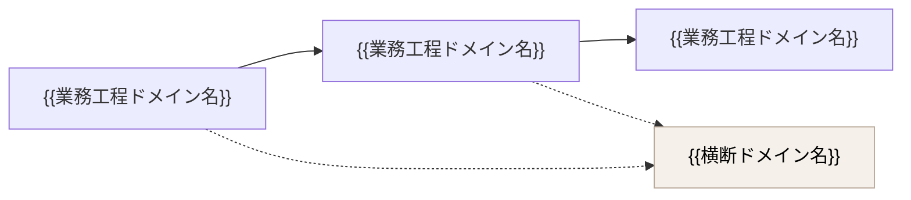

<!--
================================================================================
ドメイン定義書 テンプレート

【使い方】
- 章構成は固定
- 表記規約(プレースホルダ `{{xxx}}` / HINT記法 / 要確認マーカー / 文体)はリポジトリ直下の `CLAUDE.md` を参照
================================================================================
-->

# ドメイン定義書

## 本書について

<!-- HINT:
本書の目的・読者・対象範囲を1段落で示す。
「BRD のスコープを業務領域単位に分解し、下流の PRD・ドメイン要求仕様書群の
構成単位の根拠となる」旨を宣言する。
-->

本書は、{{プロダクト名・サービス名}}を構成するドメイン(業務領域)を定義するドキュメントです。本書はビジネス要件定義書(BRD)のスコープ・対象業務を上流とし、下流のプロダクト要求仕様書(PRD)および各ドメインごとに1冊作成されるドメイン要求仕様書群の構成単位の根拠となります。

## 前提

<!-- HINT:
本書を読む前に共有しておくべき前提事項を記載する。
現状は「ドメインの捉え方」のみだが、プロジェクト固有の前提
(用語定義・採用するモデリング手法・参照する社内標準 等)があれば追記する。
-->

### ドメインの捉え方(用語整理)

<!-- HINT:
このセクションは固定文として記載する。
プロジェクト固有の補足が必要な場合のみ、表の後ろに段落を追加する。
-->

本書で扱う「ドメイン」は、プロダクトが対象とする業務領域そのもの(問題空間)を指します。これは DDD でいうサブドメインに近い概念です。

これに対してBounded Context(BC)は、業務領域を実装に落とすときのモデル・コード・チームの境界(解空間)を指す別レイヤーの概念です。両者の対応は以下のとおりです。

| 概念 | レイヤー | 意味 | 確定するフェーズ |
|---|---|---|---|
| ドメイン | 問題空間 | プロダクトが扱う業務領域 | D1(本書) |
| Bounded Context | 解空間 | モデル/コード/チームの実装上の境界 | D2 以降 |

理想的には「1 ドメイン = 1 Bounded Context」となりますが、組織構造・スケーラビリティ・データ局所性 等の都合で、1 ドメインを複数 BC に分けたり、複数ドメインを 1 BC にまとめたりすることがあります。本書では問題空間としての網羅・分類のみを扱い、BC へのマッピングは下流の成果物で確定します。

> 補足: 「サブドメイン」という用語自体は Eric Evans の "DOMain-Driven Design"(2003)にも登場しますが、「サブドメイン=問題空間 / BC=解空間」という対比はその後のDDDコミュニティ(Vaughn Vernon ほか)で整理された現代的なフレーミングです。本書はこの現代的整理に従います。

### 分類の方針

<!-- HINT:
分類軸は以下2軸を基本とする:
  - 区分(戦略上の位置づけ): コア / サポート / 汎用
  - 種別(ドメインの性質): 業務工程ドメイン / 横断ドメイン
プロジェクト固有の分類軸を追加してもよいが、可読性のため4軸以内に留める。
-->

各ドメインは以下2軸で分類します。

- **区分(戦略上の位置づけ)**:
  - **コア(Core)**: プロダクトの差別化要因となる中核領域。最も投資・内製・独自性が必要
  - **サポート(Supporting)**: コアを支える業務領域。コアではないが業務上不可欠
  - **汎用(Generic)**: 業界・業務横断で汎用化されている領域。SaaS・パッケージ・既存資産の活用が選択肢になりやすい
- **種別(ドメインの性質)**:
  - **業務工程ドメイン**: 業務フロー上の工程に対応するドメイン(例: 申込受付・引受査定 等)
  - **横断ドメイン**: 複数の業務工程をまたがって参照されるドメイン(例: 顧客情報・商品マスタ・本人確認 等)

## 一覧

<!-- HINT:
ID は通し番号(DOM1, DOM2, ...)ではなく、内容を表す英字略号(3〜6文字目安、大文字)を採用する。
ドメインIDは下流成果物(PRD・ドメイン要求仕様書群・C4モデル 等)から参照されるキーとなるため、
意味の読み取れる名称を優先する。例:
  - 業務工程ドメイン: DESIGN(設計書作成)/ APPL(申込受付)/ UNDW(引受査定) 等
  - 横断ドメイン: PROD(商品)/ CUST(顧客)/ KYC(本人確認)/ AUDIT(統制・証跡) 等
AIDDフェーズ名(D0/D1/D2 等)との衝突を避ける。
概要・主な関心事は1〜2文で要点のみ記述する。
具体的な機能・画面・テーブル名・サービス名は書かない(下流の PRD・ドメイン要求仕様書に降ろす)。
-->

| ID | ドメイン名 | 区分 | 種別 | 概要 | 主な関心事 |
|---|---|---|---|---|---|
| {{ID}} | {{ドメイン名}} | {{コア/サポート/汎用}} | {{業務工程/横断}} | {{何を扱う領域か(1〜2文)}} | {{差別化ポイント・規制要件・特有のリスク 等}} |
| {{ID}} | {{ドメイン名}} | {{コア/サポート/汎用}} | {{業務工程/横断}} | {{何を扱う領域か(1〜2文)}} | {{差別化ポイント・規制要件・特有のリスク 等}} |

## ドメイン間の主な連携

<!-- HINT:
業務工程ドメイン同士の前後関係、および業務工程ドメインから横断ドメインへの参照関係を、
Mermaid記法で示す。詳細なシーケンスは下流(L1/L2 シーケンス)に降ろし、
本書では「どのドメインがどのドメインを参照するか」のレベルに留める。

凡例(具体的な Mermaid 記法は下記コードブロック参照):
  - 実線矢印: 業務工程上の前後関係(業務がドメイン間を遷移する)
  - 破線矢印: 横断ドメインへの参照関係(マスタ参照・本人確認 等)
  - 横断ドメインのノードは `classDef crosscut` で別色に塗り分けて視認性を確保する

業務フローが BRD のスコープ表で十分に表現できており、横断ドメインへの参照も
本書の一覧表の「概要」で読み取れる場合は、本セクションは省略してよい。
-->

