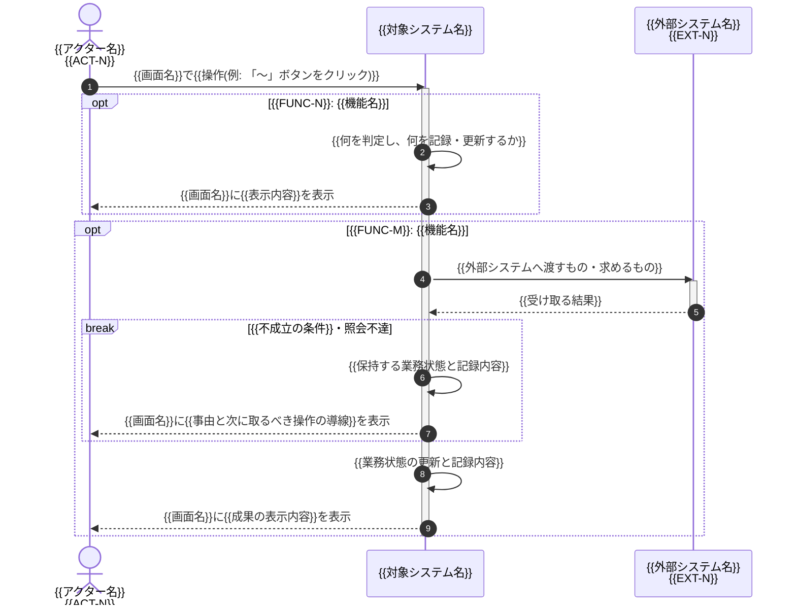

<!--
================================================================================
C4モデル レベル1 シーケンス テンプレート(文書の骨組み)

- 本テンプレートは「タイトル + UC 節の骨組み(メタ情報 + Mermaid 図の枠)」のみを定義する。
- 登場要素の選定・ファイル分割・活性区間の付け方・インデント規約・メッセージ本文の書き方・機能グルーピング・分岐の描き方 等の振る舞いルールは `.claude/skills/d2-c4-level1-sequences/SKILL.md` を参照。
- プレースホルダ `{{xxx}}` / 要確認マーカー / 文体 / ID 表記 等の汎用規約は リポジトリ直下の `CLAUDE.md` を参照。
================================================================================
-->

# C4モデル レベル1 シーケンス: {{ドメイン名}}

{{本書のスコープを1段落で明記: C4モデル レベル1 の登場要素(アクター・対象システム・外部システム)のみを用い、対象システムを黒箱として1ユースケース1本のシーケンスで表す旨と、対象システム内部の構造は本書では扱わない旨}}

## {{UC-N}}: {{UC 名}}

- **主アクター**: {{アクター名: ACT-N}}
- **トリガ**: {{UC を開始する業務イベント}}
- **事前条件**: {{開始時点の業務状態(省略語を使わず対象を具体名で記載)}}
- **事後条件**: {{完了時点の業務状態(UC の主要価値が成立した状態。省略語を使わず対象を具体名で記載)}}
- **関連機能**: {{FUNC-N: 機能名}}, {{FUNC-M: 機能名}}
- **関連外部システム**: {{EXT-N}}

## {{UC-N+1}}: {{UC 名}}

<!-- HINT: 以降、当該ドメインの UC を ユースケース一覧の UC 番号順に同じ構成で繰り返す -->
