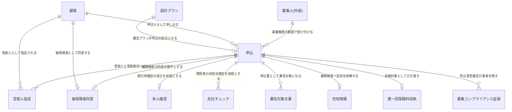

<!--
================================================================================
概念データモデル 記法サンプル(記法の正典)

- 本ファイルは成果物ではなく、生成時に記法を揃えるための参照用サンプル。`docs/` には配置しない。
- 成果物本体は **全ドメインを 1 ファイルに集約した** `docs/D2.system-requirements/conceptual-data-model.md`。本サンプルはその中から申込受付ドメインに関わる部分だけを抜き出した完成形(ドメイン別図 1 節 + 各一覧表の当該ドメイン分)であり、**本ファイルの範囲が成果物の範囲ではない**。
- 文書全体の骨組み(タイトル・本書について・全体概念モデル図・各表の位置)は `.claude/skills/d2-conceptual-data-model/template.md` を参照。
- 記法の根拠となるルールは `.claude/skills/d2-conceptual-data-model/SKILL.md` を参照。
================================================================================
-->

### 申込受付

## 概念エンティティ一覧(申込受付ドメイン分の抜粋)

| ID | ドメイン | エンティティ名 | 区分 | 保有区分 | 定義 | 主な属性(概念) | 関連要求 ID |
|---|---|---|---|---|---|---|---|
| CDM-6 | 申込受付: DOM-APPL | 申込 | イベント | 本システム | 確定した設計プランを起点に、申込人が保険契約を申し込む意思を確定させた事実。保険料払込方法・申込業務状態を保持し、告知受付・第一回保険料収納・引受査定へ引き渡される | 申込番号・申込日時・保険料払込方法・申込業務状態・受付募集人・横断確認結果の充足状態 | DOM-APPL-DATA-1・DOM-APPL-DATA-3・DOM-COMMON-SEC-DATA-3・DOM-APPL-BR-1・DOM-APPL-BR-2 |
| CDM-7 | 申込受付: DOM-APPL | 受取人指定 | イベント | 本システム | 1 件の申込において、保険金等の受取人と受取割合を指定した内容。1 申込に対し複数存在しうるため申込とは別エンティティとする(申込が存在しなければ存在しえない) | 受取人・続柄・受取割合・指定区分 | DOM-APPL-DATA-2・DOM-CUST-DATA-2・DOM-APPL-BR-4 |
| CDM-8 | 申込受付: DOM-APPL | 被保険者同意 | イベント | 本システム | 申込人と被保険者が異なる契約形態において、被保険者が契約締結に同意した事実。同意を要しない契約形態では存在しない | 同意者・同意日時・同意取得方法 | DOM-APPL-BR-4・DOM-APPL-IRR-5 |
| CDM-9 | 申込受付: DOM-APPL | 募集人(外部) | リソース | 外部参照 | 意向把握・設計・申込受付を行う募集人および所属代理店。募集人管理システム(EXT-2)が正典であり、本システムは募集権限照合の結果と証跡への責任主体付与に必要な最小限の属性のみを参照する【要確認: 募集人を所管するドメインがドメイン定義書に存在しないため、参照元が最も多い申込受付に暫定所属させている】 | 募集人識別・氏名・所属代理店・募集権限区分・募集チャネル | DOM-COMMON-SEC-DATA-5・DOM-APPL-BR-8・DOM-HEAR-BR-8・DOM-SUIT-DATA-2 |
| CDM-29 | 本人確認(KYC): DOM-KYC | 本人確認 | イベント | 本システム | 犯罪収益移転防止法上の取引時確認を外部本人確認サービス(EXT-6)へ依頼し、判定結果を受領・確定した事実。要目視時は業務担当者の目視判断を含む | 確認方法・判定結果・判定日時・判定主体・目視判断記録・依頼識別・有効期限 | DOM-KYC-DATA-2・DOM-KYC-DATA-4・DOM-KYC-BR-3・DOM-KYC-BR-4・DOM-KYC-BR-8 |
| CDM-31 | 本人確認(KYC): DOM-KYC | 本人確認書類(外部) | リソース | 外部参照 | 取引時確認に用いる本人確認書類画像・顔画像等の生データ。本人確認(eKYC)サービス(EXT-6)側で保管し、本システムは保有しない | 書類種別・提出日時・外部保管識別 | DOM-KYC-DATA-1・DOM-KYC-BR-5 |

## エンティティ間の関連(申込受付ドメイン分の抜粋)

| 関連元 | 関連先 | 多重度 | 関連の意味 | 関連要求 ID |
|---|---|---|---|---|
| 設計プラン | 申込 | 1 : 0..1 | 申込は確定済みの設計プラン 1 件を起点とする。確定プランのない申込は成立しない | DOM-APPL-BR-1・DOM-DESIGN-BR-6 |
| 申込 | 受取人指定 | 1 : 1..N | 申込は受取人と受取割合を必ず 1 件以上定める。受取人指定は申込に存在依存する | DOM-APPL-BR-2・DOM-APPL-BR-4 |
| 申込 | 被保険者同意 | 1 : 0..1 | 申込人と被保険者が異なる契約形態でのみ同意が必要となり、同意未確認の申込は確定しない | DOM-APPL-BR-4・DOM-APPL-IRR-5 |
| 申込 | 本人確認 | 1 : 0..1 | 取引時確認の成立が申込確定・後続引き渡しの前提となる | DOM-APPL-BR-5・DOM-KYC-BR-1・DOM-KYC-BR-6 |
| 申込 | 反社チェック | 1 : 0..N | 契約関係者ごとに照合し、関係者変更時は再チェックする。非該当確定が後続進行の前提となる | DOM-APPL-BR-6・DOM-ASF-BR-1・DOM-ASF-BR-2 |
| 申込 | 募集コンプライアンス証跡 | 1 : 0..N | 申込意思確定の事実が証跡として発生する。証跡が欠落した申込は完了扱いとしない | DOM-APPL-BR-9 |
| 募集人(外部) | 申込 | 1 : 0..N | 募集権限を有する募集人のみが申込を受け付けられる | DOM-APPL-BR-8 |
| 顧客 | 申込 | 1 : 0..N | 顧客が申込人(契約者)として申し込む | DOM-APPL-DATA-2・DOM-CUST-BR-1 |
| 本人確認 | 本人確認書類(外部) | 1 : 0..N | 判定材料となる書類は外部サービスで保管し、本システムは判定結果の事実のみを保持する | DOM-KYC-BR-5・DOM-KYC-DATA-1 |

## 業務状態を持つエンティティ(申込受付ドメイン分の抜粋)

| エンティティ | 主な業務状態 | 定義元 |
|---|---|---|
| 申込 | 入力中・中断中・入力完了・確認中・署名待ち・申込確定・引渡済・取消・謝絶 | [申込受付要求仕様書 §業務状態遷移](../../../docs/D1.business-requirements/domain-requirements/application-requirement-document.md#業務状態遷移) |

<!-- HINT: 本サンプルから引き写す点 -->
<!-- HINT:
- エンティティ名をダブルクォートで囲む書き方と、図と一覧表のエンティティ名の完全一致
- ドメイン列にドメイン名とドメイン ID を併記する(ドメイン定義書との網羅突き合わせの担保点。ID を省略しない)
- 多重度の使い分け(必須は縦棒、任意は丸。「とりあえず 0..N」にしない)
- 関連ラベルを業務言語の動詞句で書く(「持つ」「紐づく」で済ませない)
- 同一エンティティ間に役割の異なる関連が複数ある場合の書き分け(顧客が申込人・受取人・被保険者として別行で登場する)
- 属性を図に書かず一覧表の「主な属性(概念)」列に寄せる粒度(3〜6 個・型は書かない)
- 外部が正典のエンティティの扱い(名称末尾に外部の注記、定義列で正典の外部システム ID を明記、属性は参照に必要な最小限)
- 生データを外部に委ね結果のみを保持する概念の定義文(本人確認書類は外部保管、本人確認は結果のみ保持)
- ドメイン別図には他ドメイン・外部参照のエンティティも引き込む(ドメインをまたぐ関連こそが本書の価値)
- 業務状態は状態名の列挙と定義元へのリンクに留め、遷移そのものを再掲しない
- 推測・仮置きの判断にはインラインの要確認マーカーを残す(募集人の暫定ドメイン所属 等)
-->
