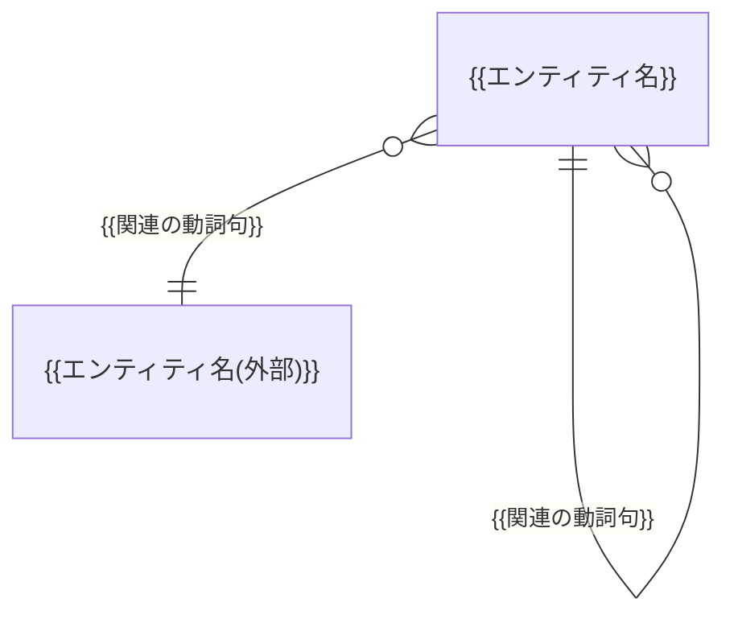
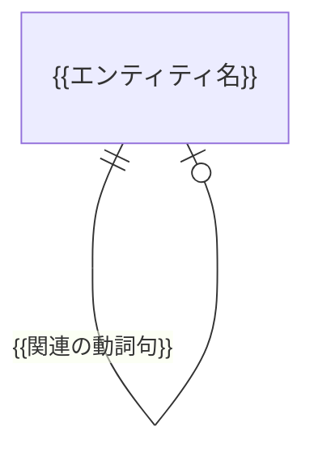

<!--
================================================================================
概念データモデル テンプレート(文書の骨組み)

- 本テンプレートは「タイトル + 章構成 + Mermaid 図の枠 + 表の列構成」のみを定義する。
- 抽象度の境界・エンティティの抽出と粒度・多重度の使い分け・図の分割・各表の埋め方 等の振る舞いルールは `.claude/skills/d2-conceptual-data-model/SKILL.md` を参照。
- 記法の具体例(完成形の1ドメイン分)は `.claude/skills/d2-conceptual-data-model/example.md` を参照。
- プレースホルダ `{{xxx}}` / 要確認マーカー / 文体 / ID 表記 等の汎用規約は リポジトリ直下の `CLAUDE.md` を参照。
================================================================================
-->

# 概念データモデル

## 本書について

本書は、{{プロダクト名・サービス名}}が扱う業務上の概念(エンティティ)と、その関連を整理したドキュメントです。プロダクト要求仕様書(PRD)およびドメイン要求仕様書群を上流とし、下流の論理 ER 図・テーブル定義(D3)の起点となります。

本書は概念レベルに留まり、格納方法(テーブル・カラム・データ型・キー設計・正規化 等)には踏み込みません。

## 全体概念モデル図

{{全体図のスコープを1〜2文で明記: 俯瞰用に主要な関連のみを描くこと、外部システムが正典のエンティティは名称末尾に「(外部)」を付すこと}}

## ドメイン別概念モデル図

### {{ドメイン名}}

### {{ドメイン名}}

<!-- HINT: 以降、ドメイン定義書 §一覧 の並び順に同じ構成で繰り返す -->

## 概念エンティティ一覧

| ID | ドメイン | エンティティ名 | 区分 | 保有区分 | 定義 | 主な属性(概念) | 関連要求 ID |
|---|---|---|---|---|---|---|---|
| {{CDM-1}} | {{ドメイン名: DOM-コード}} | {{エンティティ名}} | {{リソース / イベント}} | {{本システム / 外部参照}} | {{業務上何を指す概念か(1〜2文)}} | {{属性名・属性名・属性名}} | {{関連要求 ID}} |

## エンティティ間の関連

| 関連元 | 関連先 | 多重度 | 関連の意味 | 関連要求 ID |
|---|---|---|---|---|
| {{エンティティ名}} | {{エンティティ名}} | {{1 : 0..N}} | {{業務上その関連が何を表すか・存在依存や一意性制約}} | {{関連要求 ID}} |

## 業務状態を持つエンティティ

| エンティティ | 主な業務状態 | 定義元 |
|---|---|---|
| {{エンティティ名}} | {{状態名・状態名・状態名}} | [{{ドメイン名}}要求仕様書 §業務状態遷移]({{相対パス}}#業務状態遷移) |
