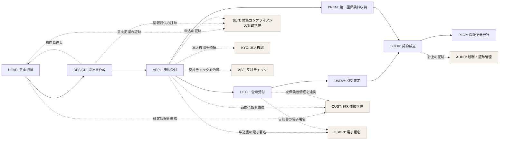

# ドメイン定義書

## 本書について

本書は、Sample生命保険株式会社 個人保険新契約システムを構成するドメイン(業務領域)を定義するドキュメントです。本書はビジネス要件定義書(BRD)のスコープ・対象業務を上流とし、下流のプロダクト要求仕様書(PRD)および各ドメインごとに1冊作成されるドメイン要求仕様書群の構成単位の根拠となります。

## 前提

### ドメインの捉え方(用語整理)

本書で扱う「ドメイン」は、プロダクトが対象とする業務領域そのもの(問題空間)を指します。これは DDD でいうサブドメインに近い概念です。

これに対してBounded Context(BC)は、業務領域を実装に落とすときのモデル・コード・チームの境界(解空間)を指す別レイヤーの概念です。両者の対応は以下のとおりです。

| 概念 | レイヤー | 意味 | 確定するフェーズ |
|---|---|---|---|
| ドメイン | 問題空間 | プロダクトが扱う業務領域 | D1(本書) |
| Bounded Context | 解空間 | モデル/コード/チームの実装上の境界 | D2 以降 |

理想的には「1 ドメイン = 1 Bounded Context」となりますが、組織構造・スケーラビリティ・データ局所性 等の都合で、1 ドメインを複数 BC に分けたり、複数ドメインを 1 BC にまとめたりすることがあります。本書では **問題空間としての網羅・分類のみを扱い**、BC へのマッピングは下流の成果物で確定します。

> 補足: 「サブドメイン」という用語自体は Eric Evans の "Domain-Driven Design"(2003)にも登場しますが、「サブドメイン=問題空間 / BC=解空間」という対比はその後のDDDコミュニティ(Vaughn Vernon ほか)で整理された現代的なフレーミングです。本書はこの現代的整理に従います。

### 分類の方針

各ドメインは以下2軸で分類します。

- **区分(戦略上の位置づけ)**:
  - **コア(Core)**: プロダクトの差別化要因となる中核領域。最も投資・内製・独自性が必要
  - **サポート(Supporting)**: コアを支える業務領域。コアではないが業務上不可欠
  - **汎用(Generic)**: 業界・業務横断で汎用化されている領域。SaaS・パッケージ・既存資産の活用が選択肢になりやすい
- **種別(ドメインの性質)**:
  - **業務工程ドメイン**: 業務フロー上の工程に対応するドメイン(例: 申込受付・引受査定 等)
  - **横断ドメイン**: 複数の業務工程をまたがって参照されるドメイン(例: 顧客情報・本人確認 等)

## 一覧

| ID | ドメイン名 | 区分 | 種別 | 概要 | 主な関心事 |
|---|---|---|---|---|---|
| HEAR | 意向把握 | サポート【要確認: 「お客様本位の業務運営」(意向把握品質による差別化)を競争優位の源泉と位置づける場合「コア」となる可能性あり】 | 業務工程 | お客様の保険加入目的・希望保障(種類/額/期間)・予算・既契約状況・家族構成・職業 等をヒアリングし、意向情報として記録・管理する領域。設計書作成および申込前の意向確認(設計書が当初意向に沿っているか)の根拠となる | 意向の網羅性、対面/非対面双方での聴取品質、意向変更の追跡性、設計書との整合性検証への引き渡し、お客様本位の業務運営の起点としての位置づけ |
| DESIGN | 設計書作成 | コア | 業務工程 | HEARで把握された顧客意向に基づき保険商品の設計(プラン)を作成し、保険料試算・帳票出力を行う領域 | 意向に沿った最適プラン提示、対面/非対面ハイブリッドでの操作性、マルチチャネル展開への耐性、設計から申込への滑らかな引き渡し |
| APPL | 申込受付 | サポート | 業務工程 | 申込人・被保険者の情報、保険料払込方法、受取人指定 等を登録し、申込意思を確定させる領域 | 不備削減、本人確認・反社チェック・電子署名等の各横断ドメインとの確実な連携、申込データの完全性 |
| DECL | 告知受付 | サポート | 業務工程 | 被保険者の健康状態・職業 等に関する告知情報を取得し、要配慮個人情報として管理する領域 | 告知妨害・不告知教唆の防止、要配慮個人情報の厳格な取扱い、告知内容の正確性確保 |
| UNDW | 引受査定 | コア | 業務工程 | 告知内容・診査結果・環境査定情報をもとに引受可否・特別条件付与を判定する領域。自動判定と例外査定の双方を扱う | 自動判定率(70%以上)、判定品質の標準化、判定根拠の追跡可能性、自動判定ロジックの段階的チューニング、将来の機械学習活用への備え |
| PREM | 第一回保険料収納 | サポート | 業務工程 | 第一回保険料の収納手段(口座振替・クレジットカード・振込・コンビニ払込・現金 等)を確定し、収納成立を確認するまでの業務領域。第一回保険料の収納完了は引受可決と並ぶ契約成立条件であり、責任開始日(保障開始日)の起算にも直結する。収納不能時の再依頼・代替手段提示、一定期間内に収納できなかった場合の申込撤回対応も含む。第2回目以降の継続収納は既存収納システムが担うため対象外 | 既存収納システム・外部決済サービスとの疎結合連携、収納成立の確実かつ迅速な検知、責任開始日の正確な確定、収納不能ケースの再依頼・代替手段提示の業務継続性、契約成立条件としての完全性 |
| BOOK | 契約成立(計上) | サポート | 業務工程 | 引受可決および第一回保険料収納の双方完了を契約成立条件として計上処理を行う領域。既存契約管理システムへの計上連携を伴う | 計上処理の自動化、既存契約管理システムへの連携安定性、月末月初繁忙期のスループット |
| PLCY | 保険証券発行 | サポート | 業務工程 | 成立済み契約に対し保険証券データを生成し、契約者・被保険者へ交付する領域。物理発送(印刷・封入・郵送)は既存帳票発送システムへ委ねる | 証券データの完全性、既存帳票発送システムへの連携、電子交付/物理交付の双方への対応性 |
| CUST | 顧客情報管理 | サポート | 横断 | 申込人・被保険者・受取人の属性情報・関係性を集約し、名寄せ・同意管理を含めて一元管理する領域。要配慮個人情報を含む | 個人情報・要配慮個人情報の保護、本人同意管理、データの正確性・最新性、後続業務(契約管理)への引き渡し |
| SUIT | 募集コンプライアンス証跡管理 | サポート | 横断 | 募集規制(意向把握義務・情報提供義務・適合性原則)に対応する各業務局面で発生する説明・確認・同意の証跡を横断的に収集・保全する領域。HEAR(意向把握)・DESIGN(設計書作成)・APPL(申込受付)・DECL(告知受付) 等の各工程で発生する証跡イベントを集約する。意向把握・情報提供の業務工程そのものは各工程ドメインが担い、本ドメインは証跡の収集・保全・説明可能性に責務を限定する | フィデューシャリー・デューティーの担保、不適切募集の予防、証跡の網羅性・改ざん不能性、コンプライアンス部・監督官庁への説明可能性 |
| KYC | 本人確認(KYC) | 汎用 | 横断 | 申込時(および高額契約時)の取引時確認(本人確認)を行う領域。外部本人確認サービスの利用を前提とする | 犯罪収益移転防止法の遵守、外部サービスとの疎結合連携、確認結果の証跡保持 |
| ASF | 反社チェック | 汎用 | 横断 | 申込人・被保険者・関係者の反社会的勢力該当性を確認する領域。外部反社チェックサービスの利用を前提とする | 反社会的勢力排除、外部サービスとの疎結合連携、チェック結果の証跡保持 |
| ESIGN | 電子署名 | 汎用 | 横断 | 申込書・告知書 等への電子署名を取得・検証する領域。外部電子署名サービスの利用を前提とする | 電子帳簿保存法における真実性の確保、外部サービスとの疎結合連携、署名証跡の保持 |
| AUDIT | 統制・証跡管理(アクセス制御・監査ログ・電子帳簿保存) | サポート | 横断 | 役割ベースアクセス制御(RBAC)、改ざん不能な監査ログ、電子的に保存される申込・契約関係書類の統制を担う領域 | 最小権限の原則、要配慮個人情報へのアクセス制御、監査ログの改ざん不能性、電子帳簿保存法の真実性・可視性要件、内部監査・第三者セキュリティ診断への対応 |

## ドメイン間の主な連携

業務工程ドメイン同士の前後関係・フィードバック(実線/破線矢印)と、横断ドメインへの主な参照関係(破線矢印)を示します。詳細なシーケンスは下流の L1/L2 シーケンス図に降ろし、本書では「どのドメインがどのドメインを参照するか」のレベルに留めます。

> **凡例(矢印の意味):**
>
> - **実線 `A --> B`**: 業務工程の **前後関係**。A の完了が B の業務上の契機となる **時系列の流れ** を表す(例: 意向把握 → 設計書作成)。
> - **破線 `A -.-> B`**: **参照関係(依存関係)**。A が B の機能・データ・統制を業務上 **参照/依存** することを表す。時系列の順序ではなく「どのドメインが何に依存するか」を示す。横断ドメイン(顧客情報・募集コンプライアンス証跡・本人確認 等)への参照、および業務工程間のフィードバック(`DESIGN -.->|意向見直し| HEAR` = 設計書提示後の意向見直し)を含む。
>
> 図の可読性確保のため代表的な関係のみ描画しています。実際には、(1) ほぼすべての業務工程ドメインが CUST(顧客情報管理)・AUDIT(統制・証跡管理)を参照し、(2) 募集各工程および汎用ドメイン(KYC・ASF・ESIGN)で発生する説明・確認・同意・署名の証跡は SUIT(募集コンプライアンス証跡管理)が集約し、(3) 全ドメインの操作証跡・電子帳簿保存対象は AUDIT(統制・証跡管理)が集約します。
