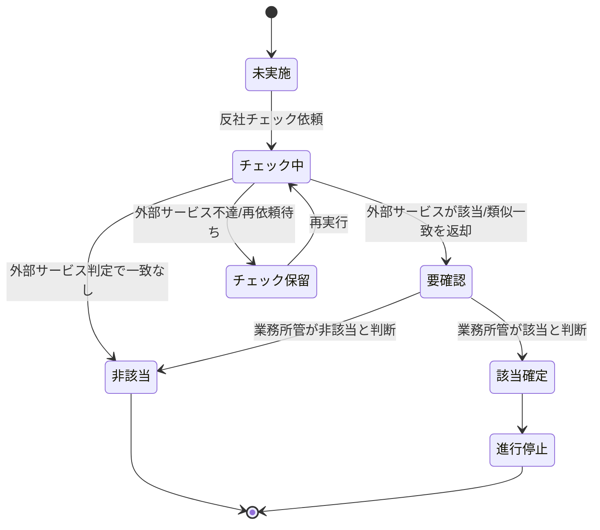

# 反社チェック要求仕様書

## 本書について

### 概要

本書は、[ドメイン定義書](../domain-definition-document#一覧)に記載されるドメインのうち、「反社チェック」に関する要求事項を記載したドキュメントです。
本書は「本ドメインとして何を満たすべきか(What)」を扱います。

### 注記

本書では原則として 具体的な実装手段(How)には踏み込みませんが、 **ビジネス・規制上譲れない本ドメイン固有のHow** は本書で確定します。

## 業務要求

### 業務ルール

本ドメイン固有の業務ルールを以下に示します。プロダクト横断で共通の要求は PRD を正典とし、ここでは再定義しません。

| ID | 業務ルール | 内容 | 根拠/制約 |
|---|---|---|---|
| ASF-BR-1 | チェック対象範囲 | 申込受付時に、申込人(契約者)・被保険者・受取人 等の契約関係者を反社会的勢力該当性のチェック対象とする | 反社会的勢力排除(PRD-REG-7) / ドメイン定義書 ASF 概要【要確認: チェック対象とする関係者の範囲(受取人・親権者等を含むか)を業務所管で確定要】 |
| ASF-BR-2 | チェック実施タイミング | 反社チェックは申込受付時に実施することを必須とする。申込内容(関係者)に変更が生じた場合は再チェックを要する | 反社会的勢力排除(PRD-REG-7) / ドメイン定義書(APPL からの参照) |
| ASF-BR-3 | 判定の一次根拠 | 反社会的勢力該当性の一次判定は外部反社チェックサービスの照合結果に基づく | ドメイン定義書 ASF 主な関心事 |
| ASF-BR-4 | 該当・要確認時の業務判断 | 外部サービスが「該当」または「要確認(類似・あいまい一致)」を返す場合、業務所管(コンプライアンス部)の確認・最終判断をチェック完了の要件とする | 反社会的勢力排除(PRD-REG-7) / PRD-SEC-5【要確認: 反社該当時の謝絶/保留/契約見送りの業務フローと決裁権限を業務所管で確定要】 |
| ASF-BR-5 | 反社該当時の契約進行停止 | 反社会的勢力に該当すると確定した場合、当該申込を契約成立へ進めず、業務所管の指示に従い謝絶等の対応を行う | 反社会的勢力排除(PRD-REG-7) |
| ASF-BR-6 | チェック未済の契約成立禁止 | 反社チェックが完了(非該当確定または業務所管の承認)していない申込は、契約成立(計上)へ進めない | 反社会的勢力排除(PRD-REG-7) / ドメイン定義書(APPL からの参照) |
| ASF-BR-7 | チェック結果の証跡保持 | 反社チェックの実施事実・照合方法・判定結果・判定日時・判定主体・業務所管の最終判断を、説明責任に耐える形で証跡として保持する | 反社会的勢力排除(PRD-REG-7) / PRD-SEC-DATA-6 / PRD-SEC-6 |
| ASF-BR-8 | 確認結果の機密性 | 反社該当・要確認の判定情報は、業務所管および職務上必要な担当者以外に開示しない。募集人・申込人本人への判定理由の開示は業務所管の方針に従う | PRD-SEC-5 / 反社会的勢力排除(PRD-REG-7)【要確認: 判定理由の開示範囲(募集人・申込人への通知有無)を業務所管で確定要】 |

### 業務状態遷移

本ドメインが管理する主要な業務対象(反社チェック案件)の業務状態と遷移を示します。

| 業務状態 | 定義 | この状態での主な制約 |
|---|---|---|
| 未実施 | 申込に対し反社チェックがまだ依頼されていない状態 | 後続の契約成立(計上)へ進めない |
| チェック中 | 反社チェック依頼を発し、外部反社チェックサービスの照合待ちの状態 | 結果確定まで契約成立扱いにしない |
| チェック保留 | 外部サービス不達等により照合が完了していない状態 | 再実行待ち。契約成立は保留 |
| 要確認 | 外部サービスが該当または類似一致を返し、業務所管の確認を要する状態 | 業務所管の判断完了まで契約成立扱いにしない。判定情報は機密扱い |
| 非該当 | 反社会的勢力に該当しないと確定した状態 | 後続工程へ進行可能 |
| 該当確定 | 反社会的勢力に該当すると確定した状態 | 契約成立へ進めない |
| 進行停止 | 該当確定により当該申込の進行を停止した状態 | 業務所管の指示に従い謝絶等の対応 |

| 遷移元 | 遷移先 | 契機 | 主体 | 前提条件 |
|---|---|---|---|---|
| 未実施 | チェック中 | 申込受付に伴う反社チェック依頼 | 募集人 / 新契約事務担当者 | 契約関係者情報が登録済み |
| チェック中 | 非該当 | 外部サービスが一致なしを返却 | 外部反社チェックサービス | 照合完了 |
| チェック中 | 要確認 | 外部サービスが該当/類似一致を返却 | 外部反社チェックサービス | 照合完了 |
| チェック中 | チェック保留 | 外部サービス不達・タイムアウト | 外部反社チェックサービス | 照合未完了 |
| チェック保留 | チェック中 | 業務上の再実行手順 | 新契約事務担当者 | 再実行可能 |
| 要確認 | 非該当 | 業務所管が非該当と判断 | コンプライアンス部 | 判断根拠が記録される |
| 要確認 | 該当確定 | 業務所管が該当と判断 | コンプライアンス部 | 判断根拠が記録される |
| 該当確定 | 進行停止 | 業務所管の指示 | コンプライアンス部 | 謝絶等の対応方針が決定 |

### 業務運用(イレギュラー対応)

正常系から外れる業務局面と、その業務上の取り扱いを以下に示します。本ドメインは外部反社チェックサービス利用を前提とするため、外部サービス不達・判定保留・再実施 等の業務運用を厚く定めます。

| ID | イレギュラー事象 | 発生契機 | 業務上の対応 |
|---|---|---|---|
| ASF-IRR-1 | 外部反社チェックサービスの不達・タイムアウト | サービス障害・通信障害・応答遅延 | チェック保留状態を維持し、業務上の再依頼手順で再実行する。一定時間内に復旧しない場合は契約成立をチェック完了まで保留する(PRD-NFR-4 縮退運用に整合) |
| ASF-IRR-2 | 外部サービスが類似・あいまい一致(要確認)を返却 | 氏名・生年月日等の部分一致 | 要確認状態へ遷移し、業務所管(コンプライアンス部)の確認・最終判断に付す。判断根拠と結果を証跡として残す(ASF-BR-4 に整合) |
| ASF-IRR-3 | 反社該当の確定 | 外部判定または業務所管判断で該当確定 | 該当確定・進行停止とし、業務所管の指示に従い謝絶等の対応を行う。経営層・コンプライアンス部へエスカレーションする(ASF-BR-5・PRD-SEC-9 に整合) |
| ASF-IRR-4 | 申込内容(関係者)の事後変更 | 受取人変更・被保険者変更 等 | 変更後の関係者に対し反社チェックを再実施し、チェック完了を取り直す(ASF-BR-2 に整合) |
| ASF-IRR-5 | チェック保留中の申込手続き中断・再開 | 申込人・募集人都合での中断 | 中断・再開時もチェック状態を保持し、再開後に保留分の再実行を継続する(PRD-FR-3 に整合) |
| ASF-IRR-6 | 判定情報の不適切参照の疑い | 機密扱い判定情報への想定外アクセス | 監査ログから参照経路を追跡し、CSIRT・コンプライアンス部へエスカレーションする(ASF-BR-8・PRD-SEC-9 に整合) |

## セキュリティ要求

### データアクセス要求

| ID | データ | PRD 機密区分との対応 | 本ドメインでの取り扱い |
|---|---|---|---|
| ASF-DATA-1 | 照合対象者情報(申込人・被保険者・関係者の照合用属性) | PRD-SEC-DATA-1 個人情報 | 保存時暗号化(PRD-SEC-4)・最小権限アクセス(PRD-SEC-5)。照合目的に限定して利用(PRD-REG-3) |
| ASF-DATA-2 | 反社チェック結果(照合方法・判定結果・判定日時・判定主体・業務所管の最終判断) | PRD-SEC-DATA-6 個人情報含む・業務上機密 | 改ざん不能保存。10年間保持(PRD-SEC-7)。該当・要確認情報は業務所管に限定し全件監査ログ対象(ASF-BR-8) |
| ASF-DATA-3 | 外部反社チェックサービスとの連携記録(依頼・応答・再実行履歴) | PRD-SEC-DATA-7 業務上機密 | 改ざん不能保存。10年間保持(PRD-SEC-7)。冪等性確保のため依頼識別子を保持(PRD-NFR-9) |

## 受け入れ基準

* チェックの網羅性: 申込受付に伴うすべての対象申込・対象関係者に対し反社チェックが実施され、未済のまま契約成立へ進む経路が存在しないこと(ASF-BR-1・ASF-BR-6)
* 法令遵守: 反社会的勢力排除の要請が業務プロセスに組み込まれ、該当時の進行停止・エスカレーションが機能することをUATで確認済みであること(PRD-REG-7)
* 証跡の十分性: チェックの実施事実・方法・結果・日時・主体・業務所管判断が改ざん不能に保持され、10年間保持方針に整合していること(ASF-BR-7・PRD-SEC-6・PRD-SEC-7)
* 機密性の確保: 該当・要確認の判定情報が業務所管および職務上必要な担当者に限定され、不適切参照が監査可能であること(ASF-BR-8・PRD-SEC-5)
* 業務状態遷移の通し確認: 正常(非該当)および異常(要確認・該当確定・外部不達・再実施)の各経路が業務として収束することを確認済みであること
* 外部連携の堅牢性: 外部反社チェックサービスの不達・要確認・タイムアウト時の再実行・縮退運用シナリオが確認済みであること(PRD-NFR-4・PRD-NFR-9)
