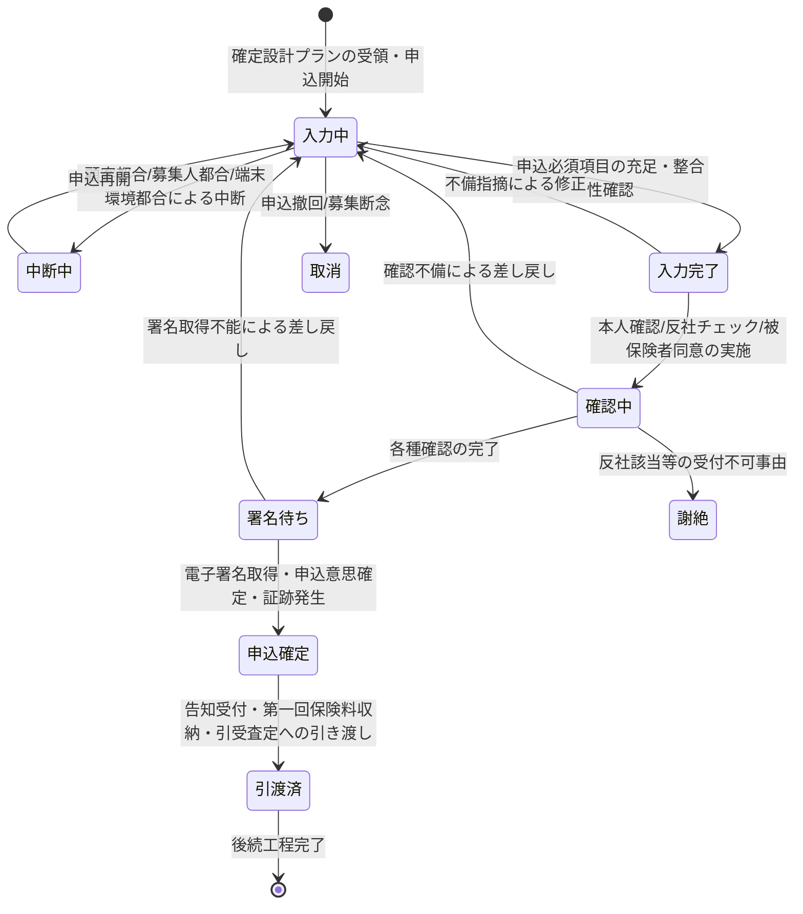

# 申込受付要求仕様書

## 本書について

### 概要

本書は、[ドメイン定義書](../domain-definition-document#一覧)に記載されるドメインのうち、「申込受付」に関する要求事項を記載したドキュメントです。
本書は「本ドメインとして何を満たすべきか(What)」を扱います。

### 注記

本書では原則として 具体的な実装手段(How)には踏み込みませんが、 **ビジネス・規制上譲れない本ドメイン固有のHow** は本書で確定します。

## 業務要求

### 業務ルール

本ドメインは「申込意思の確定・申込データの完全性確保」を担うドメインですが、横断的な水準・方針・原則(保険業法・保険法・犯収法・電子帳簿保存法・反社チェック義務 等の法令準拠、外部連携の縮退運用・冪等性、業務の中断/再開 等)は **ドメイン共通要求仕様書** が単独責務として扱います。本書は **並列の関係** にあり、共通要求と内容が重ならない当該ドメイン固有の業務ルール(確定設計プラン起点・申込項目の完全性・入力時点抑止・関係性整合・横断確認結果の必須性・募集権限内受付・申込意思確定の証跡発生・後続工程への引き渡し範囲)のみを記述します。

| ID | 業務ルール | 内容 | 根拠/制約 |
|---|---|---|---|
| DOM-APPL-BR-1 | 確定設計プランを起点とする申込 | 申込は DESIGN で確定・引き渡された設計プランを起点とする。確定プランがない状態で申込を確定してはならない | ドメイン定義書 DESIGN→APPL 連携 / ドメイン定義書「申込データの完全性」 |
| DOM-APPL-BR-2 | 申込項目の完全性 | 申込人・被保険者・受取人の情報、保険料払込方法、受取人指定 等の申込必須項目を完全に取得する。必須項目の欠落・項目間の不整合(関連項目の矛盾)がある状態で申込意思を確定してはならない | ドメイン定義書「不備削減」「申込データの完全性」 / PRD 体験設計「不備の発生抑止」 |
| DOM-APPL-BR-3 | 入力時点での不備抑止 | 申込不備は受付後の事後検知ではなく入力時点での必須・整合性・関連項目矛盾チェックで発生を抑止する。前工程(設計・意向)からの引き継ぎ精度も不備発生源として扱う | BRD KPI「不備返戻率5%以下」 / PRD 体験設計「不備の発生抑止」 |
| DOM-APPL-BR-4 | 申込人・被保険者・受取人の関係性整合 | 申込人・被保険者・受取人の関係性が保険契約上適正であること(被保険者同意の要否判定、受取人指定の適正性を含む)を業務上検証する。被保険者の同意が必要な契約形態で同意が確認できない申込を確定してはならない | 保険法(被保険者・受取人の権利保護) / 生命保険新契約実務 |
| DOM-APPL-BR-5 | 本人確認の完了 | 申込時の取引時確認(本人確認)を実施し、確認未了の申込を契約成立工程へ引き渡してはならない | 犯罪収益移転防止法 / ドメイン定義書 APPL→KYC 連携 |
| DOM-APPL-BR-6 | 反社チェックの実施 | 申込人・被保険者・関係者の反社会的勢力該当性確認を実施する。反社該当が確認された申込は受け付けず所定の業務手続に回す | 反社会的勢力排除 / ドメイン定義書 APPL→ASF 連携 |
| DOM-APPL-BR-7 | 申込意思の電子署名による確定 | 申込意思の確定は申込人(被保険者同意を要する場合は被保険者を含む)の電子署名取得をもって行う。電子署名が取得できない申込を確定済みとしてはならない | 電子帳簿保存法(真実性確保の業務上の前提) / ドメイン定義書 APPL→ESIGN 連携 |
| DOM-APPL-BR-8 | 募集人の取扱権限内での受付 | 申込を受け付ける募集人は対象顧客・商品種別について募集権限を有していなければならない。権限外募集人による申込受付を行わない。募集権限の判定は外部システム(募集人管理システム `EXT-CHNL-MASTER`)を参照する | 保険業法(募集人登録義務) / ドメイン定義書 APPL→EXT-CHNL-MASTER 連携 |
| DOM-APPL-BR-9 | 申込受付の証跡発生 | 申込意思の確定(いつ・誰が・どの内容で・どの確認を経て)を募集コンプライアンス証跡として発生させる。証跡が欠落した申込を完了扱いしてはならない | 金融庁監督指針 / 保険業法 / ドメイン定義書 APPL→SUIT 連携 |
| DOM-APPL-BR-10 | 後続工程への完全な引き渡し | 確定申込は告知受付・第一回保険料収納・引受査定 が必要とする項目を欠落なく引き渡す。本人確認・反社・電子署名・募集権限の確認結果を申込の完全性の構成要素とする | ドメイン定義書「申込データの完全性」 / ドメイン定義書 APPL→DECL/PREM 連携 |

<!-- HINT(リファクタ経緯):
本表は並列モデル化により、各 BR の「根拠/制約」列からドメイン共通要求 ID(`DOM-COMMON-*`)への参照を削除した。本書とドメイン共通要求は並列の関係(参照関係を持たない)であり、保険業法・保険法・犯収法・電子帳簿保存法・反社チェック義務 等の法令準拠、外部連携の縮退運用・冪等性、業務の中断/再開 等の横断的な水準・方針・原則は共通要求側に単独責務がある。BR の削除はなく、参照削除のみ。BR-5/BR-6/BR-7 は本ドメイン固有の責務境界(本ドメインが KYC・ASF・ESIGN に依頼する業務契機と、確認未済時の業務継続停止)を主題とするため残置している。
-->

### 業務状態遷移

本ドメインが管理する主要な業務対象である「申込」の業務状態と遷移を示します。

| 業務状態 | 定義 | この状態での主な制約 |
|---|---|---|
| 入力中 | 申込情報を入力・編集している状態 | 後続工程へ引き渡し不可。申込は暫定扱い |
| 中断中 | 申込入力を一時中断している状態 | 入力済みデータを保持する。再開まで確定不可 |
| 入力完了 | 申込必須項目が充足し整合性が確認された状態 | 各種確認(本人確認・反社・同意)未了の間は確定不可 |
| 確認中 | 本人確認・反社チェック・被保険者同意 等を実施中の状態 | 確認結果が出るまで署名・確定不可 |
| 署名待ち | 各種確認が完了し電子署名取得待ちの状態 | 署名取得まで申込確定不可 |
| 申込確定 | 電子署名が取得され申込意思が確定し証跡が発生した状態 | 後続工程へ引き渡し可。変更は追跡記録 |
| 引渡済 | 確定申込を後続工程へ引き渡した状態 | 不備差し戻し時は入力中へ戻す |
| 取消 | 申込撤回・募集断念で申込が成立しなかった状態 | 引き渡し不可。証跡保全 |
| 謝絶 | 反社該当等の受付不可事由で受け付けなかった状態 | 引き渡し不可。所定の業務手続へ。証跡保全 |

| 遷移元 | 遷移先 | 契機 | 主体 | 前提条件 |
|---|---|---|---|---|
| (開始) | 入力中 | 確定設計プランの受領・申込開始 | 募集人 | DESIGN のプランが確定・引渡済 |
| 入力中 | 中断中 | 顧客都合/募集人都合/端末環境都合による中断 | 募集人 | 入力済みデータの保持 |
| 中断中 | 入力中 | 申込再開 | 募集人 | 再開期限内 |
| 入力中 | 入力完了 | 申込必須項目の充足・整合性確認 | 募集人 | 必須項目網羅・項目間矛盾なし |
| 入力完了 | 確認中 | 本人確認/反社/被保険者同意の実施 | 募集人/申込人・被保険者 | 入力完了・募集人の募集権限 |
| 確認中 | 署名待ち | 各種確認の完了 | システム連携先(KYC/ASF) | 本人確認完了・反社非該当・必要な同意取得 |
| 署名待ち | 申込確定 | 電子署名取得・申込意思確定・証跡発生 | 申込人(必要時被保険者) | 電子署名取得・募集コンプライアンス証跡発生 |
| 申込確定 | 引渡済 | 告知受付/第一回保険料収納/引受査定への引き渡し | 募集人/事務担当者 | 申込確定済・確認結果欠落なし |
| 入力中 | 取消 | 申込撤回/募集断念 | 募集人/申込人 | 証跡保全 |
| 確認中 | 謝絶 | 反社該当等の受付不可事由 | 事務担当者 | 所定の業務手続・証跡保全 |

### 業務運用(イレギュラー対応)

正常系から外れる業務局面と、その業務上の取り扱いを以下に示します。

| ID | イレギュラー事象 | 発生契機 | 業務上の対応 |
|---|---|---|---|
| DOM-APPL-IRR-1 | 申込不備の検知 | 必須項目欠落・項目間矛盾・前工程引き継ぎの齟齬 | 入力中へ差し戻し、不備内容と是正方法を業務上明示する。事後検知ではなく入力時点抑止を優先する(DOM-APPL-BR-3 に整合) |
| DOM-APPL-IRR-2 | 本人確認が完了しない | 外部本人確認サービスの不達・確認結果不一致 | 確認未了の申込を後続へ引き渡さない。再実施を業務上促す。一定期間内に完了しない場合は申込を保留・取消の業務判断に回す |
| DOM-APPL-IRR-3 | 反社該当が確認された | 反社チェックで該当判定 | 申込を謝絶とし所定の業務手続へ回す。判定根拠・対応を証跡として保全する |
| DOM-APPL-IRR-4 | 電子署名が取得できない | 申込人/被保険者の署名不能・外部電子署名サービス不達 | 署名待ちのまま申込を確定させない。署名取得手段の代替提示または差し戻しとする |
| DOM-APPL-IRR-5 | 被保険者同意が確認できない | 申込人と被保険者が異なる契約で被保険者の同意未取得 | 被保険者同意の要否判定に従い、同意未確認の申込を確定させない。被保険者本人への確認を業務上促す(DOM-APPL-BR-4 に整合) |
| DOM-APPL-IRR-6 | 外部連携障害時の業務継続 | KYC・反社・電子署名・決済 等の外部連携障害 | 申込入力・保留は継続可とし、確認・確定は外部連携回復後に行う |
| DOM-APPL-IRR-7 | 申込の長時間中断・撤回 | 顧客都合での長期中断・申込撤回 | 入力済みデータを保持し中断中とする。撤回時は取消とし証跡を保全する |
| DOM-APPL-IRR-8 | 募集権限外/権限失効中の受付試行 | 担当変更・募集人登録の失効 | 権限外の申込受付を行わず、適正な権限を有する募集人への引き継ぎを業務上促す(DOM-APPL-BR-8 に整合) |

## セキュリティ要求

### データアクセス要求

| ID | データ | 機密区分 | 本ドメインでの取り扱い |
|---|---|---|---|
| DOM-APPL-DATA-1 | 申込情報(プラン内容・保険料・払込方法・受取人指定) | 個人情報・業務上機密 | 募集人は自身が関与する申込のみアクセス可。確定後の変更は追跡記録 |
| DOM-APPL-DATA-2 | 申込人・被保険者・受取人の属性・関係性 | 個人情報 | CUST と連携。役割×組織×目的に基づく最小権限制御 |
| DOM-APPL-DATA-3 | 本人確認・反社チェック結果(参照・証跡) | 個人情報含む・業務上機密 | KYC/ASF を正典として結果を参照し申込完全性の構成要素とする |
| DOM-APPL-DATA-4 | 電子署名取得証跡 | 個人情報含む・業務上機密 | ESIGN と連携。署名取得事実を申込確定の前提として保持 |
| DOM-APPL-DATA-5 | 申込受付・申込意思確定の募集コンプライアンス証跡 | 個人情報含む・業務上機密 | SUIT へ連携。参照は限定 |
| DOM-APPL-DATA-6 | 個人情報取得に係る本人同意記録 | 個人情報 | 取得・利用目的と同意・撤回の事実を保持 |

## 受け入れ基準

* 申込データの完全性: 必須項目欠落・項目間矛盾がある状態で申込意思を確定できないことが業務シナリオで確認できる(DOM-APPL-BR-2・DOM-APPL-BR-3)
* 横断連携の確実性: 本人確認・反社チェック・電子署名の各確認結果が欠落した申込を後続へ引き渡せないことが確認できる(DOM-APPL-BR-5・DOM-APPL-BR-6・DOM-APPL-BR-7・DOM-APPL-BR-10)
* 関係性整合: 被保険者同意が必要な契約形態で同意未確認の申込を確定できないことが確認できる(DOM-APPL-BR-4・DOM-APPL-IRR-5)
* 不備削減: 入力時点での不備抑止が機能し、事後返戻ではなく入力時点で不備が解消される業務動線が確認できる(DOM-APPL-BR-3・BRD KPI 不備返戻率5%以下)
* 募集コンプライアンス証跡: 申込意思確定の証跡が発生し SUIT へ連携されることが確認できる(DOM-APPL-BR-9・DOM-APPL-DATA-5)
* 募集権限内受付の遵守: 募集権限外の申込受付が業務上抑止され、権限失効時の引き継ぎが促されることが確認できる(DOM-APPL-BR-8・DOM-APPL-IRR-8)
* 主要業務状態遷移の通し確認: 入力中→入力完了→確認中→署名待ち→申込確定→引渡済 の正常系、および不備差し戻し・謝絶・取消・外部連携障害の異常系が通しで確認できる
