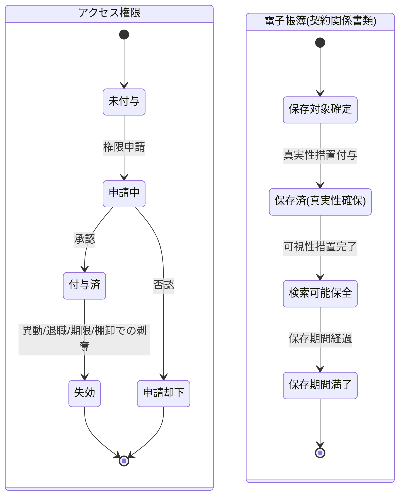

# 統制・証跡管理(アクセス制御・監査ログ・電子帳簿保存)要求仕様書

## 本書について

### 概要

本書は、[ドメイン定義書](../domain-definition-document.md#一覧)に記載されるドメインのうち、「統制・証跡管理(アクセス制御・監査ログ・電子帳簿保存)」に関する要求事項を記載したドキュメントです。
本書は「本ドメインとして何を満たすべきか(What)」を扱います。

### 注記

本書では原則として 具体的な実装手段(How)には踏み込みませんが、 **ビジネス・規制上譲れない本ドメイン固有のHow** は本書で確定します。

## 業務要求

### 業務ルール

本ドメインは「統制責務」を担うドメインですが、横断的な水準・方針・原則(RBAC 方針・改ざん不能性・保持期間・電子帳簿保存法対応 等)は **ドメイン共通要求仕様書** が単独責務として扱います。本書は **並列の関係** にあり、共通要求と内容が重ならない当該ドメイン固有の業務ルール(スコープ・粒度・対象集合・運用サイクル)のみを記述します。

| ID | 業務ルール | 内容 | 根拠/制約 |
|---|---|---|---|
| DOM-AUDIT-BR-1 | 権限付与・変更・剥奪の業務手続き | 権限の付与・変更・剥奪は申請・承認の業務手続きを経る。職務上の必要性が示されたうえで業務所管が承認し、付与後の権限行使は職務分掌に整合させる | ドメイン定義書 AUDIT 主な関心事 / 業界一般知識(内部統制実務)【要確認: 権限申請・承認の決裁ルート(所属長承認・コンプライアンス部承認の要否)を業務所管で確定要】 |
| DOM-AUDIT-BR-4 | 監査対象業務イベントの確定 | 本プロダクトで監査ログに記録すべき業務イベントを当該ドメインで確定する。具体的には、個人情報・契約データへのアクセス・操作・参照、権限の付与/変更/剥奪、証跡参照、ログ改変試行 を監査対象業務イベントとし、各業務工程ドメインから収集する | ドメイン定義書 AUDIT 主な関心事 / 業界一般知識(内部統制実務) |
| DOM-AUDIT-BR-9 | 監査証跡の説明可能性 | 内部監査部・第三者セキュリティ診断・コンプライアンス部・(必要時)監督官庁 の求めに応じ、改ざんされていない証跡を **説明可能な形で提供する業務プロセス** を整備する。請求の受領・対応期限・提供範囲の判定・回付の手順を業務として定義する | ドメイン定義書 AUDIT 主な関心事 / 業界一般知識(内部監査実務) |
| DOM-AUDIT-BR-10 | アクセス権限の定期棚卸 | 付与済みアクセス権限の妥当性を定期的に棚卸し、不要権限・退職者/異動者の権限を剥奪する運用サイクルを定める | ドメイン定義書 AUDIT 主な関心事 / 業界一般知識(内部統制実務)【要確認: 権限棚卸の実施頻度(四半期/半期 等)を業務所管で確定要】 |

<!-- HINT(リファクタ経緯):
本表は並列モデル化(Step2 試験実施)により、共通要求の言い換えになっていた BR(旧 BR-2/3/5/6/7/8)を削除し、各 BR の「根拠/制約」列からドメイン共通要求 ID(`DOM-COMMON-*`)への参照も削除した。本書とドメイン共通要求は並列の関係(参照関係を持たない)であり、横断的な水準・方針・原則は共通要求側に単独責務がある。ID 連番は欠番のまま維持し、横展開完了後に一括リナンバリングする予定。
-->

### 業務状態遷移

本ドメインが管理する主要な業務対象は、(1) アクセス権限付与、(2) 電子保存される契約関係書類(電子帳簿)です。両者の業務状態と遷移を示します。

| 業務状態 | 定義 | この状態での主な制約 |
|---|---|---|
| 未付与 | 利用者にアクセス権限が付与されていない状態 | 統制対象データへアクセス不可 |
| 申請中 | 権限付与・変更を申請し承認待ちの状態 | 承認完了まで権限は有効化されない |
| 付与済 | アクセス権限が有効な状態 | 最小権限の範囲内でのみ利用可。参照は監査ログ対象 |
| 申請却下 | 権限申請が否認された状態 | 権限は付与されない |
| 失効 | 異動・退職・期限・棚卸により権限が剥奪された状態 | 統制対象データへアクセス不可 |
| 保存対象確定 | 電子保存すべき契約関係書類が確定した状態 | 真実性措置前は正式保存扱いにしない |
| 保存済(真実性確保) | 改ざん検証可能な措置を付与し保存した状態 | 内容改変を許容しない |
| 検索可能保全 | 可視性要件(検索)を満たし保全された状態 | 保存期間中は改変・消失を許容しない |
| 保存期間満了 | 保存期間が満了した状態 | 規程に基づく廃棄手続き対象 |

| 遷移元 | 遷移先 | 契機 | 主体 | 前提条件 |
|---|---|---|---|---|
| 未付与 | 申請中 | 権限の付与・変更申請 | 利用者所属長 / 業務所管 | 職務上の必要性が示される |
| 申請中 | 付与済 | 承認 | 業務所管(承認権限者) | 最小権限・職務分掌に整合 |
| 申請中 | 申請却下 | 否認 | 業務所管(承認権限者) | 必要性が認められない |
| 付与済 | 失効 | 異動・退職・期限到来・定期棚卸 | 業務所管 / 人事連携 | 権限保持の前提が消滅 |
| 保存対象確定 | 保存済(真実性確保) | 真実性措置(タイムスタンプ等)の付与 | 統制・証跡管理(業務所管) | 保存対象書類が確定 |
| 保存済(真実性確保) | 検索可能保全 | 可視性措置(検索要件)の充足 | 統制・証跡管理(業務所管) | 真実性措置が完了 |
| 検索可能保全 | 保存期間満了 | 保存期間経過 | 統制・証跡管理(業務所管) | 保持期間が満了 |

### 業務運用(イレギュラー対応)

正常系から外れる業務局面と、その業務上の取り扱いを以下に示します。

| ID | イレギュラー事象 | 発生契機 | 業務上の対応 |
|---|---|---|---|
| DOM-AUDIT-IRR-1 | 権限を超えたアクセスの試行・検知 | 最小権限を超える参照・操作の試行 | アクセスを拒否し、試行を改ざん不能に記録する。要配慮個人情報への不正アクセス疑いはCSIRT・コンプライアンス部へエスカレーションする |
| DOM-AUDIT-IRR-2 | 監査ログ自体への改変試行 | ログの改ざん・削除の試行 | 改変試行を別系統で全件追跡し、内部監査部・CSIRTへエスカレーションする(DOM-AUDIT-BR-4 が定義する監査対象業務イベントに含む) |
| DOM-AUDIT-IRR-3 | 退職者・異動者の権限残存 | 人事異動・退職に伴う剥奪漏れ | 定期棚卸・人事連携で検知し、即時に権限を失効させる。残存期間中のアクセス有無を監査ログで遡及確認する(DOM-AUDIT-BR-10 に整合) |
| DOM-AUDIT-IRR-4 | 電子帳簿の真実性・可視性要件の不充足 | 真実性措置の付与失敗・検索要件の不備 | 当該書類を正式保存扱いとせず、真実性・可視性措置を再充足する。是正までの経緯を証跡として残す |
| DOM-AUDIT-IRR-5 | 保存期間内の証跡消失・破損の疑い | ストレージ障害・運用ミス 等 | 消失・破損範囲を特定し、保全手段で復元を図る。復元不能時はコンプライアンス部・内部監査部へエスカレーションし、影響と再発防止を記録する |
| DOM-AUDIT-IRR-6 | 緊急時の例外的アクセス(ブレイクグラス) | 障害対応・インシデント対応での特権行使 | 事前承認または事後速やかな承認を要件とし、行使内容を全件記録のうえ事後レビューに付す【要確認: 緊急時例外アクセスの承認方式(事前/事後)を業務所管で確定要】 |
| DOM-AUDIT-IRR-7 | 第三者セキュリティ診断での重大指摘 | リリース前診断での統制不備指摘 | 指摘事項を業務所管で受領し、是正完了をリリース判定の必須条件とする(DOM-AUDIT-BR-9 が定義する説明可能性業務プロセスで対応) |

## セキュリティ要求

### データアクセス要求

| ID | データ | 機密区分 | 本ドメインでの取り扱い |
|---|---|---|---|
| DOM-AUDIT-DATA-1 | 監査ログ・操作ログ(アクセス・操作・参照・権限変更・ログ改変試行) | 業務上機密 | 本ドメインが直接管理する中核データ |
| DOM-AUDIT-DATA-2 | アクセス権限・役割定義(役割×組織×商品×募集チャネル、特権権限) | 業務上機密 | 厳格管理。付与・変更・剥奪の履歴を保持。定期棚卸対象(DOM-AUDIT-BR-10) |
| DOM-AUDIT-DATA-3 | 電子保存される契約関係書類(申込書・告知書・契約関係書類)の保全メタ情報 | 個人情報含む・業務上機密 | 真実性措置(タイムスタンプ等)・可視性措置(検索要件)を保持 |
| DOM-AUDIT-DATA-4 | 統制対象データのアクセス可否判定の根拠(役割・組織・目的の評価記録) | 業務上機密 | 判定根拠を追跡可能に保持し監査に供する(DOM-AUDIT-BR-4 が定義する監査対象業務イベントの一部) |

## 受け入れ基準

* 権限申請・承認の業務手続きの運用: 権限の付与・変更・剥奪が申請・承認の業務手続きを経て運用されていることをUATで確認済みであること(DOM-AUDIT-BR-1)
* 監査対象業務イベントの網羅: 当該ドメインで確定した監査対象(個人情報・契約データのアクセス・操作・参照、権限の付与/変更/剥奪、証跡参照、ログ改変試行)が各業務工程ドメインから漏れなく収集されることを確認済みであること(DOM-AUDIT-BR-4)
* 監査対応プロセスの整備: 内部監査部・第三者セキュリティ診断・コンプライアンス部の求めに対し、説明可能な形で証跡を提供する業務プロセスが整備・運用されていること(DOM-AUDIT-BR-9)
* 定期棚卸サイクルの運用: 付与済みアクセス権限の定期棚卸が業務手順で実施され、退職者・異動者の権限が即時失効される運用が確認済みであること(DOM-AUDIT-BR-10)
* 業務状態遷移の通し確認: 権限付与/失効および電子帳簿の保存対象確定〜保存期間満了の各経路、ならびに不正アクセス・改変試行・権限残存・証跡消失・ブレイクグラスの異常局面が業務として収束することを確認済みであること(DOM-AUDIT-IRR-1〜7)
