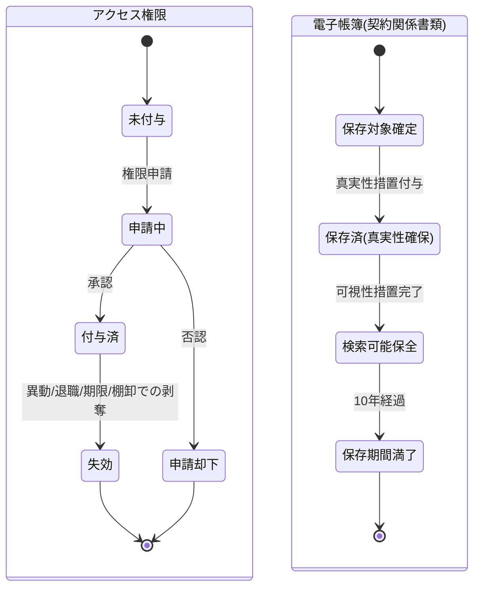

# 統制・証跡管理(アクセス制御・監査ログ・電子帳簿保存)要求仕様書

## 本書について

### 概要

本書は、[ドメイン定義書](../domain-definition-document#一覧)に記載されるドメインのうち、「統制・証跡管理(アクセス制御・監査ログ・電子帳簿保存)」に関する要求事項を記載したドキュメントです。
本書は「本ドメインとして何を満たすべきか(What)」を扱います。

### 注記

本書では原則として 具体的な実装手段(How)には踏み込みませんが、 **ビジネス・規制上譲れない本ドメイン固有のHow** は本書で確定します。

## 業務要求

### 業務ルール

本ドメイン固有の業務ルールを以下に示します。プロダクト横断で共通の要求(RBAC方針・監査ログ対象・保存期間 等の水準)は PRD-SEC-* を正典とし、ここでは本ドメインの統制責務としての運用ルールを定めます。

| ID | 業務ルール | 内容 | 根拠/制約 |
|---|---|---|---|
| AUDIT-BR-1 | 役割・権限の付与原則 | 利用者への権限付与は職務上必要な最小範囲とし、役割×組織×商品×募集チャネルの組合せで制御する。権限付与・変更・剥奪は申請・承認の業務手続きを経る | PRD-SEC-5 / ドメイン定義書 AUDIT 主な関心事【要確認: 権限申請・承認の決裁ルート(所属長承認・コンプライアンス部承認の要否)を業務所管で確定要】 |
| AUDIT-BR-2 | 要配慮個人情報へのアクセス限定 | 告知情報等の要配慮個人情報へのアクセスは、引受査定担当者・限定された業務担当者のみに限定し、参照を全件証跡化する | PRD-SEC-DATA-2 / PRD-REG-3 |
| AUDIT-BR-3 | 特権アクセスの分離管理 | 特権アクセス(管理者操作・データ直接操作 等)は通常権限と別系統で管理し、付与・行使を厳格に統制・記録する | PRD-SEC-5 |
| AUDIT-BR-4 | 監査ログの記録対象 | 個人情報・契約データへのアクセス・操作・参照、権限の付与/変更/剥奪、証跡の参照、ログ自体への改変試行 を記録対象とする | PRD-SEC-6 / PRD-SEC-DATA-7 |
| AUDIT-BR-5 | 監査ログの改ざん不能性 | 監査ログは事後の改変・削除ができない形で保全し、ログ自体への改変試行も全件追跡可能とする | PRD-SEC-6 / ドメイン定義書 AUDIT 主な関心事 |
| AUDIT-BR-6 | 証跡の保存期間 | 監査ログ・契約関係の証跡は10年間保持する。保持期間中の消失・改変を許容しない | PRD-SEC-7 / PRD-REG-5 |
| AUDIT-BR-7 | 電子帳簿保存の真実性確保 | 電子保存される申込書・告知書・契約関係書類について、保存後の改ざんの有無を事後検証できる状態(タイムスタンプ等)で保全する | 電子帳簿保存法(PRD-REG-5) / ドメイン定義書 AUDIT 主な関心事 |
| AUDIT-BR-8 | 電子帳簿保存の可視性確保 | 電子保存される契約関係書類は、取引年月日・取引金額・取引先 等の条件で検索・速やかに参照可能な状態で保全する | 電子帳簿保存法 可視性要件(PRD-REG-5)【要確認: 電子帳簿保存法上の検索要件(検索項目の確定範囲)を業務所管で確定要】 |
| AUDIT-BR-9 | 内部監査・第三者診断への証跡提供 | 内部監査部・第三者セキュリティ診断・コンプライアンス部・(必要時)監督官庁 の求めに応じ、改ざんされていない証跡を説明可能な形で提供する | PRD-SEC-8 / PRD-REG-6 / ドメイン定義書 AUDIT 主な関心事 |
| AUDIT-BR-10 | アクセス権限の定期棚卸 | 付与済みアクセス権限の妥当性を定期的に棚卸し、不要権限・退職者/異動者の権限を剥奪する | PRD-SEC-5 / PRD-SEC-1【要確認: 権限棚卸の実施頻度(四半期/半期 等)を業務所管で確定要】 |

### 業務状態遷移

本ドメインが管理する主要な業務対象は、(1) アクセス権限付与、(2) 電子保存される契約関係書類(電子帳簿)です。両者の業務状態と遷移を示します。

| 業務状態 | 定義 | この状態での主な制約 |
|---|---|---|
| 未付与 | 利用者にアクセス権限が付与されていない状態 | 統制対象データへアクセス不可 |
| 申請中 | 権限付与・変更を申請し承認待ちの状態 | 承認完了まで権限は有効化されない |
| 付与済 | アクセス権限が有効な状態 | 最小権限の範囲内でのみ利用可。参照は監査ログ対象 |
| 申請却下 | 権限申請が否認された状態 | 権限は付与されない |
| 失効 | 異動・退職・期限・棚卸により権限が剥奪された状態 | 統制対象データへアクセス不可 |
| 保存対象確定 | 電子保存すべき契約関係書類が確定した状態 | 真実性措置前は正式保存扱いにしない |
| 保存済(真実性確保) | 改ざん検証可能な措置を付与し保存した状態 | 内容改変を許容しない |
| 検索可能保全 | 可視性要件(検索)を満たし保全された状態 | 保存期間中は改変・消失を許容しない |
| 保存期間満了 | 10年の保存期間が満了した状態 | 規程に基づく廃棄手続き対象 |

| 遷移元 | 遷移先 | 契機 | 主体 | 前提条件 |
|---|---|---|---|---|
| 未付与 | 申請中 | 権限の付与・変更申請 | 利用者所属長 / 業務所管 | 職務上の必要性が示される |
| 申請中 | 付与済 | 承認 | 業務所管(承認権限者) | 最小権限・職務分掌に整合 |
| 申請中 | 申請却下 | 否認 | 業務所管(承認権限者) | 必要性が認められない |
| 付与済 | 失効 | 異動・退職・期限到来・定期棚卸 | 業務所管 / 人事連携 | 権限保持の前提が消滅 |
| 保存対象確定 | 保存済(真実性確保) | 真実性措置(タイムスタンプ等)の付与 | 統制・証跡管理(業務所管) | 保存対象書類が確定 |
| 保存済(真実性確保) | 検索可能保全 | 可視性措置(検索要件)の充足 | 統制・証跡管理(業務所管) | 真実性措置が完了 |
| 検索可能保全 | 保存期間満了 | 10年の保存期間経過 | 統制・証跡管理(業務所管) | 保持期間が満了 |

### 業務運用(イレギュラー対応)

正常系から外れる業務局面と、その業務上の取り扱いを以下に示します。

| ID | イレギュラー事象 | 発生契機 | 業務上の対応 |
|---|---|---|---|
| AUDIT-IRR-1 | 権限を超えたアクセスの試行・検知 | 最小権限を超える参照・操作の試行 | アクセスを拒否し、試行を改ざん不能に記録する。要配慮個人情報への不正アクセス疑いはCSIRT・コンプライアンス部へエスカレーションする(PRD-SEC-9 に整合) |
| AUDIT-IRR-2 | 監査ログ自体への改変試行 | ログの改ざん・削除の試行 | 改変試行を別系統で全件追跡し、内部監査部・CSIRTへエスカレーションする(AUDIT-BR-5・PRD-SEC-9 に整合) |
| AUDIT-IRR-3 | 退職者・異動者の権限残存 | 人事異動・退職に伴う剥奪漏れ | 定期棚卸・人事連携で検知し、即時に権限を失効させる。残存期間中のアクセス有無を監査ログで遡及確認する(AUDIT-BR-10 に整合) |
| AUDIT-IRR-4 | 電子帳簿の真実性・可視性要件の不充足 | 真実性措置の付与失敗・検索要件の不備 | 当該書類を正式保存扱いとせず、真実性・可視性措置を再充足する。是正までの経緯を証跡として残す(AUDIT-BR-7・AUDIT-BR-8・PRD-REG-5 に整合) |
| AUDIT-IRR-5 | 保存期間内の証跡消失・破損の疑い | ストレージ障害・運用ミス 等 | 消失・破損範囲を特定し、保全手段で復元を図る。復元不能時はコンプライアンス部・内部監査部へエスカレーションし、影響と再発防止を記録する(AUDIT-BR-6 に整合) |
| AUDIT-IRR-6 | 緊急時の例外的アクセス(ブレイクグラス) | 障害対応・インシデント対応での特権行使 | 事前承認または事後速やかな承認を要件とし、行使内容を全件記録のうえ事後レビューに付す(AUDIT-BR-3 に整合)【要確認: 緊急時例外アクセスの承認方式(事前/事後)を業務所管で確定要】 |
| AUDIT-IRR-7 | 第三者セキュリティ診断での重大指摘 | リリース前診断での統制不備指摘 | 指摘事項を業務所管で受領し、是正完了をリリース判定の必須条件とする(PRD-SEC-8 に整合) |

## セキュリティ要求

### データアクセス要求

| ID | データ | PRD 機密区分との対応 | 本ドメインでの取り扱い |
|---|---|---|---|
| AUDIT-DATA-1 | 監査ログ・操作ログ(アクセス・操作・参照・権限変更・ログ改変試行) | PRD-SEC-DATA-7 業務上機密 | 本ドメインが直接管理する中核データ。改ざん不能保存。10年間保持(PRD-SEC-7・AUDIT-BR-6) |
| AUDIT-DATA-2 | アクセス権限・役割定義(役割×組織×商品×募集チャネル、特権権限) | PRD-SEC-DATA-7 業務上機密 | 厳格管理。付与・変更・剥奪の履歴を改ざん不能に保持。定期棚卸対象(AUDIT-BR-10) |
| AUDIT-DATA-3 | 電子保存される契約関係書類(申込書・告知書・契約関係書類)の保全メタ情報 | PRD-SEC-DATA-6 個人情報含む・業務上機密 | 真実性措置(タイムスタンプ等)・可視性措置(検索要件)を保持。改ざん不能保存。10年間保持(PRD-REG-5・PRD-SEC-7) |
| AUDIT-DATA-4 | 統制対象データのアクセス可否判定の根拠(役割・組織・目的の評価記録) | PRD-SEC-DATA-7 業務上機密 | 改ざん不能保存。判定根拠を追跡可能に保持し監査に供する(PRD-SEC-5・PRD-SEC-6) |

## 受け入れ基準

* アクセス制御の有効性: 役割×組織×商品×募集チャネルの最小権限制御が機能し、要配慮個人情報へのアクセスが職務上必要な担当者に限定されていることをUATで確認済みであること(AUDIT-BR-1・AUDIT-BR-2・PRD-SEC-5)
* 監査ログの改ざん不能性: 個人情報・契約データへのアクセス・操作・参照、およびログ自体への改変試行が改ざん不能に記録・追跡できることを確認済みであること(AUDIT-BR-4・AUDIT-BR-5・PRD-SEC-6)
* 保存期間の充足: 監査ログ・契約関係証跡が10年間、消失・改変なく保持される運用が確認済みであること(AUDIT-BR-6・PRD-SEC-7)
* 電子帳簿保存法遵守: 電子保存される契約関係書類の真実性確保・可視性確保(検索要件)が業務プロセスに組み込まれ、UATで遵守状況を確認済みであること(AUDIT-BR-7・AUDIT-BR-8・PRD-REG-5)
* 監査対応: 内部監査部・第三者セキュリティ診断・コンプライアンス部の求めに対し、改ざんされていない証跡を説明可能な形で提供でき、リリース前診断の重大指摘がゼロであること(AUDIT-BR-9・PRD-SEC-8)
* 業務状態遷移の通し確認: 権限付与/失効および電子帳簿の保存対象確定〜保存期間満了の各経路、ならびに不正アクセス・改変試行・権限残存・証跡消失の異常局面が業務として収束することを確認済みであること
* 継承 PRD 要求の充足: 本書が継承する PRD セキュリティ・法務横断要求が本ドメインの統制責務として充足されていること
