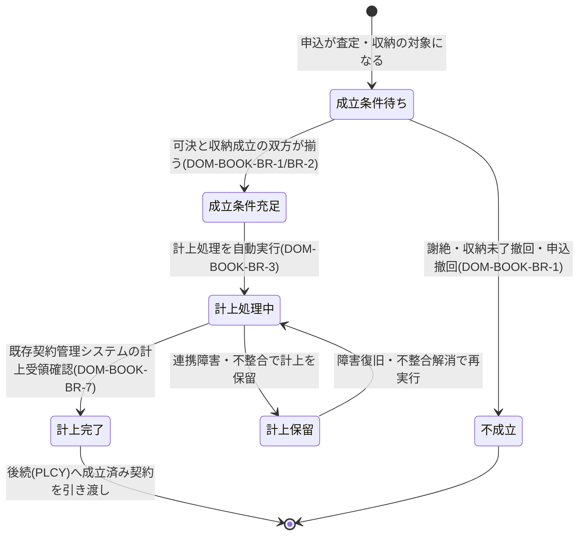

# 契約成立(計上)要求仕様書

## 本書について

### 概要

本書は、[ドメイン定義書](../domain-definition-document.md#一覧)に記載されるドメインのうち、「契約成立(計上)」に関する要求事項を記載したドキュメントです。
本書は「本ドメインとして何を満たすべきか(What)」を扱います。

### 注記

本書では原則として 具体的な実装手段(How)には踏み込みませんが、 **ビジネス・規制上譲れない本ドメイン固有のHow** は本書で確定します。

## 業務要求

### 業務ルール

本ドメインは「引受可決と第一回保険料収納成立の双方完了による契約成立判定と既存契約管理システムへの計上連携」を担うドメインですが、横断的な水準・方針・原則(外部連携の冪等性方針・スループット・互換性・改ざん不能性 等)は **ドメイン共通要求仕様書** が単独責務として扱います。本書は **並列の関係** にあり、共通要求と内容が重ならない当該ドメイン固有の業務ルール(契約成立条件の判定・成立条件の充足順序非依存・計上の自動化・成立日の確定・既存契約管理システムへの計上連携の責務・計上完了の確定要件・繁忙期スループットの業務管理・成立後の責務境界)のみを記述します。

| ID | 業務ルール | 内容 | 根拠/制約 |
|---|---|---|---|
| DOM-BOOK-BR-1 | 契約成立条件の判定 | 引受可決(UNDW)および第一回保険料収納成立(PREM)の双方が完了している場合に限り契約が成立する。いずれか一方でも未充足・不成立・撤回の場合は契約不成立とし計上しない | ドメイン定義書「双方完了を契約成立条件として」 / BRD スコープNo.7 |
| DOM-BOOK-BR-2 | 成立条件の充足順序非依存 | 引受可決と収納成立は到着順序を問わず、双方が揃った時点で成立条件充足とみなす。先に揃った一方は他方の到着を待つ | 生命保険新契約実務(可決・収納の前後関係は案件で変動) / UNDW・PREM 連携 |
| DOM-BOOK-BR-3 | 計上処理の自動実行 | 契約成立条件の充足を検知した契約は、原則として人手を介さず計上処理を自動実行する。手動介入は業務運用上の例外局面に限定する | ドメイン定義書「計上処理の自動化」 / KPI「リードタイム短縮」(BRD) |
| DOM-BOOK-BR-4 | 成立日の確定 | 契約成立日は、契約成立条件(可決・収納成立)の双方が充足した時点に基づき社内規程で一意に確定する。責任開始日(DOM-PREM-BR-4 で確定)とは別概念として両者を保持する | 生命保険契約の成立日と責任開始期の区別 / PREM 連携 |
| DOM-BOOK-BR-5 | 既存契約管理システムへの計上連携 | 成立した契約は既存契約管理システム(`EXT-POLICY-MASTER`)へ計上連携する。連携の業務契機は契約成立条件充足の検知とし、計上連携の発出は本ドメインの責務とする | ドメイン定義書「既存契約管理システムへの計上連携」 / BRD スコープ注記 |
| DOM-BOOK-BR-7 | 計上完了の確定 | 計上は、既存契約管理システムからの計上受領確認をもって完了とする。連携依頼のみでは計上完了とみなさず、受領確認まで契約成立処理を完了させない | ドメイン定義書「連携安定性」 / 計上実務(受領確認が完了の業務的定義) |
| DOM-BOOK-BR-8 | 月末月初繁忙期のスループット確保 | 月末月初に集中する計上対象の滞留を起こさず、繁忙期相当の処理量を業務時間内に処理しきる。滞留時は優先度に基づく処理順序を業務運用で管理する | ドメイン定義書「月末月初繁忙期のスループット」 / KPI「リードタイム」(BRD) |
| DOM-BOOK-BR-9 | 計上後の責務境界 | 本ドメインの責務は計上完了までとし、計上完了後の契約保全・継続収納・保険金支払 等は既存契約管理システムの責務とする。本ドメインはこれらを行わない | BRD スコープ注記(成立後業務はスコープ外) / ドメイン定義書 |

<!-- HINT(リファクタ経緯):
本表は並列モデル化により、共通要求の言い換えになっていた BR(旧 BR-6「計上の冪等性・二重計上防止」)を削除し、各 BR の「根拠/制約」列からドメイン共通要求 ID(`DOM-COMMON-*`)への参照を削除した。本書とドメイン共通要求は並列の関係(参照関係を持たない)であり、外部連携の冪等性方針・互換性・改ざん不能性 等の横断的な水準・方針・原則は共通要求側に単独責務がある。なお BR-5(既存契約管理システムへの計上連携)は EXT-1 連携の方針(疎結合・改修範囲の限定)そのものではなく「計上連携の業務契機と発出責務が本ドメインにあること」を主題に書き直し、BR-7(計上完了の確定)は「受領確認をもって完了とする」という本ドメイン固有の業務的完了定義として残置している。ID 連番は欠番のまま維持し、横展開完了後に一括リナンバリングする予定。
-->

### 業務状態遷移

本ドメインが管理する主要な業務対象である「契約成立案件」の業務状態と遷移を示します。

| 業務状態 | 定義 | この状態での主な制約 |
|---|---|---|
| 成立条件待ち | 可決・収納成立のいずれか/双方が未充足の状態 | 双方揃うまで計上しない(DOM-BOOK-BR-1) |
| 成立条件充足 | 引受可決と第一回保険料収納成立の双方が揃った状態 | 計上前。成立日確定の前提が整う(DOM-BOOK-BR-4) |
| 計上処理中 | 既存契約管理システムへ計上連携を実行中の状態 | 受領確認まで計上未完了 |
| 計上完了 | 既存契約管理システムの計上受領確認を得た状態 | 後続PLCYへ引き渡し可能 |
| 計上保留 | 連携障害・データ不整合で計上を一時保留した状態 | 計上完了とみなさない。滞留管理・復旧後再実行の対象 |
| 不成立 | 謝絶・収納未了撤回・申込撤回により契約が成立しなかった状態 | 計上しない。後続PLCYへは引き渡さない |

| 遷移元 | 遷移先 | 契機 | 主体 | 前提条件 |
|---|---|---|---|---|
| 成立条件待ち | 成立条件充足 | 可決と収納成立の双方が揃う | システム(業務ルール) | UNDW可決・PREM収納成立を受領(DOM-BOOK-BR-1/BR-2) |
| 成立条件待ち | 不成立 | 謝絶・収納未了撤回・申込撤回 | システム(業務ルール) | UNDW/PREM から不成立を受領 |
| 成立条件充足 | 計上処理中 | 計上処理を自動実行 | システム(業務ルール) | 成立日確定(DOM-BOOK-BR-4) |
| 計上処理中 | 計上完了 | 既存契約管理システムの計上受領確認 | システム(連携) | 受領確認到着(DOM-BOOK-BR-7) |
| 計上処理中 | 計上保留 | 連携障害・データ不整合 | システム(連携) | 障害検知・不整合検知 |
| 計上保留 | 計上処理中 | 障害復旧・不整合解消で再実行 | 新契約事務担当者・システム | 再実行可能 |

### 業務運用(イレギュラー対応)

正常系から外れる業務局面と、その業務上の取り扱いを以下に示します。

| ID | イレギュラー事象 | 発生契機 | 業務上の対応 |
|---|---|---|---|
| DOM-BOOK-IRR-1 | 既存契約管理システム連携の障害・不達 | 連携先のダウン・タイムアウト・応答不達 | 計上を保留管理し、復旧後にリトライする |
| DOM-BOOK-IRR-2 | 計上データの不整合検知 | 連携時に契約情報・顧客情報の不整合を検知 | 計上保留とし、新契約事務担当者が不整合原因を確認・是正後に再計上。是正不能時は不成立として後続を停止 |
| DOM-BOOK-IRR-3 | 一方のみ成立で他方が長期未到着 | 可決のみ/収納成立のみで他方が滞留 | 成立条件待ちとして滞留管理し、滞留要因(UNDW・PREM側)へ照会。期限超過時は不成立判断を業務運用で行う |
| DOM-BOOK-IRR-4 | 計上完了後の取消要請 | 計上完了後にクーリングオフ・重大不備・申込錯誤 等が判明 | 本ドメインの責務境界(DOM-BOOK-BR-9)を踏まえ、計上取消・契約取消は既存契約管理システム側の取消業務と連携して行う。本ドメインは取消連携と証跡保全に責務を限定【要確認: クーリングオフ等の成立後取消の業務責務境界(本システム/既存契約管理システムの分担)】 |
| DOM-BOOK-IRR-5 | 月末月初の計上滞留 | 繁忙期の計上対象集中 | DOM-BOOK-BR-8 に従い優先度に基づく処理順序で滞留を解消。滞留状況を新契約事務担当者が一覧で把握できる前提で運用 |
| DOM-BOOK-IRR-6 | 二重計上の疑い | リトライ・連携再送と実計上が重複 | 二重計上が判明した場合は既存契約管理システムと整合させ取消・是正を行う |
| DOM-BOOK-IRR-7 | 受領確認の未達 | 計上連携は送信したが受領確認が返らない | 計上未完了として扱い(DOM-BOOK-BR-7)、受領確認到着まで保留・再確認。確認不能が継続する場合は連携障害として DOM-BOOK-IRR-1 に準じる |

## セキュリティ要求

### データアクセス要求

| ID | データ | 機密区分 | 本ドメインでの取り扱い |
|---|---|---|---|
| DOM-BOOK-DATA-1 | 契約成立判定情報(可決・収納成立の充足状態) | 個人情報・業務上機密 | 双方の充足状態・成立条件判定結果を保持 |
| DOM-BOOK-DATA-2 | 計上対象契約情報(プラン・保険料・受取人指定 等) | 個人情報・業務上機密 | 計上の確定スナップショットとして保持。役割×組織での権限制御 |
| DOM-BOOK-DATA-3 | 契約成立日・確定根拠 | 個人情報・業務上機密 | 一意確定し確定根拠を保持。責任開始日とは別概念として保持(DOM-BOOK-BR-4) |
| DOM-BOOK-DATA-4 | 計上連携の処理識別・計上状態 | 業務上機密 | 二重計上を起こさないための処理識別と計上状態を保持(DOM-BOOK-BR-7) |
| DOM-BOOK-DATA-5 | 契約成立後の契約管理引き渡し情報 | 個人情報 | 既存契約管理システムへ引き渡す顧客・契約情報。最小権限制御 |

## 受け入れ基準

* 契約成立条件の判定: 引受可決と第一回保険料収納成立の双方完了時のみ計上され、いずれか不成立・撤回時は計上されないこと(DOM-BOOK-BR-1・BR-2)
* 計上の自動化: 成立条件充足を検知した契約が原則人手を介さず計上され、リードタイムKPIに資すること(DOM-BOOK-BR-3)
* 成立日の確定: 契約成立日が一意に確定し、責任開始日と区別して保持されること(DOM-BOOK-BR-4)
* 既存契約管理システム連携: 計上連携が本ドメインから発出され、受領確認をもって計上完了とすること(DOM-BOOK-BR-5・BR-7)
* スループット: 月末月初繁忙期相当の処理量で計上滞留が業務時間内に解消されること(DOM-BOOK-BR-8)
* イレギュラー対応: 連携障害・データ不整合・一方のみ成立・成立後取消・二重計上の疑い の各局面が業務上収束すること
* 責務境界の遵守: 計上完了後の保全・継続収納・支払 を本ドメインで行わず、既存契約管理システムへ正しく引き渡すこと(DOM-BOOK-BR-9)
