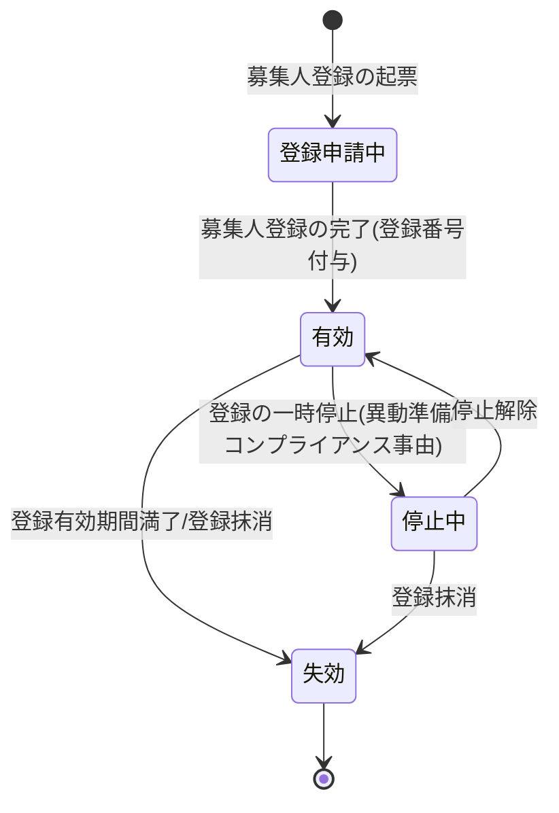

# 募集チャネル管理要求仕様書

## 本書について

### 概要

本書は、[ドメイン定義書](../domain-definition-document#一覧)に記載されるドメインのうち、「募集チャネル管理」に関する要求事項を記載したドキュメントです。
本書は「本ドメインとして何を満たすべきか(What)」を扱います。

### 注記

本書では原則として 具体的な実装手段(How)には踏み込みませんが、 **ビジネス・規制上譲れない本ドメイン固有のHow** は本書で確定します。

## 業務要求

### 業務ルール

本ドメインが管理する募集チャネル・代理店・募集人・募集権限に関する業務ルールを以下に示します。

| ID | 業務ルール | 内容 | 根拠/制約 |
|---|---|---|---|
| CHNL-BR-1 | 募集チャネルの定義 | 初期フェーズの募集チャネルとして営業職員チャネル・代理店チャネルを定義する。ダイレクト・銀行窓販・組込型保険 等のチャネルはフェーズ2で追加する [フェーズ2] | ドメイン定義書(複数チャネルへの拡張耐性) / BRD「マルチチャネル対応」 |
| CHNL-BR-2 | 代理店(組織)の管理 | 代理店を組織として登録し、代理店の登録状態・取扱可能商品・配下募集人の所属関係を管理する | ドメイン定義書(代理店) / 生保業務一般 |
| CHNL-BR-3 | 募集人の登録管理 | 営業職員・代理店募集人を募集人として登録し、保険業法上の募集人登録(登録番号・登録有効期間・所属)を正確かつ最新に保持する | PRD-REG-1 / 保険業法第276条(募集人登録義務) |
| CHNL-BR-4 | 募集人登録の有効性確認 | 募集行為(意向把握・設計書作成・申込受付)の実施時点で、当該募集人の登録が有効であることを業務上の前提とする。登録失効・停止中の募集人による募集を許容しない | 保険業法第276条 / PRD-REG-1 |
| CHNL-BR-5 | 商品×募集人の募集権限制御 | 商品種別・特約ごとに、各募集人・代理店が募集可能か(取扱資格)を募集権限として保持し、無資格の商品の募集を業務上許容しない | ドメイン定義書(商品×募集人の権限制御) / PRD-SEC-5 |
| CHNL-BR-6 | 募集管理者の管理階層 | 営業所長・支社長(募集管理者)、代理店店主・代理店募集管理者の管理階層を保持し、配下募集人のモニタリング・統括の業務関係を表現する | アクター一覧(ACT-8・ACT-9・ACT-10) |
| CHNL-BR-7 | 登録情報変更の即時反映 | 募集人・代理店の異動・登録抹消・取扱資格変更を、後続の募集権限判定に遅滞なく反映する。古い登録情報での募集を業務上発生させない | PRD-SEC-DATA-5(正確性・最新性を最優先) |
| CHNL-BR-8 | チャネル非依存の権限モデル | 募集チャネル追加に対し、チャネル種別を識別子として扱い、募集人区分・権限モデル本体を共通化する。チャネル追加時の既存チャネルへの影響を局所化する [フェーズ2: ダイレクト/銀行窓販等のチャネル追加] | ドメイン定義書(複数チャネルへの拡張耐性) / PRD体験設計(マルチチャネル展開耐性) |

### 業務状態遷移

本ドメインが管理する主要な業務対象である「募集人登録(募集人の登録状態と取扱資格)」の業務状態と遷移を示します。

| 業務状態 | 定義 | この状態での主な制約 |
|---|---|---|
| 登録申請中 | 募集人登録の手続きが起票され完了前の状態 | 募集行為(意向把握・設計書作成・申込受付)に従事不可 |
| 有効 | 募集人登録が有効で募集行為に従事できる状態 | 取扱資格のある商品のみ募集可。資格外商品の募集は不可 |
| 停止中 | 異動準備・コンプライアンス事由等で募集行為を一時停止した状態 | 募集行為に従事不可。既存進行案件の取り扱いは業務上判定 |
| 失効 | 登録有効期間満了または登録抹消により募集資格を喪失した状態 | 新規募集行為に従事不可。過去の募集実績は履歴として保全 |

| 遷移元 | 遷移先 | 契機 | 主体 | 前提条件 |
|---|---|---|---|---|
| (なし) | 登録申請中 | 募集人登録の起票 | 募集管理部門 / 代理店本社担当者 | 募集人採用・委託契約の業務上の決定 |
| 登録申請中 | 有効 | 募集人登録の完了 | 募集管理部門 | 保険業法上の登録手続き完了・登録番号付与 |
| 有効 | 停止中 | 登録の一時停止 | 募集管理部門 / コンプライアンス部 | 異動準備またはコンプライアンス事由 |
| 停止中 | 有効 | 停止解除 | 募集管理部門 | 停止事由の解消 |
| 有効 / 停止中 | 失効 | 登録有効期間満了または登録抹消 | 募集管理部門 | 有効期間満了または委託解除・退職等 |

### 業務運用(イレギュラー対応)

正常系から外れる業務局面と、その業務上の取り扱いを以下に示します。

| ID | イレギュラー事象 | 発生契機 | 業務上の対応 |
|---|---|---|---|
| CHNL-IRR-1 | 登録失効中の募集行為 | 登録失効・停止中の募集人が募集行為を行おうとした | 当該募集人による募集行為を業務上許容しない。進行中案件は引き継ぎ先募集人への移管または業務部門判断で取り扱う |
| CHNL-IRR-2 | 募集人の異動・案件引き継ぎ | 募集人の異動・退職により進行中の意向把握/設計/申込案件が宙に浮く | 案件を後任募集人または管理者へ引き継ぎ、引き継ぎ後の募集権限・コンプライアンス責任の所在を業務上明確化する |
| CHNL-IRR-3 | 取扱資格外商品の募集 | 募集人が取扱資格を持たない商品種別・特約を募集しようとした | 無資格の商品の募集を業務上許容しない。設計書作成・申込受付側へ資格不足を通知し手続きを差し戻す |
| CHNL-IRR-4 | 登録情報の更新遅延 | 異動・抹消・資格変更の反映が遅延し古い権限で募集が行われた懸念 | 反映遅延を業務上のリスクとして検知・是正し、影響を受けた案件のコンプライアンス上の取り扱いをコンプライアンス部と判定する |
| CHNL-IRR-5 | 登録番号・登録有効期間の不整合 | 募集人登録の登録番号・有効期間に誤り/期限切れが判明 | 誤りある登録での募集を業務上停止し、登録情報の是正を最優先で行う(PRD-SEC-DATA-5) |

## セキュリティ要求

### データアクセス要求

| ID | データ | PRD 機密区分との対応 | 本ドメインでの取り扱い |
|---|---|---|---|
| CHNL-DATA-1 | 募集人登録情報(登録番号・登録有効期間・所属・区分) | PRD-SEC-DATA-5(業務上機密・法令義務) | 厳格管理。保険業法第276条に基づき正確性・最新性を最優先。登録操作は監査対象 |
| CHNL-DATA-2 | 代理店登録情報(組織・取扱可能商品・配下募集人) | PRD-SEC-DATA-5(業務上機密・法令義務) | 厳格管理。組織階層・所属関係を正確に保持 |
| CHNL-DATA-3 | 商品×募集人の募集権限(取扱資格) | PRD-SEC-DATA-5(業務上機密・法令義務)/ PRD-SEC-5 | RBAC の入力。資格変更を後続権限判定に遅滞なく反映 |
| CHNL-DATA-4 | 募集チャネル区分・募集管理階層 | PRD-SEC-DATA-5(業務上機密) | チャネル非依存モデルの識別子として保持。チャネル追加時の影響を局所化([フェーズ2]) |

## 受け入れ基準

* 募集人登録の正確性(PRD-REG-1 / 保険業法第276条 充足): 募集人登録情報(登録番号・有効期間・所属)が正確かつ最新に保持され、登録失効・停止中の募集が許容されないこと(CHNL-BR-3 / CHNL-BR-4 / CHNL-IRR-1)
* 募集権限制御: 商品×募集人の取扱資格が保持され、無資格商品の募集が業務上拒否されること(CHNL-BR-5 / CHNL-IRR-3)
* 登録変更の即時反映: 異動・抹消・資格変更が後続の募集権限判定に遅滞なく反映されること(CHNL-BR-7 / CHNL-IRR-4)
* チャネル拡張耐性: 営業職員チャネル・代理店チャネルを初期対応とし、チャネル追加時に既存チャネルへの影響を局所化できる権限モデルであること(CHNL-BR-8、ダイレクト/銀行窓販等は [フェーズ2])
* 連携整合: 申込受付・設計書作成・募集コンプライアンス証跡管理への募集人・権限・責任主体情報の供給が業務状態遷移と整合すること
* 監査追跡性: 募集人・代理店登録情報の登録・変更・抹消が改ざん不能に記録されること
