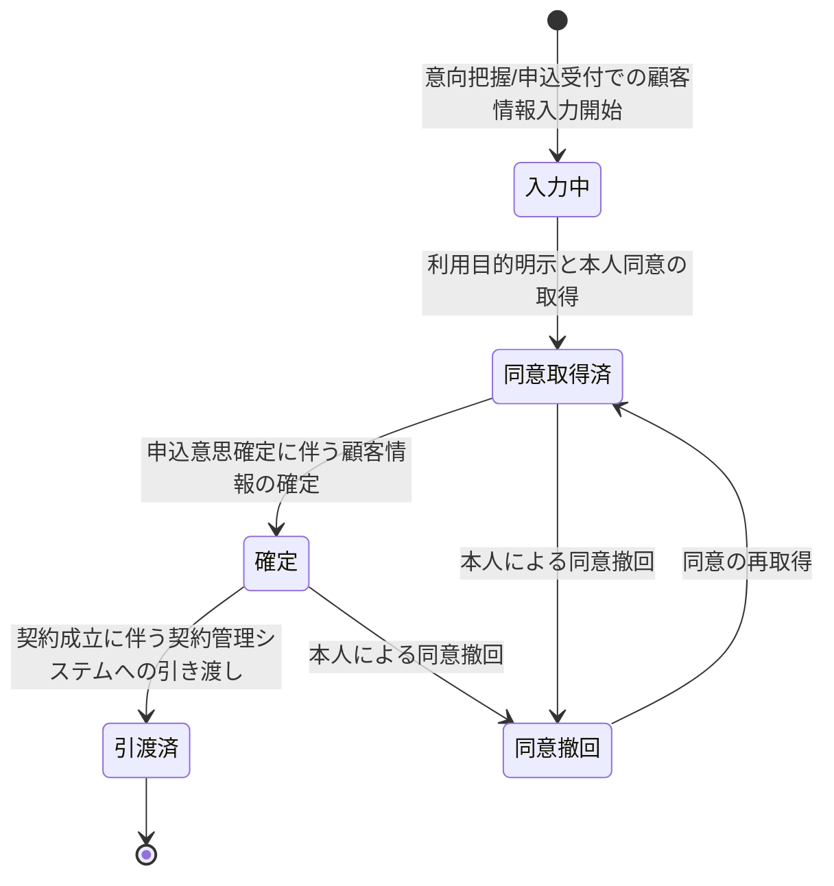

# 顧客情報管理要求仕様書

## 本書について

### 概要

本書は、[ドメイン定義書](../domain-definition-document#一覧)に記載されるドメインのうち、「顧客情報管理」に関する要求事項を記載したドキュメントです。
本書は「本ドメインとして何を満たすべきか(What)」を扱います。

### 注記

本書では原則として 具体的な実装手段(How)には踏み込みませんが、 **ビジネス・規制上譲れない本ドメイン固有のHow** は本書で確定します。

## 業務要求

### 業務ルール

本ドメインが集約・一元管理する顧客情報・関係性・同意に関する業務ルールを以下に示します。

| ID | 業務ルール | 内容 | 根拠/制約 |
|---|---|---|---|
| CUST-BR-1 | 顧客主体の区別 | 申込人(契約者)・被保険者・受取人を区別して属性情報を保持する。申込人と被保険者が同一/別、受取人が複数 等の組合せを業務上正しく表現できること | 生保業務一般 / アクター一覧(ACT-5・ACT-6・ACT-7) |
| CUST-BR-2 | 関係性の集約 | 申込人・被保険者・受取人の相互関係(続柄・指定割合 等)を一案件単位で集約し、関係性の整合(被保険者の存在しない申込を許容しない 等)を業務ルールとして保持する | 生保業務一般 / ドメイン定義書(関係性) |
| CUST-BR-3 | 名寄せ(同一人物の同定) | 氏名・生年月日・住所 等から同一人物を同定し、過去・他案件の顧客との名寄せを行う。誤名寄せ・名寄せ漏れを業務上区別し、確証が得られない場合は別人物として扱う | ドメイン定義書(名寄せ) / 生保業務一般 |
| CUST-BR-4 | 利用目的の特定と明示 | 個人情報・要配慮個人情報の取得時に利用目的を特定し本人へ明示する。特定した目的の範囲を超える利用を業務上行わない | PRD-REG-3 / PRD-FR-4 |
| CUST-BR-5 | 本人同意の取得・撤回・更新管理 | 個人情報・要配慮個人情報の取得・利用に対する本人同意を取得し、同意の対象・取得日時・撤回/更新の履歴を管理する。撤回後は撤回された目的での利用を停止する | PRD-FR-4 / PRD-REG-3 |
| CUST-BR-6 | 要配慮個人情報の厳格取扱い | 健康情報・診査情報 等の要配慮個人情報を含む顧客情報は、取得時の明示的本人同意を前提に、職務上必要な担当者のみ参照可能とする | PRD-REG-3 / PRD-SEC-DATA-2 / PRD-SEC-5 |
| CUST-BR-7 | データの正確性・最新性の維持 | 後続業務で参照される顧客情報の正確性・最新性を維持する。同一案件内での更新は最新の確定情報を一元的に反映する | ドメイン定義書(データの正確性・最新性) |
| CUST-BR-8 | 契約管理への引き渡し | 契約成立時に、確定した申込人・被保険者・受取人の属性・関係性を既存契約管理システムへ引き渡す対象として確定させる。引き渡し対象は契約成立条件充足後に確定する | ドメイン定義書(後続業務への引き渡し) / PRD-NFR-8 |
| CUST-BR-9 | 保有・削除の法令準拠 | 個人情報・要配慮個人情報の保管期間・削除を法令および社内規程に準拠して扱う。不要となった目的の情報の保持を業務上漫然と継続しない | PRD-REG-3 |

### 業務状態遷移

本ドメインが管理する主要な業務対象である「顧客情報(一案件内の申込人・被保険者・受取人の属性・関係性・同意)」の業務状態と遷移を示します。

| 業務状態 | 定義 | この状態での主な制約 |
|---|---|---|
| 入力中 | 意向把握・申込受付等で顧客情報を取得・編集している状態 | 利用目的に対する本人同意未取得のため、目的外利用・後続引き渡し不可 |
| 同意取得済 | 利用目的が明示され本人同意が取得された状態 | 同意の範囲内でのみ利用可。要配慮個人情報は職務上必要な担当者のみ参照可 |
| 確定 | 申込意思確定に伴い顧客情報・関係性が確定した状態 | 確定後の変更は更新履歴を残す。契約成立まで契約管理引き渡しは行わない |
| 同意撤回 | 本人が同意を撤回した状態 | 撤回された目的での利用を停止。手続き継続可否を業務上判定 |
| 引渡済 | 契約成立により契約管理システムへ引き渡し済みの状態 | 本システムでの新規更新対象外。証跡・履歴として保全 |

| 遷移元 | 遷移先 | 契機 | 主体 | 前提条件 |
|---|---|---|---|---|
| (なし) | 入力中 | 顧客情報の入力開始 | 募集人 / 申込人・被保険者 | 意向把握または申込受付の業務開始 |
| 入力中 | 同意取得済 | 利用目的明示と本人同意の取得 | 申込人・被保険者 | 利用目的が特定・明示済み |
| 同意取得済 | 確定 | 申込意思の確定 | 募集人 / 申込人 | 申込受付での申込意思確定 |
| 確定 | 引渡済 | 契約成立 | (契約成立に伴う業務連携) | 引受可決かつ第一回保険料収納成立 |
| 同意取得済 / 確定 | 同意撤回 | 本人による同意撤回 | 申込人・被保険者 | 撤回の意思表示 |
| 同意撤回 | 同意取得済 | 同意の再取得 | 申込人・被保険者 | 利用目的の再明示と再同意 |

### 業務運用(イレギュラー対応)

正常系から外れる業務局面と、その業務上の取り扱いを以下に示します。

| ID | イレギュラー事象 | 発生契機 | 業務上の対応 |
|---|---|---|---|
| CUST-IRR-1 | 名寄せ判定の不確実 | 氏名・生年月日等が近似するが同一人物と断定できない | 確証が得られない場合は別人物として扱い、誤統合を業務上回避する。要確認案件として人手確認に回す運用とする |
| CUST-IRR-2 | 同意の撤回 | 手続き途中で本人が個人情報利用への同意を撤回 | 撤回された目的での利用を停止。当該同意が手続き継続の前提である場合は、手続き継続不可として申込受付・告知受付側へ連絡し業務上の取り扱いを判定する |
| CUST-IRR-3 | 要配慮個人情報の取得同意未取得 | 健康情報を含む情報の取得時に必要な本人同意が未取得 | 同意未取得のまま要配慮個人情報を保持・利用しない。同意取得を業務手続き上の前提として差し戻す |
| CUST-IRR-4 | 顧客情報の不整合 | 同一人物に矛盾する属性(生年月日相違 等)が判明 | 最新の確証ある情報を確定情報とし、不整合を更新履歴として保全。確定できない場合は要確認として人手確認に回す |
| CUST-IRR-5 | 契約管理引き渡しの不達 | 契約成立後の契約管理システムへの引き渡しが不達 | 引き渡し対象は確定状態で保全し、回復可能な形で再連携する。引き渡し未了を業務上の未完了として追跡する(連携の信頼性方針は PRD-NFR-9 に従う) |
| CUST-IRR-6 | 個人情報の開示・訂正・削除請求 | 本人から保有個人情報の開示・訂正・利用停止の請求 | 法令に基づき請求に対応する。手続き進行中案件への影響を業務上判定し、関係ドメインへ連絡する |

## セキュリティ要求

### データアクセス要求

| ID | データ | PRD 機密区分との対応 | 本ドメインでの取り扱い |
|---|---|---|---|
| CUST-DATA-1 | 申込人・被保険者・受取人の属性情報 | PRD-SEC-DATA-1(個人情報) | 役割×組織×目的の最小権限制御。参照は監査ログ対象。保存時暗号化必須 |
| CUST-DATA-2 | 顧客間の関係性(続柄・受取人指定割合 等) | PRD-SEC-DATA-1(個人情報) | 一案件単位で集約し整合を維持。受取人指定の正確性を最優先(PRD-REG-2) |
| CUST-DATA-3 | 本人同意情報(対象目的・取得日時・撤回/更新履歴) | PRD-SEC-DATA-1(個人情報)/ PRD-FR-4 | 同意の対象・履歴を改ざんなく保持し、撤回後の利用停止を担保 |
| CUST-DATA-4 | 要配慮個人情報を含む顧客情報の取得目的・同意管理 | PRD-SEC-DATA-2(要配慮個人情報) | 取得時の明示的本人同意を前提に職務上必要な担当者のみ参照可。参照は監査ログ必須 |

## 受け入れ基準

* 主体・関係性の網羅: 申込人・被保険者・受取人の区別と関係性(同一/別、複数受取人 等)が業務ルールとして正しく表現できること
* 同意管理の充足(PRD-FR-4 / PRD-REG-3 充足): 利用目的の特定・明示・本人同意の取得・撤回・更新が業務状態遷移として通し確認でき、撤回後に目的外利用が生じないこと
* 要配慮個人情報の厳格取扱い: 取得同意未取得の要配慮個人情報を保持・利用しないこと(CUST-BR-6 / CUST-IRR-3)
* 名寄せの安全性: 名寄せ不確実時に誤統合を回避し別人物扱いとする運用が確認されていること(CUST-BR-3 / CUST-IRR-1)
* 引き渡しの完全性: 契約成立時の契約管理システムへの顧客情報引き渡し対象が確定状態で保全され、不達時に回復可能であること(CUST-BR-8 / CUST-IRR-5)
* 法令準拠の保有・削除: 保有・削除・開示訂正請求対応が個人情報保護法に準拠して扱われること
