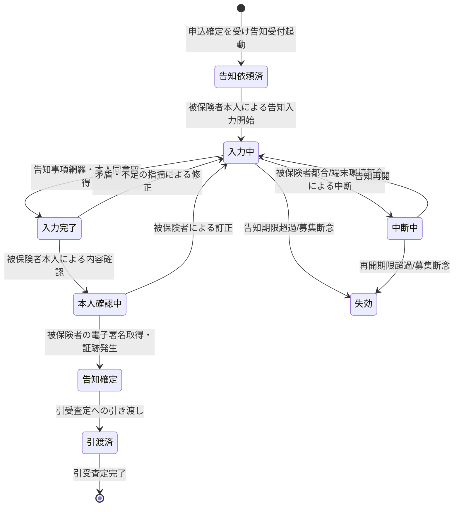

# 告知受付ドメイン要求仕様書

## 本書について

### 概要

本書は、Sample生命保険株式会社 個人保険新契約システムの「告知受付」ドメインに関するドメイン要求を記載したドキュメントです。

上流のプロダクト要求仕様書(PRD)が定めたプロダクトレベルの What のうち本ドメインに関わる横断要求を継承し、その上に本ドメイン固有の業務ルール・業務状態遷移・業務運用(イレギュラー対応)を積み上げて詳細化します。「Why → What → How」の階層では、PRD(プロダクトの What)を Why として引き継ぎ、本書は「本ドメインとして何を満たすべきか(ドメインの What)」を扱います。具体的な機能・画面・データ構造・API 等の How は後続の D2 以降の成果物で扱います。

### 想定読者

* 告知受付・引受コンプライアンス領域のドメインエキスパート
* 告知受付ドメイン担当の開発・QA
* PdM / PM
* 上流成果物(PRD・ドメイン定義書)作成者

### 注記

本書では原則として How(具体的な実装手段)には踏み込みませんが、ビジネス・規制上譲れない具体水準のうち **本ドメイン固有のもの** は本書で確定します。プロダクト横断で共通の水準は PRD を正典とし、本書では重複定義せず継承します。

## 対象ドメイン

| ドメインID | ドメイン名 | 区分 | 種別 | 概要 | 主な関心事 |
|---|---|---|---|---|---|
| DECL | 告知受付 | サポート | 業務工程 | 被保険者の健康状態・職業 等に関する告知情報を取得し、要配慮個人情報として管理する領域 | 告知妨害・不告知教唆の防止、要配慮個人情報の厳格な取扱い、告知内容の正確性確保 |

## 継承するPRD要求

本ドメインに効く PRD 横断要求を以下に継承します。各要求の実体は PRD を正典とし、本書では本ドメインでの適用観点のみ補足します。

| 継承元 PRD ID | 要求名 | 本ドメインでの適用観点 |
|---|---|---|
| PRD-FR-1 | 業務通知 | 告知完了 等の節目イベントを募集人・事務担当者・被保険者へ通知する。本ドメインは主たる通知発生工程 |
| PRD-FR-2 | 帳票出力 | 告知書 等の業務帳票を画面表示・PDF・電子交付の各形態で出力する局面に適用する |
| PRD-FR-3 | 業務の中断・再開 | 被保険者本人による告知入力の途中中断から入力済みデータを失わず再開する局面に適用する |
| PRD-FR-4 | 同意取得・同意管理 | 要配慮個人情報(健康状態 等)の取得時に法令上必要な本人同意を確実に取得する局面に適用する。本ドメインは要配慮個人情報取得の中心 |
| PRD-NFR-1 | オンライン操作のレスポンスタイム | 被保険者の告知入力の主要操作のレスポンス水準を継承する |
| PRD-NFR-3 | 業務時間帯の稼働率 | 縮退運用方針(PRD-NFR-4)上、告知受付は申込前後の業務継続対象に含まれる |
| PRD-NFR-4 | 障害時の縮退運用方針 | 外部連携(電子署名)障害時の告知業務継続シナリオを保持することを継承する |
| PRD-SEC-2 | 認証方式 | 被保険者本人(ACT-6)の認証、要配慮個人情報を扱う操作の MFA 必須を継承する。本ドメインは MFA 必須操作の典型 |
| PRD-SEC-4 | 保存時暗号化 | 告知情報(要配慮個人情報)の保存時暗号化を継承する |
| PRD-SEC-5 | RBAC・最小権限 | 告知情報は引受査定担当者・限定された業務担当者のみ参照可とする厳格なアクセス制御を継承する |
| PRD-SEC-6 | 監査ログ・改ざん不能性 | 告知情報(要配慮個人情報)の参照・操作を改ざん不能に記録する。本ドメインは参照監査ログ必須の典型 |
| PRD-REG-2 | 保険法 | 告知義務に関する規定(告知事項網羅性・告知妨害/不告知教唆防止)、被保険者の権利保護を業務プロセスに組み込む。本ドメインは保険法対応の中心 |
| PRD-REG-3 | 個人情報保護法 | 健康情報を要配慮個人情報として取得時の本人同意・厳格なアクセス制御・利用目的の特定を必須化する観点を継承する |
| PRD-REG-5 | 電子帳簿保存法 | 告知書を電子保存する場合の真実性確保(電子署名連携)を継承する |
| PRD-REG-6 | 金融庁「保険会社向けの総合的な監督指針」 | お客様本位の業務運営原則に基づく適正な告知取得を担保する観点を継承する |

## ドメイン固有の業務要求

### 業務ルール

本ドメイン固有の業務として満たすべき判断基準・制約・条件を以下に示します。

| ID | 業務ルール | 内容 | 根拠/制約 |
|---|---|---|---|
| DECL-BR-1 | 告知事項の網羅 | 被保険者の健康状態・既往歴・現在の傷病・職業 等、引受査定が必要とする告知事項を網羅的に取得する。告知事項に欠落がある状態で告知完了としてはならない | 保険法(告知義務 PRD-REG-2)、ドメイン定義書「告知内容の正確性確保」 |
| DECL-BR-2 | 被保険者本人による告知 | 告知は被保険者本人の入力・申述による。被保険者以外(募集人・申込人 等)が被保険者に代わって告知内容を記入・改変してはならない | 保険法(告知義務・告知妨害/不告知教唆防止 PRD-REG-2)、アクター一覧 ACT-6 |
| DECL-BR-3 | 告知妨害・不告知教唆の防止 | 募集人その他の関与者が、被保険者の告知を妨げる行為、事実と異なる告知や不告知を勧める行為を業務プロセス上できない構造とする。告知は被保険者が事実をそのまま申述できる経路で取得する | 保険法(告知妨害/不告知教唆防止 PRD-REG-2)、ドメイン定義書「告知妨害・不告知教唆の防止」 |
| DECL-BR-4 | 要配慮個人情報の取得同意 | 健康状態・既往歴 等の要配慮個人情報を取得する前に、取得・利用目的を被保険者へ明示し法令上必要な本人同意を取得する。同意未取得の状態で告知情報を確定してはならない | 個人情報保護法(要配慮個人情報 PRD-REG-3)、PRD-FR-4 |
| DECL-BR-5 | 告知情報の厳格なアクセス制御 | 告知情報は引受査定担当者および職務上必要な限定された業務担当者のみが参照できる。募集人・申込人は被保険者の告知内容を参照できない(被保険者本人を除く) | 個人情報保護法(PRD-REG-3)、PRD-SEC-5、ドメイン定義書「要配慮個人情報の厳格な取扱い」 |
| DECL-BR-6 | 告知の正確性確保 | 告知内容の正確性を被保険者自身が確認・確定する手続を経る。告知事項間の明らかな矛盾は被保険者へ確認を促す。確認・確定を経ない告知を引受査定へ引き渡してはならない | 保険法(告知義務 PRD-REG-2)、ドメイン定義書「告知内容の正確性確保」 |
| DECL-BR-7 | 告知の確定と電子署名 | 告知の確定は被保険者本人の電子署名取得をもって行う。電子署名が取得できない告知を確定済みとしてはならない | 電子帳簿保存法(真実性確保 PRD-REG-5)、ドメイン定義書 DECL→ESIGN 連携 |
| DECL-BR-8 | 告知情報の引受査定への引き渡し | 確定告知情報は引受査定が必要とする項目を欠落なく引き渡す。確定・本人確認・同意取得を経ていない告知を引き渡してはならない | ドメイン定義書 DECL→UNDW 連携(ドメイン定義書「ドメイン間の主な連携」)、保険法(PRD-REG-2) |
| DECL-BR-9 | 告知の証跡発生 | 告知取得(いつ・誰が・どの告知事項を・どの同意のもとで申述したか、妨害防止経路の遵守を含む)を募集コンプライアンス証跡として発生させる。証跡が欠落した告知を完了扱いしてはならない | 金融庁監督指針(PRD-REG-6)、保険法(PRD-REG-2)、ドメイン定義書 SUIT 連携 |

### 業務状態遷移

本ドメインが管理する主要な業務対象である「告知情報」の業務状態と遷移を示します。

| 業務状態 | 定義 | この状態での主な制約 |
|---|---|---|
| 告知依頼済 | 申込確定を受け告知受付が起動された状態 | 被保険者本人の入力開始待ち。第三者は告知内容に関与不可 |
| 入力中 | 被保険者本人が告知を入力している状態 | 引受査定へ引き渡し不可。被保険者以外の記入・改変不可 |
| 中断中 | 告知入力を一時中断している状態 | 入力済みデータを保持する。再開まで確定不可 |
| 入力完了 | 告知事項が網羅され本人同意を取得した状態 | 本人確認未了の間は確定不可 |
| 本人確認中 | 被保険者本人が告知内容を確認している状態 | 確認・確定まで引き渡し不可 |
| 告知確定 | 被保険者の電子署名が取得され告知が確定し証跡が発生した状態 | 引受査定へ引き渡し可。参照は厳格制御 |
| 引渡済 | 確定告知を引受査定へ引き渡した状態 | 参照は引受査定担当者・限定担当者のみ |
| 失効 | 告知期限超過・募集断念で告知が成立しなかった状態 | 引き渡し不可。証跡保全 |

| 遷移元 | 遷移先 | 契機 | 主体 | 前提条件 |
|---|---|---|---|---|
| (開始) | 告知依頼済 | 申込確定を受け告知受付起動 | 申込受付(APPL)からの引き渡し | 申込が確定済 |
| 告知依頼済 | 入力中 | 被保険者本人による告知入力開始 | 被保険者本人 | 被保険者本人の認証(MFA) |
| 入力中 | 中断中 | 被保険者都合/端末環境都合による中断 | 被保険者本人 | 入力済みデータの保持 |
| 中断中 | 入力中 | 告知再開 | 被保険者本人 | 再開期限内 |
| 入力中 | 入力完了 | 告知事項網羅・本人同意取得 | 被保険者本人 | 要配慮個人情報取得同意取得済 |
| 入力完了 | 本人確認中 | 被保険者本人による内容確認 | 被保険者本人 | 告知事項網羅・矛盾解消 |
| 本人確認中 | 告知確定 | 被保険者の電子署名取得・証跡発生 | 被保険者本人 | 電子署名取得・募集コンプライアンス証跡発生 |
| 告知確定 | 引渡済 | 引受査定への引き渡し | システム連携 | 確定済・同意取得済・本人確認済 |
| 入力中/中断中 | 失効 | 告知期限超過/募集断念 | 事務担当者 | 証跡保全 |

### 業務運用(イレギュラー対応)

正常系から外れる業務局面と、その業務上の取り扱いを以下に示します。

| ID | イレギュラー事象 | 発生契機 | 業務上の対応 |
|---|---|---|---|
| DECL-BOP-1 | 告知事項の不足・矛盾 | 必須告知事項の欠落・告知事項間の明らかな矛盾 | 入力中へ戻し、不足・矛盾箇所を被保険者へ提示して訂正を促す。網羅・整合しない告知を確定・引き渡ししない |
| DECL-BOP-2 | 告知妨害・不告知教唆の疑い | 募集人等が被保険者の告知に介入しようとする・第三者が代理入力しようとする | 告知は被保険者本人経路でのみ受け付け、第三者の介入を業務プロセス上拒否する。疑い事象は証跡として保全しコンプライアンス部の確認に回す |
| DECL-BOP-3 | 要配慮個人情報の取得同意不取得・撤回 | 被保険者が健康情報の取得・利用に同意しない、または取得後に同意を撤回 | 同意未取得・撤回の告知情報は確定・引き渡しを行わない。撤回時は同意管理(PRD-FR-4)に従い以降の利用を停止し業務上の取り扱いを記録する |
| DECL-BOP-4 | 被保険者本人が入力できない | 被保険者の端末リテラシー・健康状態・不在 等 | 告知依頼済または中断中で保持し、被保険者本人が入力可能になるまで確定しない。代理入力は行わない。告知期限超過時は失効とし証跡を保全する |
| DECL-BOP-5 | 電子署名が取得できない | 被保険者の署名不能・外部電子署名サービス不達 | 本人確認中のまま告知を確定させない。署名取得手段の代替提示または差し戻しとし、回復処理は PRD-NFR-9 に従う |
| DECL-BOP-6 | 告知の長時間中断・期限超過 | 被保険者都合での長期中断 | 入力済みデータを保持し中断中とする。再開期限・告知期限を超過した場合は失効とし証跡を保全する |
| DECL-BOP-7 | 確定後の告知訂正の申し出 | 引き渡し後に被保険者から告知内容の訂正申し出 | 訂正の申し出と訂正前後・時点を改ざん不能な証跡として記録し、引受査定へ訂正発生を連携する。被保険者の権利保護の観点で訂正経路を確保する |

## 他ドメインとの連携

ドメイン定義書「ドメイン間の主な連携」と整合する本ドメインの入力・出力を以下に示します。

| 方向 | 相手ドメイン | 連携内容 | 契機 |
|---|---|---|---|
| 入力 | APPL(申込受付) | 申込・被保険者情報を受け取り告知受付を起動する | 申込確定後 |
| 出力 | UNDW(引受査定) | 確定告知情報を引き渡す | 告知確定後 |
| 入力/出力 | CUST(顧客情報管理) | 被保険者の属性・関係性・要配慮個人情報の同意情報を連携する | 告知情報の取得・同意取得時 |
| 出力 | SUIT(募集コンプライアンス証跡管理) | 告知取得・告知妨害防止経路遵守の証跡を連携する | 告知取得・確定時 |
| 出力/入力 | ESIGN(電子署名) | 告知書への電子署名取得を依頼し結果を受け取る | 告知確定時 |

## ドメイン固有のデータ要件

PRD §「セキュリティ要件 > データアクセス要件」の機密区分を継承し、本ドメイン固有の主要データを以下に対応づけます。構造詳細は D2 のデータモデルに降ろします。

| ID | データ | PRD 機密区分との対応 | 本ドメインでの取り扱い |
|---|---|---|---|
| DECL-DATA-1 | 告知情報(健康状態・既往歴・現在傷病・職業 等) | PRD-SEC-DATA-2(告知情報/要配慮個人情報) | 引受査定担当者・限定担当者のみ参照可。被保険者本人のみ入力・訂正可。参照は監査ログ必須・改ざん不能保存 |
| DECL-DATA-2 | 要配慮個人情報の取得に係る本人同意記録 | PRD-SEC-DATA-2 / PRD-SEC-DATA-6 | 取得・利用目的と同意・撤回の事実を保持。同意管理(PRD-FR-4)と整合 |
| DECL-DATA-3 | 告知内容訂正履歴 | PRD-SEC-DATA-2 / PRD-SEC-DATA-6 | 訂正前後・時点を改ざん不能に保持。被保険者の権利保護・引受査定への連携根拠 |
| DECL-DATA-4 | 告知取得・告知妨害防止経路遵守の募集コンプライアンス証跡 | PRD-SEC-DATA-6(募集コンプライアンス証跡/個人情報含む・業務上機密) | 改ざん不能保存。SUIT へ連携。参照は限定・全件監査ログ対象 |
| DECL-DATA-5 | 被保険者の電子署名取得証跡 | PRD-SEC-DATA-6・電子帳簿保存法(PRD-REG-5) | ESIGN と連携。真実性確保のため改ざん不能保存 |

## 受け入れ基準

* 告知事項の網羅: 告知事項に欠落がある状態で告知を確定・引き渡しできないことが業務シナリオで確認できる(DECL-BR-1・DECL-BOP-1)
* 被保険者本人入力の担保: 被保険者以外による告知内容の記入・改変ができない業務動線が確認できる(DECL-BR-2・DECL-BOP-2)
* 告知妨害・不告知教唆の防止: 募集人その他関与者が告知に介入できない構造であることが確認できる(DECL-BR-3・DECL-BOP-2)
* 要配慮個人情報の取扱い: 取得時の本人同意取得と引受査定担当者・限定担当者のみ参照可とする厳格なアクセス制御が確認できる(DECL-BR-4・DECL-BR-5・DECL-DATA-1)
* 告知の正確性確保: 被保険者本人による内容確認・電子署名を経ない告知を引受査定へ引き渡せないことが確認できる(DECL-BR-6・DECL-BR-7・DECL-BR-8)
* 告知の証跡: 告知取得と告知妨害防止経路遵守の証跡が改ざん不能に発生し SUIT へ連携されることが確認できる(DECL-BR-9・DECL-DATA-4)
* 継承 PRD 要求の充足: 本ドメインに継承した PRD 要求(MFA 必須認証、要配慮個人情報の暗号化・厳格アクセス制御・参照監査ログ、保険法・個人情報保護法対応)が本ドメインの業務局面で満たされることが確認できる
* 主要業務状態遷移の通し確認: 告知依頼済→入力中→入力完了→本人確認中→告知確定→引渡済 の正常系、および中断・失効・確定後訂正の異常系が通しで確認できる
