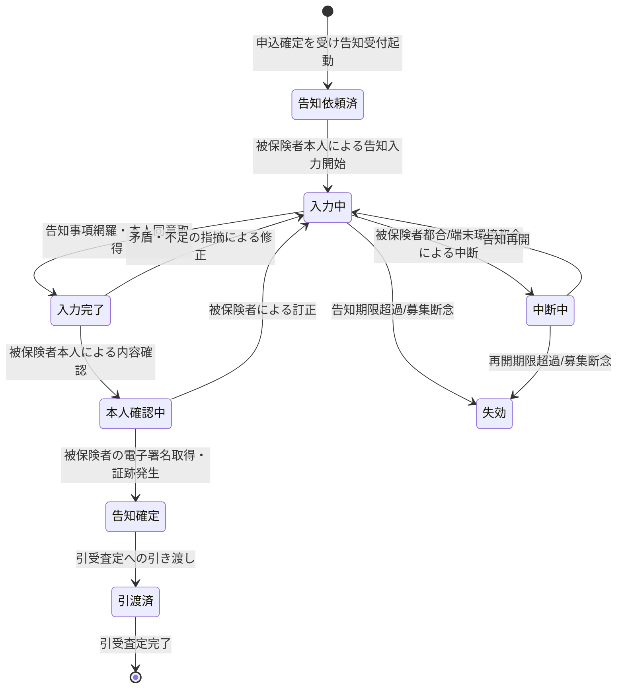

# 告知受付要求仕様書

## 本書について

### 概要

本書は、[ドメイン定義書](../domain-definition-document#一覧)に記載されるドメインのうち、「告知受付」に関する要求事項を記載したドキュメントです。
本書は「本ドメインとして何を満たすべきか(What)」を扱います。

### 注記

本書では原則として 具体的な実装手段(How)には踏み込みませんが、 **ビジネス・規制上譲れない本ドメイン固有のHow** は本書で確定します。

## 業務要求

### 業務ルール

本ドメインは「被保険者の告知受付」を担うドメインですが、横断的な水準・方針・原則(要配慮個人情報の同意取得・撤回管理の枠組み・要配慮個人情報のアクセス制御水準・RBAC/最小権限 等)は **ドメイン共通要求仕様書** が単独責務として扱います。本書は **並列の関係** にあり、共通要求と内容が重ならない当該ドメイン固有の業務ルール(告知事項の網羅・被保険者本人による告知・告知妨害/不告知教唆の防止経路・告知の正確性確認・電子署名による確定・引受査定への引き渡し条件・告知工程固有の証跡発生)のみを記述します。

| ID | 業務ルール | 内容 | 根拠/制約 |
|---|---|---|---|
| DOM-DECL-BR-1 | 告知事項の網羅 | 被保険者の健康状態・既往歴・現在の傷病・職業 等、引受査定が必要とする告知事項を網羅的に取得する。告知事項に欠落がある状態で告知完了としてはならない | 保険法(告知義務)、ドメイン定義書「告知内容の正確性確保」 |
| DOM-DECL-BR-2 | 被保険者本人による告知 | 告知は被保険者本人の入力・申述による。被保険者以外(募集人・申込人 等)が被保険者に代わって告知内容を記入・改変してはならない | 保険法(告知義務・告知妨害/不告知教唆防止)、アクター一覧 ACT-6 |
| DOM-DECL-BR-3 | 告知妨害・不告知教唆の防止 | 募集人その他の関与者が、被保険者の告知を妨げる行為、事実と異なる告知や不告知を勧める行為を業務プロセス上できない構造とする。告知は被保険者が事実をそのまま申述できる経路で取得する | 保険法(告知妨害/不告知教唆防止)、ドメイン定義書「告知妨害・不告知教唆の防止」 |
| DOM-DECL-BR-6 | 告知の正確性確保 | 告知内容の正確性を被保険者自身が確認・確定する手続を経る。告知事項間の明らかな矛盾は被保険者へ確認を促す。確認・確定を経ない告知を引受査定へ引き渡してはならない | 保険法(告知義務)、ドメイン定義書「告知内容の正確性確保」 |
| DOM-DECL-BR-7 | 告知の確定と電子署名 | 告知の確定は被保険者本人の電子署名取得をもって行う。電子署名が取得できない告知を確定済みとしてはならない | ドメイン定義書 DECL→ESIGN 連携、保険法(告知の意思確認) |
| DOM-DECL-BR-8 | 告知情報の引受査定への引き渡し | 確定告知情報は引受査定が必要とする項目を欠落なく引き渡す。確定・本人確認・同意取得を経ていない告知を引き渡してはならない | ドメイン定義書 DECL→UNDW 連携(ドメイン定義書「ドメイン間の主な連携」)、保険法 |
| DOM-DECL-BR-9 | 告知の証跡発生 | 告知取得(いつ・誰が・どの告知事項を・どの同意のもとで申述したか、妨害防止経路の遵守を含む)を募集コンプライアンス証跡として発生させ、SUIT へ連携する。証跡が欠落した告知を完了扱いしてはならない | 金融庁監督指針、保険法、ドメイン定義書 SUIT 連携 |

<!-- HINT(リファクタ経緯):
本表は並列モデル化により、共通要求の言い換えになっていた BR(旧 BR-4「要配慮個人情報の取得同意」/ 旧 BR-5「告知情報の厳格なアクセス制御」)を削除し、各 BR の「根拠/制約」列からドメイン共通要求 ID(`DOM-COMMON-*`)への参照も削除した。本書とドメイン共通要求は並列の関係(参照関係を持たない)であり、要配慮個人情報の同意取得・撤回管理の枠組み・要配慮個人情報のアクセス制御水準・RBAC/最小権限 等の横断的な水準・方針・原則は共通要求側に単独責務がある。なお BR-3(告知妨害・不告知教唆の防止)・BR-7(告知の確定と電子署名)は告知工程固有の意思確認手続きを主題とするため残置している。ID 連番は欠番のまま維持し、横展開完了後に一括リナンバリングする予定。
-->

### 業務状態遷移

本ドメインが管理する主要な業務対象である「告知情報」の業務状態と遷移を示します。

| 業務状態 | 定義 | この状態での主な制約 |
|---|---|---|
| 告知依頼済 | 申込確定を受け告知受付が起動された状態 | 被保険者本人の入力開始待ち。第三者は告知内容に関与不可 |
| 入力中 | 被保険者本人が告知を入力している状態 | 引受査定へ引き渡し不可。被保険者以外の記入・改変不可 |
| 中断中 | 告知入力を一時中断している状態 | 入力済みデータを保持する。再開まで確定不可 |
| 入力完了 | 告知事項が網羅され本人同意を取得した状態 | 本人確認未了の間は確定不可 |
| 本人確認中 | 被保険者本人が告知内容を確認している状態 | 確認・確定まで引き渡し不可 |
| 告知確定 | 被保険者の電子署名が取得され告知が確定し証跡が発生した状態 | 引受査定へ引き渡し可。参照は厳格制御 |
| 引渡済 | 確定告知を引受査定へ引き渡した状態 | 参照は引受査定担当者・限定担当者のみ |
| 失効 | 告知期限超過・募集断念で告知が成立しなかった状態 | 引き渡し不可。証跡保全 |

| 遷移元 | 遷移先 | 契機 | 主体 | 前提条件 |
|---|---|---|---|---|
| (開始) | 告知依頼済 | 申込確定を受け告知受付起動 | 申込受付(APPL)からの引き渡し | 申込が確定済 |
| 告知依頼済 | 入力中 | 被保険者本人による告知入力開始 | 被保険者本人 | 被保険者本人の認証(MFA) |
| 入力中 | 中断中 | 被保険者都合/端末環境都合による中断 | 被保険者本人 | 入力済みデータの保持 |
| 中断中 | 入力中 | 告知再開 | 被保険者本人 | 再開期限内 |
| 入力中 | 入力完了 | 告知事項網羅・本人同意取得 | 被保険者本人 | 要配慮個人情報取得同意取得済 |
| 入力完了 | 本人確認中 | 被保険者本人による内容確認 | 被保険者本人 | 告知事項網羅・矛盾解消 |
| 本人確認中 | 告知確定 | 被保険者の電子署名取得・証跡発生 | 被保険者本人 | 電子署名取得・募集コンプライアンス証跡発生 |
| 告知確定 | 引渡済 | 引受査定への引き渡し | システム連携 | 確定済・同意取得済・本人確認済 |
| 入力中/中断中 | 失効 | 告知期限超過/募集断念 | 事務担当者 | 証跡保全 |

### 業務運用(イレギュラー対応)

正常系から外れる業務局面と、その業務上の取り扱いを以下に示します。

| ID | イレギュラー事象 | 発生契機 | 業務上の対応 |
|---|---|---|---|
| DOM-DECL-IRR-1 | 告知事項の不足・矛盾 | 必須告知事項の欠落・告知事項間の明らかな矛盾 | 入力中へ戻し、不足・矛盾箇所を被保険者へ提示して訂正を促す。網羅・整合しない告知を確定・引き渡ししない(DOM-DECL-BR-1・DOM-DECL-BR-6 に整合) |
| DOM-DECL-IRR-2 | 告知妨害・不告知教唆の疑い | 募集人等が被保険者の告知に介入しようとする・第三者が代理入力しようとする | 告知は被保険者本人経路でのみ受け付け、第三者の介入を業務プロセス上拒否する(DOM-DECL-BR-2・DOM-DECL-BR-3 に整合)。疑い事象は証跡として保全しコンプライアンス部の確認に回す |
| DOM-DECL-IRR-3 | 要配慮個人情報の取得同意不取得・撤回 | 被保険者が健康情報の取得・利用に同意しない、または取得後に同意を撤回 | 同意未取得・撤回の告知情報は確定・引き渡しを行わない。撤回時は以降の利用を停止し業務上の取り扱いを記録する |
| DOM-DECL-IRR-4 | 被保険者本人が入力できない | 被保険者の端末リテラシー・健康状態・不在 等 | 告知依頼済または中断中で保持し、被保険者本人が入力可能になるまで確定しない。代理入力は行わない。告知期限超過時は失効とし証跡を保全する |
| DOM-DECL-IRR-5 | 電子署名が取得できない | 被保険者の署名不能・外部電子署名サービス不達 | 本人確認中のまま告知を確定させない。署名取得手段の代替提示または差し戻しとする(DOM-DECL-BR-7 に整合) |
| DOM-DECL-IRR-6 | 告知の長時間中断・期限超過 | 被保険者都合での長期中断 | 入力済みデータを保持し中断中とする。再開期限・告知期限を超過した場合は失効とし証跡を保全する |
| DOM-DECL-IRR-7 | 確定後の告知訂正の申し出 | 引き渡し後に被保険者から告知内容の訂正申し出 | 訂正の申し出と訂正前後・時点を証跡として記録し、引受査定へ訂正発生を連携する(DOM-DECL-BR-9 に整合)。被保険者の権利保護の観点で訂正経路を確保する |

## セキュリティ要求

### データアクセス要求

| ID | データ | 機密区分 | 本ドメインでの取り扱い |
|---|---|---|---|
| DOM-DECL-DATA-1 | 告知情報(健康状態・既往歴・現在傷病・職業 等) | 要配慮個人情報 | 引受査定担当者・限定担当者のみ参照可とし、被保険者本人のみ入力・訂正可とする。募集人・申込人は被保険者の告知内容を参照できない |
| DOM-DECL-DATA-2 | 要配慮個人情報の取得に係る本人同意記録 | 要配慮個人情報 | 取得・利用目的と同意・撤回の事実を保持し、告知確定の前提とする |
| DOM-DECL-DATA-3 | 告知内容訂正履歴 | 要配慮個人情報 | 訂正前後・時点を保持し、被保険者の権利保護および引受査定への連携根拠とする |
| DOM-DECL-DATA-4 | 告知取得・告知妨害防止経路遵守の募集コンプライアンス証跡 | 個人情報含む・業務上機密 | 告知工程で発生する固有の証跡イベント(本人経路遵守・妨害防止 等)を SUIT へ連携する |
| DOM-DECL-DATA-5 | 被保険者の電子署名取得証跡 | 個人情報含む・業務上機密 | 告知確定の意思確認の根拠として ESIGN と連携した結果を保持する |

## 受け入れ基準

* 告知事項の網羅: 告知事項に欠落がある状態で告知を確定・引き渡しできないことが業務シナリオで確認できる(DOM-DECL-BR-1・DOM-DECL-IRR-1)
* 被保険者本人入力の担保: 被保険者以外による告知内容の記入・改変ができない業務動線が確認できる(DOM-DECL-BR-2・DOM-DECL-IRR-2)
* 告知妨害・不告知教唆の防止: 募集人その他関与者が告知に介入できない構造であることが確認できる(DOM-DECL-BR-3・DOM-DECL-IRR-2)
* 告知の正確性確保: 被保険者本人による内容確認・電子署名を経ない告知を引受査定へ引き渡せないことが確認できる(DOM-DECL-BR-6・DOM-DECL-BR-7・DOM-DECL-BR-8)
* 告知の証跡: 告知取得と告知妨害防止経路遵守の証跡が発生し SUIT へ連携されることが確認できる(DOM-DECL-BR-9・DOM-DECL-DATA-4)
* 確定後訂正経路の確保: 確定後の告知訂正申し出が業務上受け止められ、引受査定へ訂正発生が連携されること(DOM-DECL-IRR-7)
* 主要業務状態遷移の通し確認: 告知依頼済→入力中→入力完了→本人確認中→告知確定→引渡済 の正常系、および中断・失効・確定後訂正の異常系が通しで確認できる
