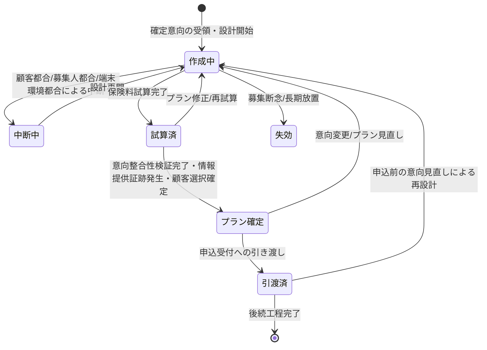

# 設計書作成ドメイン要求仕様書

## 本書について

### 概要

本書は、Sample生命保険株式会社 個人保険新契約システムの「設計書作成」ドメインに関するドメイン要求を記載したドキュメントです。

上流のプロダクト要求仕様書(PRD)が定めたプロダクトレベルの What のうち本ドメインに関わる横断要求を継承し、その上に本ドメイン固有の業務ルール・業務状態遷移・業務運用(イレギュラー対応)を積み上げて詳細化します。「Why → What → How」の階層では、PRD(プロダクトの What)を Why として引き継ぎ、本書は「本ドメインとして何を満たすべきか(ドメインの What)」を扱います。具体的な機能・画面・データ構造・API 等の How は後続の D2 以降の成果物で扱います。

### 想定読者

* 設計書作成・保険商品設計領域のドメインエキスパート
* 設計書作成ドメイン担当の開発・QA
* PdM / PM
* 上流成果物(PRD・ドメイン定義書)作成者

### 注記

本書では原則として How(具体的な実装手段)には踏み込みませんが、ビジネス・規制上譲れない具体水準のうち **本ドメイン固有のもの** は本書で確定します。プロダクト横断で共通の水準は PRD を正典とし、本書では重複定義せず継承します。

## 対象ドメイン

| ドメインID | ドメイン名 | 区分 | 種別 | 概要 | 主な関心事 |
|---|---|---|---|---|---|
| DESIGN | 設計書作成 | コア | 業務工程 | HEARで把握された顧客意向に基づき保険商品の設計(プラン)を作成し、保険料試算・帳票出力を行う領域 | 意向に沿った最適プラン提示、対面/非対面ハイブリッドでの操作性、マルチチャネル展開への耐性、設計から申込への滑らかな引き渡し |

## 継承するPRD要求

本ドメインに効く PRD 横断要求を以下に継承します。各要求の実体は PRD を正典とし、本書では本ドメインでの適用観点のみ補足します。

| 継承元 PRD ID | 要求名 | 本ドメインでの適用観点 |
|---|---|---|
| PRD-FR-1 | 業務通知 | 設計書作成完了・申込への引き渡し準備が整った旨を募集人へ通知する局面に適用する |
| PRD-FR-2 | 帳票出力 | 設計書(プラン内容・保険料試算結果)を画面表示・PDF出力・電子交付の各形態で出力する。本ドメインは設計書帳票の主たる発生源 |
| PRD-FR-3 | 業務の中断・再開 | プラン作成・保険料試算の途中中断から入力済みプランを失わずに再開する局面に適用する |
| PRD-NFR-1 | オンライン操作のレスポンスタイム | 保険料試算・プラン提示の主要操作のレスポンス水準を継承する。試算は体感に直結するため重要 |
| PRD-NFR-3 | 業務時間帯の稼働率 | 縮退運用方針(PRD-NFR-4)上、設計書作成は意向把握〜申込受付の局所稼働対象に含まれる |
| PRD-NFR-4 | 障害時の縮退運用方針 | 商品仕様参照(PROD)以外の外部連携障害時も設計書作成を継続できることを継承する |
| PRD-NFR-5 | スケーラビリティ | マルチチャネル展開・新商品投入による設計件数増加に対する水平スケーリング前提を継承する |
| PRD-NFR-7 | 業務ルール保守性 | 保険料計算ロジック・商品仕様を業務部門が把握・更新可能に保つ観点を継承する。本ドメインは試算の主利用者 |
| PRD-SEC-2 | 認証方式 | 募集人(ACT-1・ACT-2)の認証方式を継承する |
| PRD-SEC-4 | 保存時暗号化 | 設計プランに含まれる個人情報・業務上機密の保存時暗号化を継承する |
| PRD-SEC-5 | RBAC・最小権限 | 募集人は自身が関与する設計プランのみアクセス可、商品×募集人の権限制御を継承する |
| PRD-SEC-6 | 監査ログ・改ざん不能性 | 設計プラン・保険料試算結果の参照・操作の改ざん不能な記録を継承する |
| PRD-REG-1 | 保険業法・保険業法施行規則 | 募集規制のうち情報提供義務・適合性原則を設計書作成プロセスに組み込む |
| PRD-REG-3 | 個人情報保護法 | 設計プランに含まれる個人情報の取得・利用を法令準拠で実施する観点を継承する(全業務工程ドメイン適用) |
| PRD-REG-6 | 金融庁「保険会社向けの総合的な監督指針」 | お客様本位の業務運営原則に基づく適切なプラン提示を担保する観点を継承する |

## ドメイン固有の業務要求

### 業務ルール

本ドメイン固有の業務として満たすべき判断基準・制約・条件を以下に示します。

| ID | 業務ルール | 内容 | 根拠/制約 |
|---|---|---|---|
| DESIGN-BR-1 | 意向に基づくプラン作成 | 設計プランは HEAR で確定した意向情報に基づき作成する。意向が未確定・未引き渡しの状態で設計プランを確定してはならない | ドメイン定義書「意向に沿った最適プラン提示」、ドメイン定義書 HEAR→DESIGN 連携 |
| DESIGN-BR-2 | 意向との整合性検証 | 作成した設計プランが当初意向(保障種類・保障額・保障期間・予算)に沿っているかを業務上検証し、不整合があれば乖離内容を明示する。意向との乖離を解消または顧客説明・合意しないまま申込へ引き渡してはならない | 保険業法(適合性原則・情報提供義務 PRD-REG-1)、ドメイン定義書「意向に沿った最適プラン提示」 |
| DESIGN-BR-3 | 保険料試算の商品仕様準拠 | 保険料試算は商品仕様管理(PROD)が定める最新の商品仕様・引受基準・保険料計算ロジックに準拠して行う。本ドメイン内で計算ロジックを独自に保持・改変しない | PRD-NFR-7、ドメイン定義書 DESIGN→PROD 連携 |
| DESIGN-BR-4 | 取扱可能商品の制約 | 設計対象とできる商品は、募集人が募集権限を有し、かつ当該時点で取扱可能(販売停止・改定前後の適用日整合を含む)な商品に限る | 保険業法(募集人登録義務 PRD-REG-1)、ドメイン定義書 CHNL/PROD 連携 |
| DESIGN-BR-5 | 情報提供義務の証跡発生 | 設計プラン提示にあたり提供した重要事項(保障内容・保険料・注意喚起事項等)の説明事実を募集コンプライアンス証跡として発生させる。情報提供の証跡が欠落した設計書提示を完了扱いしてはならない | 保険業法(情報提供義務 PRD-REG-1)、金融庁監督指針(PRD-REG-6)、ドメイン定義書 DESIGN→SUIT 連携 |
| DESIGN-BR-6 | 設計プランの確定 | 設計プランは、保険料試算が完了し意向整合性が検証された上で確定状態に遷移させなければ申込受付へ引き渡せない。確定前の試算中プランと確定済みプランを業務上区別する | ドメイン定義書「設計から申込への滑らかな引き渡し」 |
| DESIGN-BR-7 | 複数プランの比較提示 | 顧客意向に対し複数の設計プランを作成・比較提示できる。申込へ引き渡すのは顧客が選択し確定した単一プランとする | ドメイン定義書「意向に沿った最適プラン提示」 |
| DESIGN-BR-8 | 対面/非対面での設計同等性 | 対面・非対面いずれの募集形態でも、設計プラン作成・保険料試算・情報提供の業務要件は同一とする。形態差により情報提供・整合性検証を緩めない | ドメイン定義書「対面/非対面ハイブリッドでの操作性」、PRD 体験設計「提供価値・体験方針」 |

### 業務状態遷移

本ドメインが管理する主要な業務対象である「設計プラン」の業務状態と遷移を示します。

| 業務状態 | 定義 | この状態での主な制約 |
|---|---|---|
| 作成中 | 確定意向に基づきプランを編集している状態 | 申込へ引き渡し不可。プランは暫定扱い |
| 中断中 | 設計を一時中断している状態 | 入力済みプランを保持する。再開まで確定不可 |
| 試算済 | 保険料試算が完了した状態 | 意向整合性検証・情報提供証跡が未了の間は確定不可 |
| プラン確定 | 意向整合性が検証され情報提供証跡が発生し、顧客が選択・確定したプランの状態 | 申込へ引き渡し可。意向変更時は再設計に戻す |
| 引渡済 | 確定プランを申込受付へ引き渡した状態 | 意向見直し時は再設計に戻し変更を追跡 |
| 失効 | 募集断念・長期放置でプランが成立しなかった状態 | 引き渡し不可。証跡は保全 |

| 遷移元 | 遷移先 | 契機 | 主体 | 前提条件 |
|---|---|---|---|---|
| (開始) | 作成中 | 確定意向の受領・設計開始 | 募集人 | HEAR の意向が確定・引渡済 |
| 作成中 | 中断中 | 顧客都合/募集人都合/端末環境都合による中断 | 募集人 | 入力済みプランの保持 |
| 中断中 | 作成中 | 設計再開 | 募集人 | 再開期限内 |
| 作成中 | 試算済 | 保険料試算完了 | 募集人 | 取扱可能商品・最新商品仕様準拠 |
| 試算済 | プラン確定 | 意向整合性検証完了・情報提供証跡発生・顧客選択 | 募集人 | 意向との乖離が解消または顧客合意済 |
| プラン確定 | 作成中 | 意向変更/プラン見直し | 募集人 | 変更を追跡記録 |
| プラン確定 | 引渡済 | 申込受付への引き渡し | 募集人 | プラン確定済・情報提供証跡発生済 |
| 引渡済 | 作成中 | 申込前の意向見直しによる再設計 | 募集人 | 意向変更の追跡 |
| 作成中 | 失効 | 募集断念/長期放置 | 募集人 | 証跡保全 |

### 業務運用(イレギュラー対応)

正常系から外れる業務局面と、その業務上の取り扱いを以下に示します。

| ID | イレギュラー事象 | 発生契機 | 業務上の対応 |
|---|---|---|---|
| DESIGN-BOP-1 | 意向との乖離があるプラン | 予算制約等で意向どおりの保障が組めない | 乖離内容を業務上明示し、意向の見直し(HEAR への差し戻し)または顧客への説明・合意のいずれかを経るまで申込へ引き渡さない |
| DESIGN-BOP-2 | 商品仕様の改定・販売停止 | 設計途中で対象商品が改定・販売停止 | 適用日整合を確認し、適用不可となったプランは再設計を促す。確定済みで未引き渡しのプランも適用可否を再判定する |
| DESIGN-BOP-3 | 保険料試算が継続不能 | 商品仕様管理(PROD)参照の一時不達 | 試算を完了扱いとせず、参照回復後に再試算する。回復処理はプロダクト共通の信頼性方針(PRD-NFR-9)に従う |
| DESIGN-BOP-4 | 設計の長時間中断・再開不能 | 訪問先のネットワーク不安定・顧客都合での長期中断 | 入力済みプランを保持し中断中とする。再開期限超過時は失効とし証跡を保全する |
| DESIGN-BOP-5 | 引き渡し後の意向見直し | 申込直前に顧客が意向を変更 | 引渡済プランを作成中へ戻し再設計する。変更前後・変更時点を追跡記録し、再度確定・引き渡しを行う |
| DESIGN-BOP-6 | 情報提供証跡の連携失敗 | 横断ドメイン(SUIT)への証跡連携が一時不達 | 設計書提示を完了扱いとせず、証跡連携の回復後に完了とする(PRD-NFR-9 に従う) |

## 他ドメインとの連携

ドメイン定義書「ドメイン間の主な連携」と整合する本ドメインの入力・出力を以下に示します。

| 方向 | 相手ドメイン | 連携内容 | 契機 |
|---|---|---|---|
| 入力 | HEAR(意向把握) | 確定済み意向情報を受け取る | 設計開始時 |
| 入力 | PROD(商品仕様管理) | 商品仕様・引受基準・保険料計算ロジックを参照する | 保険料試算時 |
| 入力 | CHNL(募集チャネル管理) | 募集人の商品種別に対する募集権限・取扱可能商品を参照する | 設計対象商品の選択時 |
| 出力 | APPL(申込受付) | 確定済み設計プラン(プラン内容・保険料・払込前提)を引き渡す | プラン確定・申込受付への引き渡し |
| 出力 | SUIT(募集コンプライアンス証跡管理) | 情報提供・重要事項説明の証跡を連携する | 設計プラン提示時 |
| 出力 | HEAR(意向把握) | 設計内容を受けた意向見直しの契機を返す | 設計提示後の意向変更 |

## ドメイン固有のデータ要件

PRD §「セキュリティ要件 > データアクセス要件」の機密区分を継承し、本ドメイン固有の主要データを以下に対応づけます。構造詳細は D2 のデータモデルに降ろします。

| ID | データ | PRD 機密区分との対応 | 本ドメインでの取り扱い |
|---|---|---|---|
| DESIGN-DATA-1 | 設計プラン(保障内容・保険料試算結果・払込前提) | PRD-SEC-DATA-3(申込・契約情報/個人情報・業務上機密) | 募集人は自身が関与するプランのみ参照・更新可。確定後の変更は追跡記録 |
| DESIGN-DATA-2 | 保険料計算ルール・商品仕様(参照) | PRD-SEC-DATA-4(商品仕様・引受基準・保険料計算ルール/業務上機密) | PROD を正典として参照のみ。本ドメインで保持・改変しない |
| DESIGN-DATA-3 | 意向整合性検証結果(意向と設計の乖離記録) | PRD-SEC-DATA-6(募集コンプライアンス証跡/個人情報含む・業務上機密) | 乖離内容と顧客合意の事実を改ざん不能に保持。説明可能性の根拠 |
| DESIGN-DATA-4 | 情報提供・重要事項説明の募集コンプライアンス証跡 | PRD-SEC-DATA-6(募集コンプライアンス証跡) | 改ざん不能保存。SUIT へ連携。参照は限定・全件監査ログ対象 |

## 受け入れ基準

* 意向起点の設計: 意向が確定・引き渡し済でない限り設計プランを確定できないことが業務シナリオで確認できる(DESIGN-BR-1)
* 意向整合性検証: 意向との乖離が解消または顧客合意されない限り申込へ引き渡せないことが確認できる(DESIGN-BR-2・DESIGN-BOP-1)
* 商品仕様準拠: 保険料試算が PROD の最新商品仕様・計算ロジックに準拠し、本ドメインで改変しないことが確認できる(DESIGN-BR-3)
* 情報提供証跡: 重要事項説明の証跡が改ざん不能に発生し SUIT へ連携されることが確認できる(DESIGN-BR-5・DESIGN-DATA-4)
* 申込への滑らかな引き渡し: 確定プランが欠落なく申込受付へ引き渡されることが確認できる(DESIGN-BR-6)
* 継承 PRD 要求の充足: 本ドメインに継承した PRD 要求(帳票出力、中断・再開、認証、暗号化、監査ログ、保険業法対応)が本ドメインの業務局面で満たされることが確認できる
* 主要業務状態遷移の通し確認: 作成中→試算済→プラン確定→引渡済 の正常系、および中断・失効・意向変更による再設計の異常系が通しで確認できる
