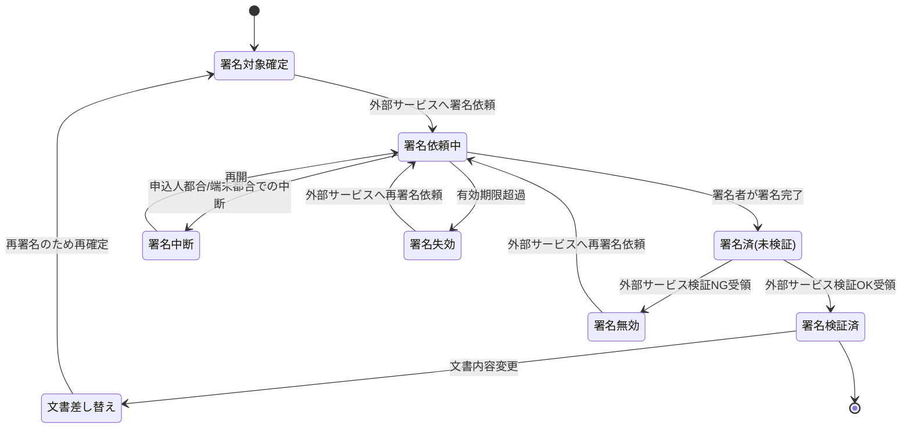

# 電子署名要求仕様書

## 本書について

### 概要

本書は、[ドメイン定義書](../domain-definition-document#一覧)に記載されるドメインのうち、「電子署名」に関する要求事項を記載したドキュメントです。

本ドメインは **外部電子署名サービス(`EXT-ESIGN-SERVICE`)の利用を前提**とし、本ドメインの責務は外部サービスとの **オーケストレーション**(署名依頼の発出・取得・検証結果受領・例外対応・有効期限管理・証跡保持)に限定します。署名取得の技術的手続き・タイムスタンプ付与・署名検証アルゴリズム 等の主たる業務ロジックは外部サービス側に委ねます。

本書は「本ドメインとして何を満たすべきか(What)」を扱います。

### 本ドメインの責務範囲と外部サービスへの委任

| 観点 | 本ドメインの責務(オーケストレーション) | 外部電子署名サービス(`EXT-ESIGN-SERVICE`)の責務 |
|---|---|---|
| 業務責務 | どの文書に・誰に・いつ署名を依頼するかの業務判断、署名依頼の発出、署名対象文書の確定管理、依頼の有効期限管理、結果受領、例外時の再依頼、証跡の保持 | 署名取得の技術的手続き、タイムスタンプ等の真実性確保措置の付与、署名の検証アルゴリズム |
| 規制対応 | 電子帳簿保存法(PRD-REG-5)の業務プロセスへの組み込み、署名済み文書の可視性(検索・参照)確保 | 真実性確保措置(タイムスタンプ等)の技術的提供 |
| データ保有 | 署名対象文書(申込書・告知書 等の確定版)、署名証跡(署名者・署名日時・検証結果)、外部サービス連携記録 | 署名生成過程の暗号鍵・技術的中間データ(本ドメインは生鍵を保持しない) |

### 注記

本書では原則として 具体的な実装手段(How)には踏み込みませんが、 **ビジネス・規制上譲れない本ドメイン固有のHow** は本書で確定します。

## 業務要求

### 業務ルール(オーケストレーション)

本ドメイン固有の業務ルール(外部サービスとのオーケストレーション責務)を以下に示します。プロダクト横断で共通の要求は PRD を正典とし、ここでは再定義しません。

| ID | 業務ルール | 内容 | 根拠/制約 |
|---|---|---|---|
| ESIGN-BR-1 | 署名対象文書の範囲 | 申込書・告知書 等、契約意思・告知意思の表明として電子署名を要する文書を署名対象とし、外部電子署名サービス(`EXT-ESIGN-SERVICE`)へ署名依頼を発出する | 電子帳簿保存法(PRD-REG-5) / ドメイン定義書 ESIGN / ドメイン定義書(APPL・DECL からの参照)【要確認: 電子署名を要する文書の確定リスト(申込書・告知書以外を含むか)を業務所管で確定要】 |
| ESIGN-BR-2 | 署名者の特定 | 署名対象文書ごとに署名すべき主体(申込人/契約者・被保険者 等)を業務上特定し、外部サービスに対して署名者として指定する。当該主体の署名をもって意思表示の成立とする | 保険業法・保険法の意思確認(PRD-REG 整合) / ドメイン定義書 ESIGN |
| ESIGN-BR-3 | 署名前の文書確定 | 署名対象は確定済みの文書内容とする。署名後に文書内容を変更する場合は外部サービスへ再署名を依頼する | 電子帳簿保存法 真実性確保(PRD-REG-5) |
| ESIGN-BR-4 | 真実性確保措置の依頼 | 署名済み文書には、改ざんの有無を事後に検証できる措置(タイムスタンプ等)を **外部サービス側で付与する**よう依頼する。本ドメインはタイムスタンプを独自に生成・管理しない | 電子帳簿保存法 真実性確保(PRD-REG-5) / PRD-EXT-8 / ドメイン定義書 ESIGN |
| ESIGN-BR-5 | 署名検証結果の受領と保持 | 外部サービスから取得した署名は、署名者・署名日時・文書の同一性の観点で **外部サービスが検証**したうえで、本ドメインは検証結果を証跡として保持する。本ドメインは独自の署名検証アルゴリズムを実装しない | 電子帳簿保存法(PRD-REG-5) / PRD-SEC-DATA-6 / PRD-EXT-8 |
| ESIGN-BR-6 | 署名完了の前提条件 | 署名依頼の発出は、当該文書に対する取扱い説明・同意(PRD-FR-4)が完了していることを前提とする | PRD-FR-4 / 保険業法(PRD-REG-1)整合 |
| ESIGN-BR-7 | 署名未完了の業務継続制限 | 申込意思・告知意思の表明として必須の署名が完了していない申込は、後続の引受査定・契約成立(計上)へ進めない | 電子帳簿保存法(PRD-REG-5) / ドメイン定義書(APPL・DECL からの参照) |
| ESIGN-BR-8 | 署名証跡の可視性 | 署名済み文書・署名証跡は、業務上・監査上の必要に応じて検索・参照可能な状態で本ドメインが保全する | 電子帳簿保存法 可視性確保(PRD-REG-5) / PRD-SEC-DATA-6 |
| ESIGN-BR-9 | 署名依頼の有効期限管理 | 外部サービスへの署名依頼には業務上の有効期限を設け、期限内に署名が完了しない場合は本ドメイン側で失効として扱い、業務所管の判断に基づき再依頼または打ち切りを行う | 業務運用上の制約【要確認: 署名依頼の有効期限(日数)を業務所管で確定要】 |

### 業務状態遷移

本ドメインが管理する **本ドメイン側のオーケストレーション状態**(署名対象文書の署名手続き)の業務状態と遷移を示します。外部サービス内部の署名生成処理状態は本ドメインの管理対象外です。

| 業務状態 | 定義 | この状態での主な制約 |
|---|---|---|
| 署名対象確定 | 署名すべき文書内容が確定した状態 | 内容確定前は署名依頼できない |
| 署名依頼中 | 外部サービスへ署名を依頼し、署名完了待ちの状態 | 署名完了まで業務継続を制限 |
| 署名中断 | 申込人都合・端末環境都合で署名手続きが中断した状態 | 入力済み手続きを失わず再開可能とする |
| 署名済(未検証) | 署名者の署名は完了したが外部サービスからの検証結果受領前の状態 | 検証結果受領まで成立扱いにしない |
| 署名検証済 | 外部サービスから署名・真実性措置の検証成功を受領した状態 | 文書差し替え時は再署名を要する |
| 署名無効 | 外部サービスの検証で不整合が判明した状態 | 再署名依頼を要する |
| 署名失効 | 有効期限内に署名完了しなかった状態 | 再署名依頼を要する |
| 文書差し替え | 署名検証後に文書内容変更が発生した状態 | 旧署名は無効化され再署名を要する |

| 遷移元 | 遷移先 | 契機 | 主体 | 前提条件 |
|---|---|---|---|---|
| 署名対象確定 | 署名依頼中 | 外部サービスへ署名依頼の発出 | 募集人 / 新契約事務担当者 | 同意取得(PRD-FR-4)が完了 |
| 署名依頼中 | 署名済(未検証) | 署名者が外部サービス上で署名を完了 | 申込人・被保険者 | 署名対象文書が確定済み |
| 署名依頼中 | 署名中断 | 申込人都合・端末環境都合での中断 | 申込人・被保険者 | 署名完了前 |
| 署名中断 | 署名依頼中 | 中断からの再開 | 申込人・被保険者 / 募集人 | 中断時点の手続きが保持されている |
| 署名依頼中 | 署名失効 | 有効期限の超過 | システム的契機(本ドメインの期限管理) | 期限内に署名未完了 |
| 署名済(未検証) | 署名検証済 | 外部サービスから検証OK受領 | 外部電子署名サービス | 署名取得済み |
| 署名済(未検証) | 署名無効 | 外部サービスから検証NG受領 | 外部電子署名サービス | 署名と文書の不整合 等 |
| 署名無効 | 署名依頼中 | 外部サービスへ再署名依頼 | 新契約事務担当者 / 募集人 | 再署名が業務上必要 |
| 署名失効 | 署名依頼中 | 外部サービスへ再署名依頼 | 新契約事務担当者 / 募集人 | 再依頼が業務上必要 |
| 署名検証済 | 文書差し替え | 文書内容の変更発生 | 募集人 / 新契約事務担当者 | 内容変更が確定 |
| 文書差し替え | 署名対象確定 | 再署名のための文書再確定 | 募集人 / 新契約事務担当者 | 変更後文書が確定 |

### 業務運用(イレギュラー対応)

正常系から外れる業務局面と、その業務上の取り扱いを以下に示します。本ドメインは外部電子署名サービス利用を前提とするため、外部サービス不達・検証不成立・再署名 等の業務運用を厚く定めます。

| ID | イレギュラー事象 | 発生契機 | 業務上の対応 |
|---|---|---|---|
| ESIGN-IRR-1 | 外部電子署名サービスの不達・タイムアウト | サービス障害・通信障害・応答遅延 | 署名依頼中状態を維持し、業務上の再依頼手順で再実行する。一定時間内に復旧しない場合は申込人へ業務通知のうえ後日再依頼とし、業務継続は署名完了まで保留する(PRD-NFR-4 縮退運用に整合) |
| ESIGN-IRR-2 | 署名検証の不成立 | 外部サービスからの検証NG受領(署名と文書の不整合・真実性措置の不備) | 署名無効とし、原因(文書改変・署名者不一致 等)を切り分けたうえで外部サービスへ再署名を依頼する。改ざんの疑いがある場合はコンプライアンス部・CSIRTへエスカレーションする(PRD-SEC-9 に整合) |
| ESIGN-IRR-3 | 署名期限の超過 | 申込人が有効期限内に署名未完了 | 署名失効とし、申込人へ業務通知のうえ外部サービスへ再署名を依頼する。一定回数の失効後の取り扱いは業務所管の方針に従う(ESIGN-BR-9 に整合) |
| ESIGN-IRR-4 | 署名後の文書内容変更 | プラン変更・告知内容修正 等の事後変更 | 旧署名を無効化し、変更後文書を再確定して外部サービスへ再署名を依頼する(ESIGN-BR-3 に整合) |
| ESIGN-IRR-5 | 署名手続きの中断・再開 | 申込人都合・端末環境都合での中断 | 署名中断状態で手続きを保持し、再開可能とする(PRD-FR-3 に整合) |
| ESIGN-IRR-6 | 署名者の取り違え | 申込人/被保険者の署名対象の誤り | 当該署名を無効とし、正しい署名者に対し外部サービスへ再署名を依頼する。証跡に取り違えと是正の経緯を残す(ESIGN-BR-2 に整合) |
| ESIGN-IRR-7 | 真実性措置(タイムスタンプ等)の付与失敗 | 外部サービスからのタイムスタンプ付与エラー応答 | 署名検証済みへ遷移させず、真実性措置の再付与または再署名を外部サービスへ依頼して真実性を確保し直す(ESIGN-BR-4・PRD-REG-5 に整合) |
| ESIGN-IRR-8 | 外部サービスの仕様変更・更改 | 外部サービス提供者側の仕様変更・サービス更改 | 連携方針(PRD-EXT-8)に基づき疎結合性を活かして本ドメイン側の改修範囲を最小化する。連携テスト・運用切替を業務継続性確保のうえで段階的に実施 |

## セキュリティ要求

### データアクセス要求

| ID | データ | PRD 機密区分との対応 | 本ドメインでの取り扱い |
|---|---|---|---|
| ESIGN-DATA-1 | 署名対象文書(申込書・告知書 等の確定版) | PRD-SEC-DATA-3 個人情報・業務上機密(告知書はPRD-SEC-DATA-2 要配慮個人情報を含む) | 本ドメインで保持。保存時暗号化(PRD-SEC-4)・最小権限アクセス(PRD-SEC-5)。要配慮個人情報を含む文書は参照を限定。外部サービスへは署名依頼時に必要範囲を送付 |
| ESIGN-DATA-2 | 署名証跡(署名者・署名日時・署名検証結果・真実性措置情報) | PRD-SEC-DATA-6 個人情報含む・業務上機密 | 改ざん不能保存。10年間保持(PRD-SEC-7)。可視性確保のため検索・参照可能に保全(ESIGN-BR-8・PRD-REG-5)。検証結果は外部サービスから受領した内容を保持 |
| ESIGN-DATA-3 | 署名済み文書(真実性措置付与済み) | PRD-SEC-DATA-6 個人情報含む・業務上機密 | 改ざん不能保存。電子帳簿保存法の真実性・可視性要件に整合(PRD-REG-5)。10年間保持(PRD-SEC-7)。**真実性措置(タイムスタンプ)は外部サービスが付与した状態で本ドメインに保管** |
| ESIGN-DATA-4 | 外部電子署名サービスとの連携記録(依頼・応答・再実行履歴) | PRD-SEC-DATA-7 業務上機密 | 改ざん不能保存。冪等性確保のため依頼識別子を保持(PRD-NFR-9 / PRD-EXT-8)。10年間保持(PRD-SEC-7) |

## 受け入れ基準

* 署名取得の網羅性: 申込意思・告知意思の表明として必須の署名対象文書すべてに対し外部サービスへの署名依頼が発出・検証結果受領が行われ、署名未完了のまま契約成立へ進む経路が存在しないこと(ESIGN-BR-1・ESIGN-BR-7)
* 電子帳簿保存法遵守: 署名済み文書の真実性確保(外部サービスのタイムスタンプ付与)・可視性確保(本ドメインの検索・参照)が業務プロセスに組み込まれ、UATで遵守状況を確認済みであること(PRD-REG-5・ESIGN-BR-4・ESIGN-BR-8)
* 検証可能性: 外部サービスから取得した署名検証結果(署名者・署名日時・文書同一性)が証跡として保持されていること(ESIGN-BR-5)
* 業務状態遷移の通し確認: 正常(署名検証済)および異常(署名無効・失効・文書差し替え・外部不達・中断)の各経路が業務として収束することを確認済みであること
* オーケストレーション堅牢性: 外部電子署名サービスの不達・検証不成立・タイムアウト時の再依頼・縮退運用シナリオが確認済みであること(PRD-NFR-4・PRD-NFR-9・PRD-EXT-8)
* 証跡の十分性: 署名取得・検証・文書参照 が改ざん不能に記録され、10年間保持方針に整合していること(PRD-SEC-6・PRD-SEC-7)
* 外部委任範囲の明示: 本ドメインの責務(オーケストレーション)と外部サービスの責務(署名取得・タイムスタンプ・検証アルゴリズム)の境界が文書・運用で明確になっており、独自のタイムスタンプ生成・署名検証ロジックを本ドメイン側に保持していないこと(ESIGN-BR-4・ESIGN-BR-5)
