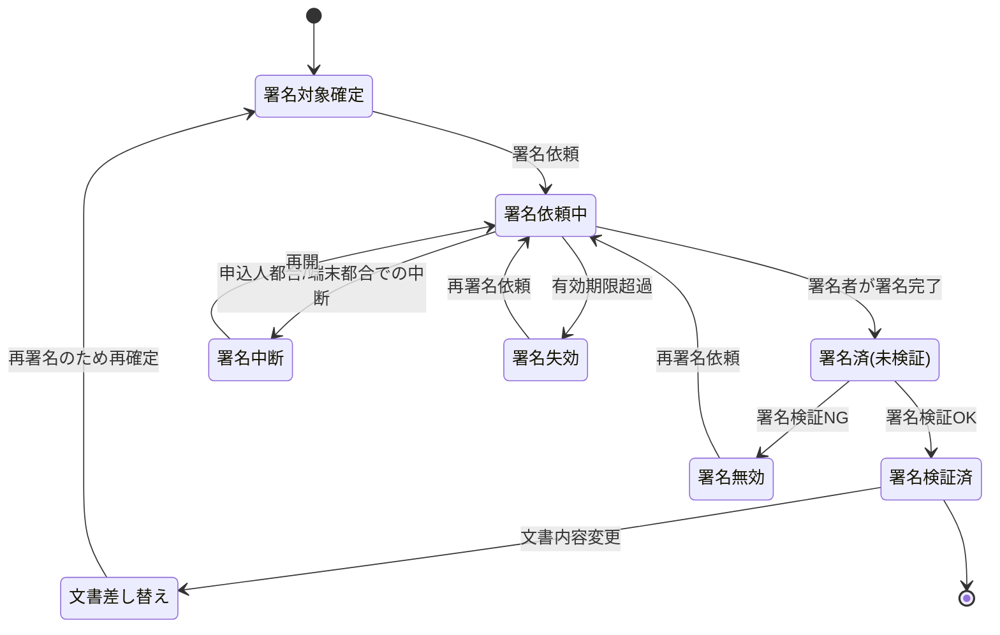

# 電子署名ドメイン要求仕様書

## 本書について

### 概要

本書は、Sample生命保険株式会社 個人保険新契約システムの「電子署名」ドメインに関するドメイン要求を記載したドキュメントです。

上流のプロダクト要求仕様書(PRD)が定めたプロダクトレベルの What のうち本ドメインに関わる横断要求を継承し、その上に本ドメイン固有の業務ルール・業務状態遷移・業務運用(イレギュラー対応)を積み上げて詳細化します。「Why → What → How」の階層では、PRD(プロダクトの What)を Why として引き継ぎ、本書は「本ドメインとして何を満たすべきか(ドメインの What)」を扱います。具体的な機能・画面・データ構造・API 等の How は後続の D2 以降の成果物で扱います。

### 想定読者

* 電子契約・電子帳簿保存の業務所管(コンプライアンス部・新契約部門)
* 電子署名ドメイン担当の開発・QA
* PdM / PM
* 上流成果物(PRD・ドメイン定義書)作成者

### 注記

本書では原則として How(具体的な実装手段)には踏み込みませんが、ビジネス・規制上譲れない具体水準のうち **本ドメイン固有のもの** は本書で確定します。プロダクト横断で共通の水準は PRD を正典とし、本書では重複定義せず継承します。

## 対象ドメイン

| ドメインID | ドメイン名 | 区分 | 種別 | 概要 | 主な関心事 |
|---|---|---|---|---|---|
| ESIGN | 電子署名 | 汎用 | 横断 | 申込書・告知書 等への電子署名を取得・検証する領域。外部電子署名サービスの利用を前提とする | 電子帳簿保存法における真実性の確保、外部サービスとの疎結合連携、署名証跡の保持 |

## 継承するPRD要求

本ドメインに効く PRD 横断要求を以下に継承します。各要求の実体は PRD を正典とし、本書では本ドメインでの適用観点のみ補足します。

| 継承元 PRD ID | 要求名 | 本ドメインでの適用観点 |
|---|---|---|
| PRD-FR-1 | 業務通知 | 署名依頼・署名完了・署名期限超過 等を申込人/被保険者・募集人へ業務通知する局面に効く |
| PRD-FR-2 | 帳票出力 | 署名対象となる申込書・告知書 等の帳票が署名対象文書として確定される点に効く |
| PRD-FR-3 | 業務の中断・再開 | 署名手続きが申込人都合・端末環境都合で中断した場合の再開に効く |
| PRD-FR-4 | 同意取得・同意管理 | 電子署名による意思表示に先立つ取扱い説明・同意取得に効く |
| PRD-NFR-4 | 障害時の縮退運用方針 | 外部電子署名サービス障害時の業務継続シナリオの前提となる |
| PRD-NFR-8 | 既存システム・外部サービスの更改耐性 | 外部電子署名サービスの差し替え・更改時に本ドメインの改修範囲を最小化する方針に効く |
| PRD-NFR-9 | 外部連携・非同期処理のエラー検知・リトライ・冪等性 | 外部電子署名サービス連携の不達・タイムアウト時の再実行・二重署名防止に効く |
| PRD-SEC-4 | 保存時暗号化 | 署名済み文書・署名証跡の保存時暗号化に効く |
| PRD-SEC-5 | RBAC・最小権限 | 署名済み文書・署名証跡へのアクセスを職務上必要な担当者に限定する方針に効く |
| PRD-SEC-6 | 監査ログ(ログ対象・改ざん不能性) | 署名取得・署名検証・文書参照を改ざん不能な形で記録する局面に効く |
| PRD-SEC-7 | 監査ログ(保存期間) | 署名証跡・契約関係書類を10年間保持する方針に効く |
| PRD-SEC-DATA-3 | 申込・契約情報 | 署名対象となる申込・契約情報の機密区分(個人情報・業務上機密)を継承する |
| PRD-SEC-DATA-6 | 募集コンプライアンス証跡 | 電子署名が募集コンプライアンス証跡の構成要素として明示されている点に効く |
| PRD-REG-3 | 個人情報保護法 | 署名対象文書に含まれる個人情報・要配慮個人情報の取扱いの法令準拠に効く |
| PRD-REG-5 | 電子帳簿保存法 | 本ドメインの中核。電子的に保存する申込書・告知書・契約関係書類の真実性確保(タイムスタンプ等)・可視性確保の起点となる |

## ドメイン固有の業務要求

### 業務ルール

本ドメイン固有の業務ルールを以下に示します。プロダクト横断で共通の要求は PRD を正典とし、ここでは再定義しません。

| ID | 業務ルール | 内容 | 根拠/制約 |
|---|---|---|---|
| ESIGN-BR-1 | 署名対象文書の範囲 | 申込書・告知書 等、契約意思・告知意思の表明として電子署名を要する文書を署名対象とする | 電子帳簿保存法(PRD-REG-5) / ドメイン定義書 ESIGN 概要 / ドメイン定義書(APPL・DECL からの参照)【要確認: 電子署名を要する文書の確定リスト(申込書・告知書以外を含むか)を業務所管で確定要】 |
| ESIGN-BR-2 | 署名者の特定 | 署名対象文書ごとに署名すべき主体(申込人/契約者・被保険者 等)を業務上特定し、当該主体の署名をもって意思表示の成立とする | 保険業法・保険法の意思確認(PRD-REG 整合) / ドメイン定義書 ESIGN 主な関心事 |
| ESIGN-BR-3 | 署名前の文書確定 | 署名対象は確定済みの文書内容とする。署名後に文書内容を変更する場合は再署名を要する | 電子帳簿保存法 真実性確保(PRD-REG-5) |
| ESIGN-BR-4 | 真実性の確保 | 署名済み文書には、改ざんの有無を事後に検証できる措置(タイムスタンプ等)を施し、文書の同一性を担保する | 電子帳簿保存法 真実性確保(PRD-REG-5) / ドメイン定義書 ESIGN 主な関心事 |
| ESIGN-BR-5 | 署名の検証 | 取得した署名は、署名者・署名日時・文書の同一性の観点で検証可能とし、検証結果を証跡として保持する | 電子帳簿保存法(PRD-REG-5) / PRD-SEC-DATA-6 |
| ESIGN-BR-6 | 署名完了の前提条件 | 署名取得は、当該文書に対する取扱い説明・同意(PRD-FR-4)が完了していることを前提とする | PRD-FR-4 / 保険業法(PRD-REG-1)整合 |
| ESIGN-BR-7 | 署名未完了の契約進行制限 | 申込意思・告知意思の表明として必須の署名が完了していない申込は、後続の引受査定・契約成立(計上)へ進めない | 電子帳簿保存法(PRD-REG-5) / ドメイン定義書(APPL・DECL からの参照) |
| ESIGN-BR-8 | 署名証跡の可視性 | 署名済み文書・署名証跡は、業務上・監査上の必要に応じて検索・参照可能な状態で保全する | 電子帳簿保存法 可視性確保(PRD-REG-5) / PRD-SEC-DATA-6 |
| ESIGN-BR-9 | 署名の有効期限 | 署名依頼には業務上の有効期限を設け、期限内に署名が完了しない場合は失効として扱う | 業務運用上の制約【要確認: 署名依頼の有効期限(日数)を業務所管で確定要】 |

### 業務状態遷移

本ドメインが管理する主要な業務対象(署名対象文書の署名手続き)の業務状態と遷移を示します。

| 業務状態 | 定義 | この状態での主な制約 |
|---|---|---|
| 署名対象確定 | 署名すべき文書内容が確定した状態 | 内容確定前は署名依頼できない |
| 署名依頼中 | 署名者へ署名を依頼し、署名完了待ちの状態 | 署名完了まで契約進行を制限 |
| 署名中断 | 申込人都合・端末環境都合で署名手続きが中断した状態 | 入力済み手続きを失わず再開可能とする |
| 署名済(未検証) | 署名者の署名は完了したが検証前の状態 | 検証完了まで成立扱いにしない |
| 署名検証済 | 署名・真実性措置の検証が完了した状態 | 文書差し替え時は再署名を要する |
| 署名無効 | 署名検証で不整合が判明した状態 | 再署名依頼を要する |
| 署名失効 | 有効期限内に署名完了しなかった状態 | 再署名依頼を要する |
| 文書差し替え | 署名検証後に文書内容変更が発生した状態 | 旧署名は無効化され再署名を要する |

| 遷移元 | 遷移先 | 契機 | 主体 | 前提条件 |
|---|---|---|---|---|
| 署名対象確定 | 署名依頼中 | 署名依頼の発出 | 募集人 / 新契約事務担当者 | 同意取得(PRD-FR-4)が完了 |
| 署名依頼中 | 署名済(未検証) | 署名者が署名を完了 | 申込人・被保険者 | 署名対象文書が確定済み |
| 署名依頼中 | 署名中断 | 申込人都合・端末環境都合での中断 | 申込人・被保険者 | 署名完了前 |
| 署名中断 | 署名依頼中 | 中断からの再開 | 申込人・被保険者 / 募集人 | 中断時点の手続きが保持されている |
| 署名依頼中 | 署名失効 | 有効期限の超過 | システム的契機(業務上の期限管理) | 期限内に署名未完了 |
| 署名済(未検証) | 署名検証済 | 署名・真実性措置の検証成功 | 外部電子署名サービス | 署名取得済み |
| 署名済(未検証) | 署名無効 | 署名・真実性措置の検証失敗 | 外部電子署名サービス | 署名と文書の不整合 等 |
| 署名無効 | 署名依頼中 | 再署名依頼 | 新契約事務担当者 / 募集人 | 再署名が業務上必要 |
| 署名失効 | 署名依頼中 | 再署名依頼 | 新契約事務担当者 / 募集人 | 再依頼が業務上必要 |
| 署名検証済 | 文書差し替え | 文書内容の変更発生 | 募集人 / 新契約事務担当者 | 内容変更が確定 |
| 文書差し替え | 署名対象確定 | 再署名のための文書再確定 | 募集人 / 新契約事務担当者 | 変更後文書が確定 |

### 業務運用(イレギュラー対応)

正常系から外れる業務局面と、その業務上の取り扱いを以下に示します。本ドメインは外部電子署名サービス利用を前提とするため、外部サービス不達・検証不成立・再署名 等の業務運用を厚く定めます。

| ID | イレギュラー事象 | 発生契機 | 業務上の対応 |
|---|---|---|---|
| ESIGN-BOP-1 | 外部電子署名サービスの不達・タイムアウト | サービス障害・通信障害・応答遅延 | 署名依頼中状態を維持し、業務上の再依頼手順で再実行する。一定時間内に復旧しない場合は申込人へ業務通知のうえ後日再依頼とし、契約進行は署名完了まで保留する(PRD-NFR-4 縮退運用に整合) |
| ESIGN-BOP-2 | 署名検証の不成立 | 署名と文書の不整合・真実性措置の不備 | 署名無効とし、原因(文書改変・署名者不一致 等)を切り分けたうえで再署名を依頼する。改ざんの疑いがある場合はコンプライアンス部・CSIRTへエスカレーションする(PRD-SEC-9 に整合) |
| ESIGN-BOP-3 | 署名期限の超過 | 申込人が有効期限内に署名未完了 | 署名失効とし、申込人へ業務通知のうえ再署名依頼を行う。一定回数の失効後の取り扱いは業務所管の方針に従う(ESIGN-BR-9 に整合) |
| ESIGN-BOP-4 | 署名後の文書内容変更 | プラン変更・告知内容修正 等の事後変更 | 旧署名を無効化し、変更後文書を再確定して再署名を取得する(ESIGN-BR-3 に整合) |
| ESIGN-BOP-5 | 署名手続きの中断・再開 | 申込人都合・端末環境都合での中断 | 署名中断状態で手続きを保持し、再開可能とする(PRD-FR-3 に整合) |
| ESIGN-BOP-6 | 署名者の取り違え | 申込人/被保険者の署名対象の誤り | 当該署名を無効とし、正しい署名者に対し再署名を依頼する。証跡に取り違えと是正の経緯を残す(ESIGN-BR-2 に整合) |
| ESIGN-BOP-7 | 真実性措置(タイムスタンプ等)の付与失敗 | 真実性確保措置の付与エラー | 署名検証済みへ遷移させず、真実性措置の再付与または再署名で真実性を確保し直す(ESIGN-BR-4・PRD-REG-5 に整合) |

## 他ドメインとの連携

| 方向 | 相手ドメイン | 連携内容 | 契機 |
|---|---|---|---|
| 入力 | APPL(申込受付) | 署名対象となる申込書 等の確定文書および署名者の特定情報を受け取る | 申込内容確定に伴う署名依頼 |
| 入力 | DECL(告知受付) | 署名対象となる告知書 等の確定文書を受け取る | 告知内容確定に伴う署名依頼 |
| 出力 | APPL(申込受付) | 申込書 等の署名完了・検証状態を返す。契約進行可否判断の前提となる | 署名検証の完了 |
| 出力 | DECL(告知受付) | 告知書 等の署名完了・検証状態を返す | 署名検証の完了 |
| 出力 | SUIT(募集コンプライアンス証跡管理) | 署名取得・検証の事実・日時・署名者を証跡イベントとして引き渡す | 署名検証の完了 |
| 出力 | AUDIT(統制・証跡管理) | 署名取得・検証・文書参照の操作ログを改ざん不能な記録として引き渡す。電子帳簿保存法対応の証跡保全に連携する | 署名取得・検証・参照のつど |

## ドメイン固有のデータ要件

| ID | データ | PRD 機密区分との対応 | 本ドメインでの取り扱い |
|---|---|---|---|
| ESIGN-DATA-1 | 署名対象文書(申込書・告知書 等の確定版) | PRD-SEC-DATA-3 個人情報・業務上機密(告知書はPRD-SEC-DATA-2 要配慮個人情報を含む) | 保存時暗号化(PRD-SEC-4)・最小権限アクセス(PRD-SEC-5)。要配慮個人情報を含む文書は参照を限定 |
| ESIGN-DATA-2 | 署名証跡(署名者・署名日時・署名検証結果・真実性措置情報) | PRD-SEC-DATA-6 個人情報含む・業務上機密 | 改ざん不能保存。10年間保持(PRD-SEC-7)。可視性確保のため検索・参照可能に保全(ESIGN-BR-8・PRD-REG-5) |
| ESIGN-DATA-3 | 署名済み文書(真実性措置付与済み) | PRD-SEC-DATA-6 個人情報含む・業務上機密 | 改ざん不能保存。電子帳簿保存法の真実性・可視性要件に整合(PRD-REG-5)。10年間保持(PRD-SEC-7) |
| ESIGN-DATA-4 | 外部電子署名サービスとの連携記録(依頼・応答・再実行履歴) | PRD-SEC-DATA-7 業務上機密 | 改ざん不能保存。冪等性確保のため依頼識別子を保持(PRD-NFR-9)。10年間保持(PRD-SEC-7) |

## 受け入れ基準

* 署名取得の網羅性: 申込意思・告知意思の表明として必須の署名対象文書すべてに対し署名取得・検証が行われ、署名未完了のまま契約成立へ進む経路が存在しないこと(ESIGN-BR-1・ESIGN-BR-7)
* 電子帳簿保存法遵守: 署名済み文書の真実性確保(タイムスタンプ等)・可視性確保(検索・参照)が業務プロセスに組み込まれ、UATで遵守状況を確認済みであること(PRD-REG-5・ESIGN-BR-4・ESIGN-BR-8)
* 検証可能性: 取得した署名が署名者・署名日時・文書同一性の観点で検証でき、検証結果が証跡として保持されていること(ESIGN-BR-5)
* 業務状態遷移の通し確認: 正常(署名検証済)および異常(署名無効・失効・文書差し替え・外部不達・中断)の各経路が業務として収束することを確認済みであること
* 外部連携の堅牢性: 外部電子署名サービスの不達・検証不成立・タイムアウト時の再実行・縮退運用シナリオが確認済みであること(PRD-NFR-4・PRD-NFR-9)
* 証跡の十分性: 署名取得・検証・文書参照が改ざん不能に記録され、10年間保持方針に整合していること(PRD-SEC-6・PRD-SEC-7)
