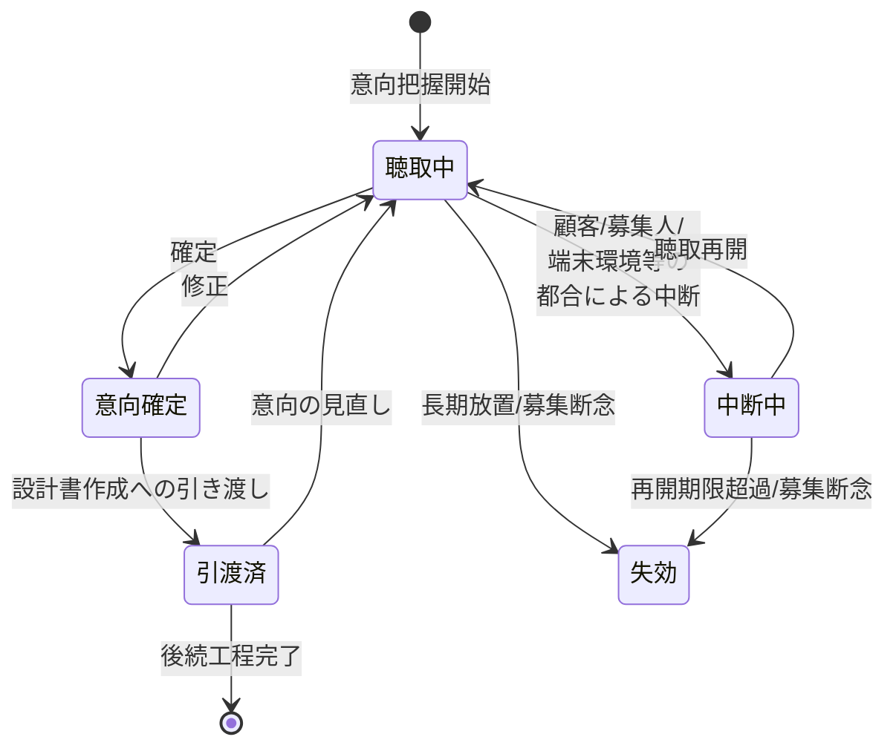

# 意向把握要求仕様書

## 本書について

### 概要

本書は、[ドメイン定義書](../domain-definition-document#一覧)に記載されるドメインのうち、「意向把握」に関する要求事項を記載したドキュメントです。
本書は「本ドメインとして何を満たすべきか(What)」を扱います。

### 注記

本書では原則として 具体的な実装手段(How)には踏み込みませんが、 **ビジネス・規制上譲れない本ドメイン固有のHow** は本書で確定します。

## 業務要求

### 業務ルール

本ドメイン固有の業務として満たすべき判断基準・制約・条件を以下に示します。

| ID | 業務ルール | 内容 | 根拠/制約 |
|---|---|---|---|
| DOM-HEAR-BR-1 | 意向把握項目の網羅 | 保険加入目的、希望する保障(種類・保障額・保障期間)、保険料予算、既契約状況、家族構成、職業を意向把握項目として網羅的に聴取・記録する。主要意向項目が未取得のまま後続の設計書作成へ引き渡してはならない | 保険業法(意向把握義務 DOM-COMMON-REG-1)、ドメイン定義書「意向の網羅性」 |
| DOM-HEAR-BR-2 | 意向確定の明示 | 聴取した意向は、顧客が表明した内容として確定状態に遷移させた上でなければ後続工程へ引き渡せない。確定前の暫定意向と確定済み意向を業務上区別する | ドメイン定義書「設計書との整合性検証への引き渡し」 |
| DOM-HEAR-BR-3 | 意向変更の追跡 | 意向の修正・追加・撤回が発生した場合、変更前後の内容と変更時点を追跡可能な形で記録する。設計書提示後に意向が変わった場合も、どの意向に基づき設計したかを後から説明できる状態を保つ | 保険業法(意向把握義務 DOM-COMMON-REG-1)、ドメイン定義書「意向変更の追跡性」 |
| DOM-HEAR-BR-4 | 対面/非対面双方での聴取品質担保 | 対面・非対面(オンライン面談)のいずれの聴取形態でも、取得すべき意向項目と確定手順は同一とする。聴取形態の違いにより意向把握の網羅性・確定要件を緩めない | ドメイン定義書「対面/非対面双方での聴取品質」、PRD 体験設計「提供価値・体験方針」 |
| DOM-HEAR-BR-5 | 意向情報取得の同意取得 | 家族構成・職業・既契約状況・収支等の個人情報を意向情報として取得する前に、取得・利用目的を顧客へ明示し本人同意を取得する。同意未取得の状態で意向情報を確定してはならない | 個人情報保護法(DOM-COMMON-REG-3)、DOM-COMMON-FR-4 |
| DOM-HEAR-BR-6 | 意向と設計書の整合性検証への引き渡し | 確定済み意向は、後続工程(設計書作成・申込前の意向確認)が「設計書が当初意向に沿っているか」を検証できる形で引き渡す。意向と設計内容の突合判断に必要な意向項目を欠落させない | ドメイン定義書「設計書との整合性検証への引き渡し」、保険業法(適合性原則の前提 DOM-COMMON-REG-1) |
| DOM-HEAR-BR-7 | 募集コンプライアンス証跡の発生 | 意向把握の実施(いつ・誰が・どの顧客に対し・どの意向を確認したか)を募集コンプライアンス証跡として発生させ、横断ドメインへ連携する。証跡が欠落した意向把握を完了扱いしてはならない | 金融庁監督指針(フィデューシャリー・デューティー DOM-COMMON-REG-6)、ドメイン定義書「お客様本位の業務運営の起点」 |
| DOM-HEAR-BR-8 | 募集人の取扱権限内での聴取 | 意向把握を行う募集人は、対象顧客・商品種別について募集権限を有していなければならない。権限外の募集人による意向把握は受け付けない。募集権限の判定は外部システム(募集人管理システム `EXT-CHNL-MASTER`)を参照する | 保険業法(募集人登録義務 DOM-COMMON-REG-1)、ドメイン定義書 HEAR→EXT-CHNL-MASTER 連携、DOM-COMMON-EXT-5 |

### 業務状態遷移

本ドメインが管理する主要な業務対象である「意向情報」の業務状態と遷移を示します。

| 業務状態 | 定義 | この状態での主な制約 |
|---|---|---|
| 聴取中 | 意向項目をヒアリングし記録している状態 | 後続工程への引き渡し不可。意向は暫定扱い |
| 中断中 | 聴取を一時中断している状態 | 入力済み意向を保持する。再開まで確定・引き渡し不可 |
| 意向確定 | 意向項目が網羅され本人同意を取得し、顧客の意向として確定した状態 | 後続工程へ引き渡し可。変更時は追跡記録を残す |
| 引渡済 | 確定意向を設計書作成へ引き渡した状態 | 意向変更時は再聴取に戻し変更を追跡する |
| 失効 | 募集断念・長期放置等で意向把握が成立しなかった状態 | 後続工程へ引き渡し不可。証跡は保全する |

| 遷移元 | 遷移先 | 契機 | 主体 | 前提条件 |
|---|---|---|---|---|
| (開始) | 聴取中 | 意向把握開始 | 募集人 | 募集人が対象顧客・商品の募集権限を有する |
| 聴取中 | 中断中 | 顧客都合/募集人都合/端末環境都合による中断 | 募集人 | 入力済み意向の保持 |
| 中断中 | 聴取中 | 聴取再開 | 募集人 | 再開期限内 |
| 聴取中 | 意向確定 | 確定(意向項目網羅・本人同意取得・顧客の意向表明) | 募集人 | 主要意向項目の網羅、個人情報取得同意取得済 |
| 意向確定 | 聴取中 | 修正(意向変更) | 募集人 | 変更前後と変更時点を追跡記録 |
| 意向確定 | 引渡済 | 設計書作成への引き渡し | 募集人 | 意向確定済・募集コンプライアンス証跡発生済 |
| 引渡済 | 聴取中 | 設計内容を受けた意向の見直し | 募集人 | 変更を追跡記録 |
| 聴取中 | 失効 | 長期放置/募集断念 | 募集人/募集管理者 | 証跡保全 |
| 中断中 | 失効 | 再開期限超過/募集断念 | 募集人/募集管理者 | 証跡保全 |
| 引渡済 | (終了) | 後続工程完了 | 後続工程(設計書作成以降) | 意向把握としての責務完了 |

### 業務運用(イレギュラー対応)

正常系から外れる業務局面と、その業務上の取り扱いを以下に示します。

| ID | イレギュラー事象 | 発生契機 | 業務上の対応 |
|---|---|---|---|
| DOM-HEAR-IRR-1 | 意向項目の一部が取得不能 | 顧客が既契約状況・収支等の開示を望まない | 取得不能項目を業務上記録し、未充足のまま設計書作成へ引き渡さない。意向の網羅性が満たせない旨を募集人に提示し、再聴取または募集中断とする |
| DOM-HEAR-IRR-2 | 聴取の長時間中断・再開不能 | 訪問先のネットワーク不安定・顧客都合での長期中断 | 入力済み意向を保持したまま中断中とし、再開期限内であれば再開可とする。再開期限を超過した場合は失効とし証跡を保全する |
| DOM-HEAR-IRR-3 | 設計書提示後の意向変更 | 顧客が設計内容を見て当初意向を変更 | 引渡済の意向を聴取中へ戻し、変更前後・変更時点を追跡記録する。変更後意向で再度確定・引き渡しを行う |
| DOM-HEAR-IRR-4 | 個人情報取得同意の不取得・撤回 | 顧客が意向情報の取得・利用に同意しない、または取得後に同意を撤回 | 同意未取得・撤回の意向情報は確定・引き渡しを行わない。撤回時は同意管理(DOM-COMMON-FR-4)に従い以降の利用を停止し、業務上の取り扱いを記録する |
| DOM-HEAR-IRR-5 | 募集権限外の募集人による聴取 | 担当変更・権限失効後の聴取試行 | 権限外の意向把握は受け付けず、適正な権限を有する募集人への引き継ぎを業務上促す |
| DOM-HEAR-IRR-6 | 募集コンプライアンス証跡の連携失敗 | 横断ドメイン(SUIT)への証跡連携が一時不達 | 意向把握を完了扱いとせず、証跡連携の回復後に完了とする。回復処理はプロダクト共通の信頼性方針(DOM-COMMON-NFR-9)に従う |

## セキュリティ要求
### データアクセス要求

PRD §「セキュリティ要求 > データアクセス要求」の機密区分を継承し、本ドメイン固有の主要データを以下に対応づけます。

| ID | データ | PRD 機密区分との対応 | 本ドメインでの取り扱い |
|---|---|---|---|
| DOM-HEAR-DATA-1 | 意向情報(加入目的・希望保障・予算・既契約・家族構成・職業) | DOM-COMMON-SEC-DATA-1(顧客情報/個人情報) | 募集人は自身が関与する顧客の意向のみ参照・更新可。確定後の変更は追跡記録 |
| DOM-HEAR-DATA-2 | 意向変更履歴 | DOM-COMMON-SEC-DATA-6(募集コンプライアンス証跡/個人情報含む・業務上機密) | 変更前後・変更時点を改ざん不能に保持。設計書整合性検証の説明根拠 |
| DOM-HEAR-DATA-3 | 意向情報取得に係る本人同意記録 | DOM-COMMON-SEC-DATA-1 / DOM-COMMON-SEC-DATA-6 | 取得・利用目的と同意・撤回の事実を保持。同意管理(DOM-COMMON-FR-4)と整合 |
| DOM-HEAR-DATA-4 | 意向把握実施の募集コンプライアンス証跡 | DOM-COMMON-SEC-DATA-6(募集コンプライアンス証跡) | 改ざん不能保存。SUIT へ連携。参照は限定・全件監査ログ対象 |

## 受け入れ基準

* 意向把握項目の網羅: DOM-HEAR-BR-1 の主要意向項目を網羅せずに後続工程へ引き渡せないことが業務シナリオで確認できる
* 意向変更の追跡: 設計書提示前後の意向変更について、変更前後・変更時点が追跡可能な形で記録されることが確認できる(DOM-HEAR-BR-3・DOM-HEAR-IRR-3)
* 対面/非対面の同等性: 対面・非対面いずれの聴取形態でも取得すべき意向項目と確定要件が同一であることが確認できる(DOM-HEAR-BR-4)
* 同意取得の徹底: 個人情報取得同意未取得・撤回時に意向情報が確定・引き渡しされないことが確認できる(DOM-HEAR-BR-5・DOM-HEAR-IRR-4)
* 募集コンプライアンス証跡: 意向把握の実施事実が改ざん不能な証跡として発生し SUIT へ連携されることが確認できる(DOM-HEAR-BR-7・DOM-HEAR-DATA-4)
* 継承 PRD 要求の充足: 本ドメインに継承した PRD 要求(中断・再開、認証、暗号化、監査ログ、保険業法・個人情報保護法対応)が本ドメインの業務局面で満たされることが確認できる
* 主要業務状態遷移の通し確認: 聴取中→意向確定→引渡済 の正常系、および中断・失効・意向変更の異常系が通しで確認できる
