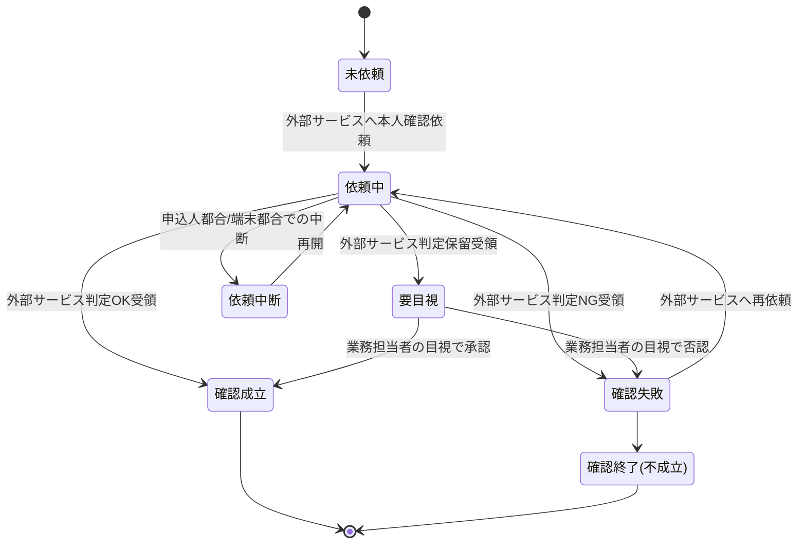

# 本人確認(KYC)要求仕様書

## 本書について

### 概要

本書は、[ドメイン定義書](../domain-definition-document#一覧)に記載されるドメインのうち、「本人確認(KYC)」に関する要求事項を記載したドキュメントです。

本ドメインは **外部本人確認サービス(eKYC、`EXT-KYC-SERVICE`)の利用を前提**とし、本ドメインの責務は外部サービスとの **オーケストレーション**(依頼・応答受領・例外対応・業務担当者目視フロー・証跡保持)に限定します。本人特定事項の真正性検証・本人実在性判定 等の主たる業務ロジックは外部サービス側に委ねます。

本書は「本ドメインとして何を満たすべきか(What)」を扱います。

### 本ドメインの責務範囲と外部サービスへの委任

| 観点 | 本ドメインの責務(オーケストレーション) | 外部本人確認サービス(`EXT-KYC-SERVICE`)の責務 |
|---|---|---|
| 業務責務 | いつ・誰に対して本人確認を依頼するかの業務判断、依頼の発出、応答の受領、結果に基づく業務継続/停止判断、業務担当者目視判断のフロー、証跡の保持、再依頼・縮退運用 | 本人特定事項の真正性確認、本人実在性確認、本人確認書類画像の自動判定、本人画像の同一性判定 |
| 規制対応 | 犯罪収益移転防止法の業務プロセスへの組み込み、疑わしい取引検知時のコンプライアンス部エスカレーション | 取引時確認の各手段(対面/非対面)で求められる検証技術の提供 |
| データ保有 | 確認結果(確認方法・判定結果・判定主体・判定日時)、業務担当者の目視判断記録、外部サービス連携記録 | 本人確認書類画像・顔画像 等の生データ(保持期間・削除方針は外部サービス契約に従う) |

### 注記

本書では原則として 具体的な実装手段(How)には踏み込みませんが、 **ビジネス・規制上譲れない本ドメイン固有のHow** は本書で確定します。

## 業務要求

### 業務ルール(オーケストレーション)

本ドメインは「本人確認(KYC)のオーケストレーション(外部サービスとの業務的な仲介)」を担うドメインですが、横断的な水準・方針・原則(犯罪収益移転防止法・外部連携の縮退運用/冪等性・改ざん不能性・証跡保持期間・要配慮個人情報のアクセス制御 等)は **ドメイン共通要求仕様書** が単独責務として扱います。本書は **並列の関係** にあり、共通要求と内容が重ならない当該ドメイン固有の業務ルール(取引時確認依頼の業務契機・対象・高額契約時の追加確認要求・外部サービス判定結果への依拠の責務境界・業務担当者目視判断のフロー・KYC 固有の証跡対象・確認未済時の業務継続停止・疑わしい取引兆候のコンプラ通知経路・確認結果の有効期間管理)のみを記述します。

| ID | 業務ルール | 内容 | 根拠/制約 |
|---|---|---|---|
| DOM-KYC-BR-1 | 取引時確認依頼の業務契機 | 個人保険新契約の申込受付時に、申込人(契約者)に対して取引時確認を外部本人確認サービス(`EXT-KYC-SERVICE`)へ依頼することを必須とする。被保険者が申込人と異なる場合の被保険者の確認要否は業務所管の判断に従う | 犯罪収益移転防止法 / ドメイン定義書 KYC【要確認: 被保険者本人に対する取引時確認の要否・範囲は犯収法上の特定取引該当性に基づき業務所管で確定要】 |
| DOM-KYC-BR-2 | 高額契約時の確認強化要求 | 一定基準額以上の保険料・保険金額となる契約は、外部サービスに対して厳格な取引時確認(追加確認事項)を要求する | 犯罪収益移転防止法【要確認: 厳格な確認を要する高額基準値(保険料/保険金額の閾値)は業務所管で確定要】 |
| DOM-KYC-BR-3 | 外部サービス判定結果への依拠 | 本人確認の合否一次判定は **外部本人確認サービスの判定結果に依拠する**。本ドメインは独自の判定ロジック(書類真正性判定・本人実在性判定 等)を保持・実装しない | ドメイン定義書 KYC(外部サービス委任の責務境界) |
| DOM-KYC-BR-4 | 業務担当者目視判断のフロー | 外部サービスが「要目視」「保留」を返す場合、業務担当者(コンプライアンス部または新契約事務担当者)の目視判断を確認成立の要件とする。目視判断の根拠と結果は本ドメインの責務として証跡保持する | ドメイン定義書 KYC【要確認: 目視最終判断の所管(コンプライアンス部か新契約事務担当者か)を確定要】 |
| DOM-KYC-BR-5 | 連携・確認結果の証跡保持(KYC 固有スコープ) | 外部サービスへの依頼内容・応答・再実行履歴・確認結果(確認方法・判定結果・判定日時・判定主体)を、後続の説明責任に耐える形で証跡として保持する。本人確認書類の生データは外部サービス側で保管し、本ドメインは判定結果の事実のみを保持する | ドメイン定義書 KYC / 犯罪収益移転防止法(取引時確認記録) |
| DOM-KYC-BR-6 | 確認未済の業務継続停止 | 取引時確認が成立していない申込は、後続の引受査定・契約成立(計上)へ進めない | 犯罪収益移転防止法 / ドメイン定義書(APPL からの参照) |
| DOM-KYC-BR-7 | 疑わしい取引のコンプラエスカレーション | 外部サービスまたは業務担当者の目視判断で「なりすまし・偽造書類・取引内容の不自然さ」等の兆候を検知した場合、業務所管(コンプライアンス部)へ通知し、疑わしい取引の届出要否判断に付す | 犯罪収益移転防止法(疑わしい取引の届出) |
| DOM-KYC-BR-8 | 確認結果再利用の有効期間管理 | 過去に成立した取引時確認結果を新規申込に再利用する場合、確認の有効期間内であることを条件とする。期限切れの場合は外部サービスへ再依頼する | 犯罪収益移転防止法【要確認: 確認結果の有効期間(再利用可否・期間)を業務所管で確定要】 |

<!-- HINT(リファクタ経緯):
本表は並列モデル化により、各 BR の「根拠/制約」列からドメイン共通要求 ID(`DOM-COMMON-*`)への参照を削除した。本書とドメイン共通要求は並列の関係(参照関係を持たない)であり、犯罪収益移転防止法・外部連携の縮退運用/冪等性・改ざん不能性・証跡保持期間・要配慮個人情報のアクセス制御 等の横断的な水準・方針・原則は共通要求側に単独責務がある。BR の削除はなく、参照削除のみ。BR-5(連携・確認結果の証跡保持)は証跡保全の枠組みそのものではなく「KYC 固有の証跡対象(依頼内容・応答・再実行履歴・確認結果)」を主題とするため残置している。
-->

### 業務状態遷移

本ドメインが管理する **本ドメイン側のオーケストレーション状態**(本人確認依頼案件)の業務状態と遷移を示します。外部サービス内部の判定処理状態は本ドメインの管理対象外です。

| 業務状態 | 定義 | この状態での主な制約 |
|---|---|---|
| 未依頼 | 申込に対し外部サービスへの本人確認依頼がまだ発出されていない状態 | 後続の契約成立(計上)へ進めない |
| 依頼中 | 外部サービスへ本人確認を依頼し、応答受領待ちの状態 | 応答受領まで成立扱いにしない |
| 依頼中断 | 申込人都合・端末環境都合で確認手続きが一時中断した状態 | 入力済みデータを失わずに再開可能とする |
| 要目視 | 外部サービスが判定保留を返し、業務担当者の目視判断を要する状態 | 目視判断完了まで成立扱いにしない |
| 確認成立 | 取引時確認が成立した状態(外部サービス判定OK、または要目視→目視承認) | 確認の有効期間内に限り後続工程で利用可 |
| 確認失敗 | 外部サービス判定NG または 業務担当者の目視否認で確認が成立しなかった状態 | 再依頼を行える。再依頼せず終局すると不成立 |
| 確認終了(不成立) | 再依頼されず取引時確認が不成立で終局した状態 | 当該申込は契約成立へ進めない |

| 遷移元 | 遷移先 | 契機 | 主体 | 前提条件 |
|---|---|---|---|---|
| 未依頼 | 依頼中 | 申込受付に伴う外部サービスへの依頼発出 | 募集人 / 申込人・被保険者(オペレーション主体)| 申込人の本人特定事項が登録済み |
| 依頼中 | 確認成立 | 外部サービスから判定OK受領 | 外部本人確認サービス | 本人確認書類・本人実在性の検証成功 |
| 依頼中 | 要目視 | 外部サービスから判定保留受領 | 外部本人確認サービス | 自動判定が確定しない |
| 依頼中 | 確認失敗 | 外部サービスから判定NG受領 | 外部本人確認サービス | 書類不真正・本人実在性不一致 等 |
| 依頼中 | 依頼中断 | 申込人都合・端末環境都合での中断 | 申込人・被保険者 | 確認手続きが完了前 |
| 依頼中断 | 依頼中 | 中断からの再開 | 申込人・被保険者 / 募集人 | 中断時点の入力データが保持されている |
| 要目視 | 確認成立 | 業務担当者が目視で承認 | コンプライアンス部 / 新契約事務担当者 | 目視確認の根拠が記録される |
| 要目視 | 確認失敗 | 業務担当者が目視で否認 | コンプライアンス部 / 新契約事務担当者 | 否認理由が記録される |
| 確認失敗 | 依頼中 | 申込人・被保険者による再依頼 | 申込人・被保険者 / 募集人 | 再依頼可能と業務上判断される |
| 確認失敗 | 確認終了(不成立) | 再依頼されず終局 | 新契約事務担当者 / コンプライアンス部 | 再依頼期限超過または業務判断による打ち切り |

### 業務運用(イレギュラー対応)

正常系から外れる業務局面と、その業務上の取り扱いを以下に示します。本ドメインは外部本人確認サービス利用を前提とするため、外部サービス不達・判定保留・再依頼 等の業務運用を厚く定めます。

| ID | イレギュラー事象 | 発生契機 | 業務上の対応 |
|---|---|---|---|
| DOM-KYC-IRR-1 | 外部本人確認サービスの不達・タイムアウト | サービス障害・通信障害・応答遅延 | 依頼中状態を維持し、業務上の再依頼手順で再実行する。一定時間内に復旧しない場合は申込人へ業務通知のうえ後日再依頼とし、契約成立は確認成立まで保留する |
| DOM-KYC-IRR-2 | 外部サービスが判定保留(要目視)を返却 | 書類画像の不鮮明・自動判定の信頼度不足 等 | 要目視状態へ遷移し、業務担当者の目視判断に付す。目視判断の根拠と結果を証跡として残す(DOM-KYC-BR-4 に整合) |
| DOM-KYC-IRR-3 | 本人確認書類の不備・有効期限切れ | 書類画像の品質不良・期限切れ書類の提出 | 外部サービスからの NG 応答を受け確認失敗とし、有効な書類による再依頼を申込人へ依頼する。再依頼待ちの間は契約成立を保留する |
| DOM-KYC-IRR-4 | なりすまし・偽造書類の疑い | 外部サービスまたは目視で不正の兆候を検知 | 確認失敗とし、業務所管(コンプライアンス部)へエスカレーションする。疑わしい取引の届出要否判断に付し、当該申込の進行を停止する(DOM-KYC-BR-7 に整合) |
| DOM-KYC-IRR-5 | 申込人都合・端末環境都合での依頼中断 | 申込人の離席・通信切断・端末不調 | 依頼中断状態で入力済みデータを保持し、再開可能とする |
| DOM-KYC-IRR-6 | 確認結果の有効期間切れ | 過去の確認結果再利用時に有効期間を超過 | 再利用不可とし、外部サービスへの再依頼を要求する(DOM-KYC-BR-8 に整合) |
| DOM-KYC-IRR-7 | 高額契約該当の事後判明 | 設計内容変更等により高額基準を事後的に超過 | 厳格な取引時確認の追加確認事項を外部サービスへ要求し、確認成立を取り直す(DOM-KYC-BR-2 に整合) |
| DOM-KYC-IRR-8 | 外部サービスの仕様変更・更改 | 外部サービス提供者側の仕様変更・サービス更改 | 外部サービスとの疎結合性を活かして本ドメイン側の改修範囲を最小化する。連携テスト・運用切替を業務継続性確保のうえで段階的に実施 |

## セキュリティ要求

### データアクセス要求

| ID | データ | 機密区分 | 本ドメインでの取り扱い |
|---|---|---|---|
| DOM-KYC-DATA-1 | 本人確認書類画像・顔画像等の確認用生データ | 個人情報 | **本ドメインでは保有しない**(外部本人確認サービス `EXT-KYC-SERVICE` 側で保管)。本ドメインは外部サービスへの送付・保管期間を契約条件で担保 |
| DOM-KYC-DATA-2 | 取引時確認結果(確認方法・判定結果・判定日時・判定主体・目視判断記録) | 個人情報含む・業務上機密 | 取引時確認の事実証跡として保持。参照は業務担当者に限定 |
| DOM-KYC-DATA-3 | 疑わしい取引の検知記録 | 個人情報含む・業務上機密 | アクセスは業務所管(コンプライアンス部)に限定 |
| DOM-KYC-DATA-4 | 外部本人確認サービスとの連携記録(依頼・応答・再実行履歴) | 業務上機密 | 二重依頼を起こさない依頼識別子を保持し、再実行履歴を本ドメインで追跡する |

## 受け入れ基準

* 取引時確認の網羅性: 申込受付に伴うすべての対象申込に対し外部サービスへの確認依頼が発出され、未依頼のまま契約成立へ進む経路が存在しないこと(DOM-KYC-BR-1・DOM-KYC-BR-6)
* 証跡の十分性: 取引時確認の実施事実・方法・結果・日時・主体・目視判断記録 が本ドメインに保持されていること(DOM-KYC-BR-5)
* 業務状態遷移の通し確認: 正常(確認成立)および異常(要目視・確認失敗・外部不達・中断・再依頼)の各経路が業務として収束することを確認済みであること
* オーケストレーション堅牢性: 外部本人確認サービスの不達・判定保留・タイムアウト時の再依頼が業務手順で運用できること(DOM-KYC-IRR-1・DOM-KYC-IRR-2)
* 外部委任範囲の明示: 本ドメインの責務(オーケストレーション)と外部サービスの責務(本人特定事項検証・本人実在性判定 等)の境界が文書・運用で明確になっており、独自の判定ロジックを本ドメイン側に保持していないこと(DOM-KYC-BR-3)
* 疑わしい取引のエスカレーション: 疑わしい取引の兆候が業務所管へ通知され、届出要否判断に付される業務動線が運用できること(DOM-KYC-BR-7・DOM-KYC-IRR-4)
* 有効期間管理: 確認結果の有効期間内のみ再利用され、期限切れ時は再依頼される運用が確認できること(DOM-KYC-BR-8・DOM-KYC-IRR-6)
