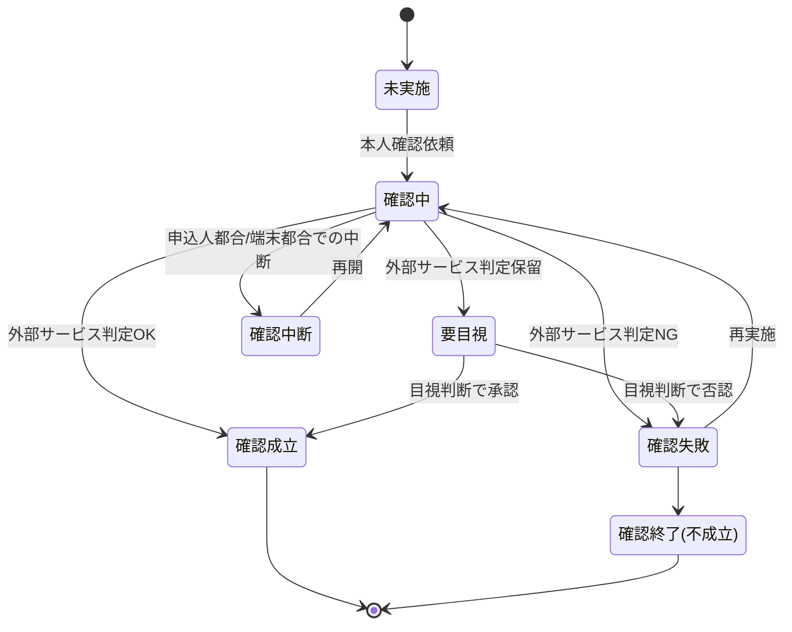

# 本人確認(KYC)ドメイン要求仕様書

## 本書について

### 概要

本書は、Sample生命保険株式会社 個人保険新契約システムの「本人確認(KYC)」ドメインに関するドメイン要求を記載したドキュメントです。

上流のプロダクト要求仕様書(PRD)が定めたプロダクトレベルの What のうち本ドメインに関わる横断要求を継承し、その上に本ドメイン固有の業務ルール・業務状態遷移・業務運用(イレギュラー対応)を積み上げて詳細化します。「Why → What → How」の階層では、PRD(プロダクトの What)を Why として引き継ぎ、本書は「本ドメインとして何を満たすべきか(ドメインの What)」を扱います。具体的な機能・画面・データ構造・API 等の How は後続の D2 以降の成果物で扱います。

### 想定読者

* 本人確認(KYC)・マネロン対策の業務所管(コンプライアンス部)
* 本人確認(KYC)ドメイン担当の開発・QA
* PdM / PM
* 上流成果物(PRD・ドメイン定義書)作成者

### 注記

本書では原則として How(具体的な実装手段)には踏み込みませんが、ビジネス・規制上譲れない具体水準のうち **本ドメイン固有のもの** は本書で確定します。プロダクト横断で共通の水準は PRD を正典とし、本書では重複定義せず継承します。

## 対象ドメイン

| ドメインID | ドメイン名 | 区分 | 種別 | 概要 | 主な関心事 |
|---|---|---|---|---|---|
| KYC | 本人確認(KYC) | 汎用 | 横断 | 申込時(および高額契約時)の取引時確認(本人確認)を行う領域。外部本人確認サービスの利用を前提とする | 犯罪収益移転防止法の遵守、外部サービスとの疎結合連携、確認結果の証跡保持 |

## 継承するPRD要求

本ドメインに効く PRD 横断要求を以下に継承します。各要求の実体は PRD を正典とし、本書では本ドメインでの適用観点のみ補足します。

| 継承元 PRD ID | 要求名 | 本ドメインでの適用観点 |
|---|---|---|
| PRD-FR-1 | 業務通知 | 本人確認の依頼・完了・要再実施を、申込人/被保険者および募集人へ業務通知する局面に効く |
| PRD-FR-3 | 業務の中断・再開 | 本人確認手続きが申込人都合・端末環境都合で中断した場合の再開に効く |
| PRD-FR-4 | 同意取得・同意管理 | 本人確認のために本人確認書類画像・顔画像等を取得する際の取得目的明示と本人同意取得に効く |
| PRD-NFR-4 | 障害時の縮退運用方針 | 外部本人確認サービス障害時の業務継続シナリオの前提となる |
| PRD-NFR-8 | 既存システム・外部サービスの更改耐性 | 外部本人確認サービスの差し替え・更改時に本ドメインの改修範囲を最小化する方針に効く |
| PRD-NFR-9 | 外部連携・非同期処理のエラー検知・リトライ・冪等性 | 外部本人確認サービス連携の不達・タイムアウト時の再実行・二重実行防止に効く |
| PRD-SEC-2 | 認証方式 | 申込人/被保険者の本人認証(メール/SMS OTP に本人確認連携を組み合わせ)に直結する |
| PRD-SEC-4 | 保存時暗号化 | 本人確認書類画像・確認結果等の保存時暗号化に効く |
| PRD-SEC-5 | RBAC・最小権限 | 本人確認書類・確認結果へのアクセスを職務上必要な担当者に限定する方針に効く |
| PRD-SEC-6 | 監査ログ(ログ対象・改ざん不能性) | 本人確認の実施・結果参照を改ざん不能な形で記録する局面に効く |
| PRD-SEC-7 | 監査ログ(保存期間) | 本人確認の証跡を10年間保持する方針に効く |
| PRD-SEC-9 | インシデント対応(エスカレーション) | なりすまし・偽造書類検知時のコンプライアンス部・CSIRT等へのエスカレーションに効く |
| PRD-SEC-DATA-1 | 顧客情報(申込人・被保険者・受取人の属性・関係性) | 本人確認の照合対象となる本人属性の機密区分(個人情報)を継承する |
| PRD-SEC-DATA-6 | 募集コンプライアンス証跡 | 本人確認結果が募集コンプライアンス証跡の構成要素となる点に効く |
| PRD-REG-3 | 個人情報保護法 | 本人確認書類に含まれる個人情報の取得・利用・保管・削除の法令準拠に効く |
| PRD-REG-4 | 犯罪収益移転防止法 | 本ドメインの存在理由そのもの。取引時確認の実施義務・疑わしい取引の届出体制の起点となる |

## ドメイン固有の業務要求

### 業務ルール

本ドメイン固有の業務ルールを以下に示します。プロダクト横断で共通の要求は PRD を正典とし、ここでは再定義しません。

| ID | 業務ルール | 内容 | 根拠/制約 |
|---|---|---|---|
| KYC-BR-1 | 取引時確認の実施対象 | 個人保険新契約の申込受付時に、申込人(契約者)に対して取引時確認(本人特定事項の確認)を必須とする。被保険者が申込人と異なる場合の被保険者の確認要否は業務所管の判断に従う | 犯罪収益移転防止法(PRD-REG-4) / ドメイン定義書 KYC 概要【要確認: 被保険者本人に対する取引時確認の要否・範囲は犯収法上の特定取引該当性に基づき業務所管で確定要】 |
| KYC-BR-2 | 高額契約時の確認強化 | 一定基準額以上の保険料・保険金額となる契約は厳格な取引時確認(追加確認事項)の対象とする | 犯罪収益移転防止法(PRD-REG-4)【要確認: 厳格な確認を要する高額基準値(保険料/保険金額の閾値)は業務所管で確定要】 |
| KYC-BR-3 | 確認方法の許容範囲 | 本人特定事項の確認は、本人確認書類の真正性確認および本人実在性の確認をもって成立とする。確認手段は外部本人確認サービスの提供方式に依拠する | 犯罪収益移転防止法(PRD-REG-4) / ドメイン定義書 KYC 主な関心事 |
| KYC-BR-4 | 確認成立の判定主体 | 取引時確認の合否一次判定は外部本人確認サービスの判定結果に基づく。サービスが「要目視」「保留」を返す場合は業務担当者(コンプライアンス部または新契約事務担当者)の目視判断を確認成立の要件とする | ドメイン定義書 KYC 主な関心事 / PRD-SEC-5【要確認: 目視最終判断の所管(コンプライアンス部か新契約事務担当者か)を確定要】 |
| KYC-BR-5 | 確認結果の証跡保持 | 取引時確認の実施事実・確認方法・判定結果・判定日時・判定主体を、後続の説明責任に耐える形で証跡として保持する | 犯罪収益移転防止法(PRD-REG-4) / PRD-SEC-DATA-6 / PRD-SEC-6 |
| KYC-BR-6 | 確認未済の契約成立禁止 | 取引時確認が成立していない申込は、後続の引受査定・契約成立(計上)へ進めない | 犯罪収益移転防止法(PRD-REG-4) / ドメイン定義書(APPL からの参照) |
| KYC-BR-7 | 疑わしい取引の検知連携 | なりすまし・偽造書類・取引内容の不自然さ 等の疑わしい取引の兆候を検知した場合、業務所管(コンプライアンス部)へ通知し、疑わしい取引の届出要否判断に付す | 犯罪収益移転防止法(PRD-REG-4) / PRD-SEC-9 |
| KYC-BR-8 | 確認結果の有効性 | 過去に成立した取引時確認結果を新規申込に再利用する場合、確認の有効期間内であることを条件とする。期限切れの場合は再実施を要する | 犯罪収益移転防止法(PRD-REG-4)【要確認: 確認結果の有効期間(再利用可否・期間)を業務所管で確定要】 |

### 業務状態遷移

本ドメインが管理する主要な業務対象(取引時確認案件)の業務状態と遷移を示します。

| 業務状態 | 定義 | この状態での主な制約 |
|---|---|---|
| 未実施 | 申込に対し取引時確認がまだ依頼されていない状態 | 後続の契約成立(計上)へ進めない |
| 確認中 | 本人確認依頼を発し、外部本人確認サービスの判定待ちの状態 | 確認結果が確定するまで成立扱いにしない |
| 確認中断 | 申込人都合・端末環境都合で確認手続きが一時中断した状態 | 入力済みデータを失わずに再開可能とする |
| 要目視 | 外部サービスが判定保留を返し、業務担当者の目視判断を要する状態 | 目視判断完了まで成立扱いにしない |
| 確認成立 | 取引時確認が成立した状態 | 確認の有効期間内に限り後続工程で利用可 |
| 確認失敗 | 外部判定NGまたは目視否認で確認が成立しなかった状態 | 再実施を依頼可能。再実施せず終局すると不成立 |
| 確認終了(不成立) | 再実施されず取引時確認が不成立で終局した状態 | 当該申込は契約成立へ進めない |

| 遷移元 | 遷移先 | 契機 | 主体 | 前提条件 |
|---|---|---|---|---|
| 未実施 | 確認中 | 申込受付に伴う本人確認依頼 | 募集人 / 申込人・被保険者 | 申込人の本人特定事項が登録済み |
| 確認中 | 確認成立 | 外部本人確認サービスが判定OKを返却 | 外部本人確認サービス | 本人確認書類・本人実在性の確認が完了 |
| 確認中 | 要目視 | 外部本人確認サービスが判定保留を返却 | 外部本人確認サービス | 自動判定が確定しない |
| 確認中 | 確認失敗 | 外部本人確認サービスが判定NGを返却 | 外部本人確認サービス | 書類不真正・本人実在性不一致 等 |
| 確認中 | 確認中断 | 申込人都合・端末環境都合での中断 | 申込人・被保険者 | 確認手続きが完了前 |
| 確認中断 | 確認中 | 中断からの再開 | 申込人・被保険者 / 募集人 | 中断時点の入力データが保持されている |
| 要目視 | 確認成立 | 業務担当者が目視で承認 | コンプライアンス部 / 新契約事務担当者 | 目視確認の根拠が記録される |
| 要目視 | 確認失敗 | 業務担当者が目視で否認 | コンプライアンス部 / 新契約事務担当者 | 否認理由が記録される |
| 確認失敗 | 確認中 | 申込人・被保険者による再実施 | 申込人・被保険者 / 募集人 | 再実施可能と業務上判断される |
| 確認失敗 | 確認終了(不成立) | 再実施されず終局 | 新契約事務担当者 / コンプライアンス部 | 再実施期限超過または業務判断による打ち切り |

### 業務運用(イレギュラー対応)

正常系から外れる業務局面と、その業務上の取り扱いを以下に示します。本ドメインは外部本人確認サービス利用を前提とするため、外部サービス不達・判定保留・再実施 等の業務運用を厚く定めます。

| ID | イレギュラー事象 | 発生契機 | 業務上の対応 |
|---|---|---|---|
| KYC-BOP-1 | 外部本人確認サービスの不達・タイムアウト | サービス障害・通信障害・応答遅延 | 確認中状態を維持し、業務上の再依頼手順で再実行する。一定時間内に復旧しない場合は申込人へ業務通知のうえ後日再依頼とし、契約成立は確認成立まで保留する(PRD-NFR-4 縮退運用に整合) |
| KYC-BOP-2 | 外部サービスが判定保留(要目視)を返却 | 書類画像の不鮮明・自動判定の信頼度不足 等 | 要目視状態へ遷移し、業務担当者の目視判断に付す。目視判断の根拠と結果を証跡として残す |
| KYC-BOP-3 | 本人確認書類の不備・有効期限切れ | 書類画像の品質不良・期限切れ書類の提出 | 確認失敗とし、有効な書類による再実施を申込人へ依頼する。再実施待ちの間は契約成立を保留する |
| KYC-BOP-4 | なりすまし・偽造書類の疑い | 外部サービスまたは目視で不正の兆候を検知 | 確認失敗とし、業務所管(コンプライアンス部)へエスカレーションする。疑わしい取引の届出要否判断に付し、当該申込の進行を停止する(KYC-BR-7・PRD-SEC-9 に整合) |
| KYC-BOP-5 | 申込人都合・端末環境都合での確認中断 | 申込人の離席・通信切断・端末不調 | 確認中断状態で入力済みデータを保持し、再開可能とする(PRD-FR-3 に整合) |
| KYC-BOP-6 | 確認結果の有効期間切れ | 過去の確認結果再利用時に有効期間を超過 | 再利用不可とし、取引時確認の再実施を要求する(KYC-BR-8 に整合) |
| KYC-BOP-7 | 高額契約該当の事後判明 | 設計内容変更等により高額基準を事後的に超過 | 厳格な取引時確認の追加確認事項を再取得し、確認成立を取り直す(KYC-BR-2 に整合) |

## 他ドメインとの連携

| 方向 | 相手ドメイン | 連携内容 | 契機 |
|---|---|---|---|
| 入力 | APPL(申込受付) | 本人確認の対象となる申込人・被保険者の本人特定事項を受け取る | 申込受付に伴う本人確認依頼 |
| 出力 | APPL(申込受付) | 取引時確認の成否(確認成立/不成立)を返す。契約成立可否判断の前提となる | 確認結果の確定 |
| 出力 | SUIT(募集コンプライアンス証跡管理) | 取引時確認の実施事実・方法・結果・日時を証跡イベントとして引き渡す | 確認結果の確定 |
| 出力 | AUDIT(統制・証跡管理) | 本人確認の実施・結果参照の操作ログを改ざん不能な記録として引き渡す | 本人確認の実施・参照のつど |
| 入力 | CUST(顧客情報管理) | 照合対象となる本人属性・既存確認結果を参照する | 本人確認依頼時・確認結果再利用判定時 |

## ドメイン固有のデータ要件

| ID | データ | PRD 機密区分との対応 | 本ドメインでの取り扱い |
|---|---|---|---|
| KYC-DATA-1 | 本人確認書類画像・顔画像等の確認用データ | PRD-SEC-DATA-1 個人情報 | 取得時に本人同意を取得(PRD-FR-4)。保存時暗号化(PRD-SEC-4)・最小権限アクセス(PRD-SEC-5)。保持期間・削除方針は法令準拠(PRD-REG-3)で確定【要確認: 確認用画像データの保持/削除期間を業務所管で確定要】 |
| KYC-DATA-2 | 取引時確認結果(確認方法・判定結果・判定日時・判定主体) | PRD-SEC-DATA-6 個人情報含む・業務上機密 | 改ざん不能保存。10年間保持(PRD-SEC-7)。参照は全件監査ログ対象 |
| KYC-DATA-3 | 疑わしい取引の検知記録 | PRD-SEC-DATA-6 個人情報含む・業務上機密 | 改ざん不能保存。アクセスは業務所管(コンプライアンス部)に限定 |
| KYC-DATA-4 | 外部本人確認サービスとの連携記録(依頼・応答・再実行履歴) | PRD-SEC-DATA-7 業務上機密 | 改ざん不能保存。10年間保持(PRD-SEC-7)。冪等性確保のため依頼識別子を保持(PRD-NFR-9) |

## 受け入れ基準

* 取引時確認の網羅性: 申込受付に伴うすべての対象申込に対し取引時確認が実施され、未実施のまま契約成立へ進む経路が存在しないこと(KYC-BR-1・KYC-BR-6)
* 法令遵守: 犯罪収益移転防止法の取引時確認・疑わしい取引の検知連携が業務プロセスに組み込まれ、UATで遵守状況を確認済みであること(PRD-REG-4)
* 証跡の十分性: 取引時確認の実施事実・方法・結果・日時・主体が改ざん不能に保持され、10年間の保持方針に整合していること(KYC-BR-5・PRD-SEC-6・PRD-SEC-7)
* 業務状態遷移の通し確認: 正常(確認成立)および異常(要目視・確認失敗・外部不達・中断・再実施)の各経路が業務として収束することを確認済みであること
* 外部連携の堅牢性: 外部本人確認サービスの不達・判定保留・タイムアウト時の再実行・縮退運用シナリオが確認済みであること(PRD-NFR-4・PRD-NFR-9)
* 継承 PRD 要求の充足: 本書が継承する PRD 横断要求が本ドメインの業務局面で充足されていること
