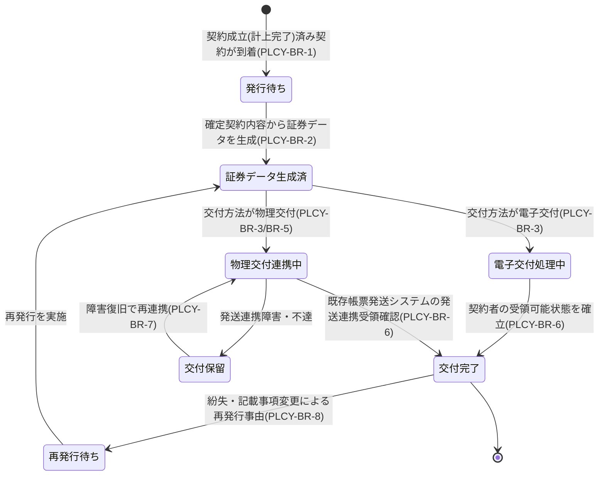

# 保険証券発行ドメイン要求仕様書

## 本書について

### 概要

本書は、Sample生命保険株式会社 個人保険新契約システムの「保険証券発行」ドメインに関するドメイン要求を記載したドキュメントです。

上流のプロダクト要求仕様書(PRD)が定めたプロダクトレベルの What のうち本ドメインに関わる横断要求を継承し、その上に本ドメイン固有の業務ルール・業務状態遷移・業務運用(イレギュラー対応)を積み上げて詳細化します。「Why → What → How」の階層では、PRD(プロダクトの What)を Why として引き継ぎ、本書は「本ドメインとして何を満たすべきか(ドメインの What)」を扱います。具体的な機能・画面・データ構造・API 等の How は後続の D2 以降の成果物で扱います。

### 想定読者

* 新契約事務部門・帳票発送業務のドメインエキスパート
* 保険証券発行ドメイン担当の開発・QA
* PdM / PM
* 上流成果物(PRD・ドメイン定義書)作成者

### 注記

本書では原則として How(具体的な実装手段)には踏み込みませんが、ビジネス・規制上譲れない具体水準のうち **本ドメイン固有のもの** は本書で確定します。プロダクト横断で共通の水準は PRD を正典とし、本書では重複定義せず継承します。

## 対象ドメイン

| ドメインID | ドメイン名 | 区分 | 種別 | 概要 | 主な関心事 |
|---|---|---|---|---|---|
| PLCY | 保険証券発行 | サポート | 業務工程 | 成立済み契約に対し保険証券データを生成し、契約者・被保険者へ交付する領域。物理発送(印刷・封入・郵送)は既存帳票発送システムへ委ねる | 証券データの完全性、既存帳票発送システムへの連携、電子交付/物理交付の双方への対応性 |

## 継承するPRD要求

本ドメインに効く PRD 横断要求を以下に継承します。各要求の実体は PRD を正典とし、本書では本ドメインでの適用観点のみ補足します。

| 継承元 PRD ID | 要求名 | 本ドメインでの適用観点 |
|---|---|---|
| PRD-FR-1 | 業務通知 | 証券発行・交付完了を節目イベントとして契約者・被保険者・募集人・新契約事務担当者へ通知する局面に効く |
| PRD-FR-2 | 帳票出力 | 保険証券を画面表示・PDF出力・既存帳票発送システム連携の各形態で出力する共通枠組みの主たる適用ドメイン |
| PRD-NFR-1 | オンライン操作のレスポンスタイム | 証券発行状況確認・電子交付閲覧操作のレスポンスに適用 |
| PRD-NFR-2 | スループット | 月末月初の契約成立集中に伴う証券発行処理のピーク処理能力に適用 |
| PRD-NFR-3 | 可用性 | 証券発行処理の業務時間帯稼働率に適用 |
| PRD-NFR-4 | 障害時の縮退運用方針 | 既存帳票発送システム連携障害時の証券交付業務継続シナリオに適用 |
| PRD-NFR-6 | 監視・障害検知 | 証券発行・帳票発送連携の処理遅延・滞留の監視に適用 |
| PRD-NFR-8 | 既存システム・外部サービスの更改耐性 | 既存帳票発送システムの更改・差し替えに対する改修範囲最小化に適用 |
| PRD-NFR-9 | 外部連携・非同期処理のエラー検知・リトライ・冪等性 | 既存帳票発送システムへの発送連携の冪等性・二重交付防止・リトライに直結 |
| PRD-SEC-2 | 認証方式 | 証券発行操作・電子交付閲覧時の本人認証に適用 |
| PRD-SEC-4 | 保存時暗号化 | 証券データ(個人情報含む)の保存時暗号化に適用 |
| PRD-SEC-5 | RBAC・最小権限 | 証券発行操作・証券データへのアクセス権限制御に適用 |
| PRD-SEC-6 | 監査ログ・改ざん不能性 | 証券発行・交付・再発行操作の改ざん不能記録に適用 |
| PRD-SEC-7 | 監査ログ保存期間 | 証券発行・交付の証跡を10年間保持する要求に適用 |
| PRD-SEC-DATA-1 | 顧客情報 | 証券記載の契約者・被保険者・受取人の属性を参照 |
| PRD-SEC-DATA-3 | 申込・契約情報 | 証券記載のプラン内容・保険料・受取人指定 等を扱う。役割×組織での権限制御 |
| PRD-REG-3 | 個人情報保護法 | 証券に記載・交付される個人情報の取扱いに適用 |
| PRD-REG-5 | 電子帳簿保存法 | 保険証券を電子的に保存・交付する場合の真実性(改ざん防止)・可視性(検索要件)確保に適用 |
| PRD-REG-6 | 金融庁監督指針 | 証券交付に関する内部管理態勢・お客様本位の業務運営原則を発行プロセスに担保 |

## ドメイン固有の業務要求

### 業務ルール

本ドメインが満たすべき判断基準・制約・条件分岐を以下に示します。

| ID | 業務ルール | 内容 | 根拠/制約 |
|---|---|---|---|
| PLCY-BR-1 | 発行対象の限定 | 保険証券は契約成立(計上完了)済みの契約に対してのみ発行する。成立条件未充足・不成立・計上未完了の契約には発行しない | ドメイン定義書「成立済み契約に対し」、BOOK 連携、生命保険新契約実務 |
| PLCY-BR-2 | 証券データの完全性 | 証券データは契約成立時点で確定した契約内容(契約者・被保険者・受取人・プラン・保険金額・保険料・払込方法・責任開始日・特別条件 等)を正確かつ網羅的に反映する。確定契約内容と証券記載内容に差異を生じさせない | ドメイン定義書「証券データの完全性」、PRD-REG-5、生命保険約款上の証券記載義務 |
| PLCY-BR-3 | 交付方法の確定 | 証券の交付方法を電子交付・物理交付のいずれか(または併用)で確定する。交付方法は契約者の選択・同意・チャネル・商品条件に基づき決定する。物理交付の印刷・封入・郵送は既存帳票発送システムへ委ねる | ドメイン定義書「電子交付/物理交付の双方への対応性」「物理発送は既存帳票発送システムへ委ねる」、PRD-FR-2 |
| PLCY-BR-4 | 電子交付の真実性確保 | 電子交付する証券は、電子帳簿保存法の真実性確保(改ざん検知可能性・作成時点の証明)・可視性確保(検索可能な形での保存)を満たす形で生成・保全する | PRD-REG-5、ドメイン定義書 |
| PLCY-BR-5 | 既存帳票発送システムへの発送連携 | 物理交付対象の証券は、印刷・封入・郵送を担う既存帳票発送システムへ発送連携する。連携は疎結合を原則とし、既存帳票発送システムの更改・差し替えに対する本ドメインの改修範囲を限定する | ドメイン定義書「既存帳票発送システムへの連携」、PRD-NFR-8、BRD スコープ注記 |
| PLCY-BR-6 | 交付完了の確定 | 電子交付は契約者の受領可能状態の確立(本人による閲覧可能化)をもって、物理交付は既存帳票発送システムへの発送連携の受領確認をもって交付処理の完了とする。発送連携依頼のみでは物理交付完了とみなさない | ドメイン定義書「証券データの完全性」、PRD-NFR-9、帳票発送実務 |
| PLCY-BR-7 | 発行・交付の冪等性・二重交付防止 | 同一契約の証券発行・交付は1回限りとし、再実行・連携再送・リトライ時にも二重発行・二重発送しない。発行・交付の確定は冪等に扱う | PRD-NFR-9(冪等性)、帳票発送実務(誤送・重複送付防止) |
| PLCY-BR-8 | 再発行の取り扱い | 証券の紛失・記載事項の事後変更 等による再発行は、初回発行と区別して扱い、再発行の事由・履歴を残す。本プロジェクトの初期フェーズでは新契約成立に伴う初回発行を対象の中心とし、保全起因の再発行は既存契約管理システム/保全業務との責務分担に従う【要確認: 保全起因の証券再発行の責務境界(本システム/既存契約管理システムの分担)】 |
| PLCY-BR-9 | 物理交付の本人到達非保証範囲 | 既存帳票発送システムへの発送連携完了後の郵送過程(配達・不在・返戻)は既存帳票発送システムの責務とし、本ドメインの責務は発送連携の確実な受け渡しと連携結果の証跡保全に限定する | BRD スコープ注記(物理発送はスコープ外)、ドメイン定義書、PLCY-BR-5 |

### 業務状態遷移

本ドメインが管理する主要な業務対象である「保険証券」の業務状態と遷移を示します。

| 業務状態 | 定義 | この状態での主な制約 |
|---|---|---|
| 発行待ち | 計上完了済み契約が到着し、証券データ生成前の状態 | 成立済み契約にのみ発行(PLCY-BR-1) |
| 証券データ生成済 | 確定契約内容から証券データを生成した状態 | 確定契約内容と差異を生じさせない(PLCY-BR-2) |
| 電子交付処理中 | 電子交付方式で契約者の受領可能状態確立を進行中の状態 | 電子帳簿保存法の真実性・可視性を満たす(PLCY-BR-4) |
| 物理交付連携中 | 既存帳票発送システムへ発送連携を実行中の状態 | 二重発送を起こさない(PLCY-BR-7)。受領確認まで交付未完了 |
| 交付完了 | 電子=受領可能状態確立/物理=発送連携受領確認 を得た状態 | 交付は冪等に確定。証跡を保全 |
| 交付保留 | 発送連携障害・不達で交付を一時保留した状態 | 交付完了とみなさない。復旧後再連携の対象 |
| 再発行待ち | 紛失・記載事項変更等で再発行事由が発生した状態 | 初回発行と区別し再発行事由・履歴を保持(PLCY-BR-8) |

| 遷移元 | 遷移先 | 契機 | 主体 | 前提条件 |
|---|---|---|---|---|
| 発行待ち | 証券データ生成済 | 確定契約内容から証券データを生成 | システム(業務ルール) | 計上完了済(PLCY-BR-1) |
| 証券データ生成済 | 電子交付処理中 | 交付方法が電子交付 | システム(業務ルール) | 交付方法=電子(PLCY-BR-3) |
| 証券データ生成済 | 物理交付連携中 | 交付方法が物理交付 | システム(業務ルール) | 交付方法=物理(PLCY-BR-3) |
| 電子交付処理中 | 交付完了 | 契約者の受領可能状態を確立 | システム(業務ルール) | 本人による閲覧可能化(PLCY-BR-6) |
| 物理交付連携中 | 交付完了 | 既存帳票発送システムの発送連携受領確認 | システム(連携) | 受領確認到着(PLCY-BR-6) |
| 物理交付連携中 | 交付保留 | 発送連携障害・不達 | システム(連携) | 障害検知 |
| 交付保留 | 物理交付連携中 | 障害復旧で再連携 | 新契約事務担当者・システム | 冪等性担保(PLCY-BR-7) |
| 交付完了 | 再発行待ち | 紛失・記載事項変更による再発行事由 | 新契約事務担当者 | 再発行事由の確定(PLCY-BR-8) |

### 業務運用(イレギュラー対応)

正常系から外れる業務局面と、その業務上の取り扱いを以下に示します。

| ID | イレギュラー事象 | 発生契機 | 業務上の対応 |
|---|---|---|---|
| PLCY-BOP-1 | 既存帳票発送システム連携の障害・不達 | 連携先のダウン・タイムアウト・応答不達 | PRD-NFR-4 の縮退運用方針に従い交付を保留管理。復旧後にリトライし PLCY-BR-7 で二重発送を防止 |
| PLCY-BOP-2 | 証券データと確定契約内容の不整合検知 | 証券データ生成時に契約内容との差異を検知 | 証券を発行・交付せず保留。新契約事務担当者が不整合原因を確認・是正後に再生成。是正不能時は発行を停止し起因ドメインへ照会 |
| PLCY-BOP-3 | 電子交付の本人受領未確立 | 契約者が電子交付の受領可能状態に到達しない | 受領可能状態確立まで交付未完了として管理。一定期間到達しない場合は物理交付への切替 等を業務運用で判断 |
| PLCY-BOP-4 | 二重発行・二重発送の疑い | リトライ・連携再送と実発行/実発送が重複 | 冪等に発行・交付を確定(PLCY-BR-7)。二重交付が判明した場合は既存帳票発送システムと整合させ是正 |
| PLCY-BOP-5 | 計上完了後・証券発行前の契約取消 | クーリングオフ・申込錯誤 等が証券発行前に判明 | 証券を発行・交付しない。BOOK(契約成立)・既存契約管理システムの取消業務と整合させ、発行停止の証跡を保全 |
| PLCY-BOP-6 | 証券交付後の記載事項変更・契約取消 | 交付後にクーリングオフ・記載変更が発生 | 既発行証券の無効化・再発行・回収は保全業務/既存契約管理システムとの責務分担(PLCY-BR-8)に従う。本ドメインは関連証跡の保全に責務を限定 |
| PLCY-BOP-7 | 物理郵送の不着・返戻 | 既存帳票発送システム側で配達不能・返戻 | PLCY-BR-9 に従い郵送過程は既存帳票発送システムの責務。返戻情報を受領した場合は再交付要否を業務運用で判断 |
| PLCY-BOP-8 | 月末月初の証券発行滞留 | 繁忙期の契約成立集中に伴う発行対象集中 | PRD-NFR-2 の処理能力前提で滞留管理。滞留状況を新契約事務担当者が把握できる前提で運用 |

## 他ドメインとの連携

| 方向 | 相手ドメイン | 連携内容 | 契機 |
|---|---|---|---|
| 入力 | BOOK(契約成立) | 成立済み契約(契約成立日・確定契約内容)を証券発行対象として受け取る | 計上完了時 |
| 出力 | CUST(顧客情報管理) | 証券記載の契約者・被保険者・受取人の属性を参照(横断参照) | 証券データ生成時 |
| 出力 | AUDIT(統制・証跡管理) | 証券発行・交付・再発行操作の改ざん不能証跡を保全依頼。電子交付の電子帳簿保存法対応の証跡保全 | 証券発行・交付・再発行時 |

## ドメイン固有のデータ要件

| ID | データ | PRD 機密区分との対応 | 本ドメインでの取り扱い |
|---|---|---|---|
| PLCY-DATA-1 | 証券データ(契約者・被保険者・受取人・プラン・保険金額・保険料・責任開始日・特別条件 等) | PRD-SEC-DATA-1(個人情報)・PRD-SEC-DATA-3(個人情報・業務上機密) | 確定契約内容の正確なスナップショットとして生成。保存時暗号化必須(PRD-SEC-4)・最小権限制御 |
| PLCY-DATA-2 | 交付方法・交付状態情報 | PRD-SEC-DATA-3(個人情報・業務上機密) | 電子/物理の交付方法・交付完了状態を保持。役割×組織での権限制御 |
| PLCY-DATA-3 | 電子交付証券の保全データ | PRD-SEC-DATA-3(個人情報・業務上機密) | 電子帳簿保存法の真実性・可視性を満たす形で保全(PLCY-BR-4・PRD-REG-5) |
| PLCY-DATA-4 | 発送連携の処理識別・連携結果 | PRD-SEC-DATA-7(業務上機密) | 二重発送防止・冪等性担保のための処理識別と連携結果を保持(PLCY-BR-7)。改ざん不能保存 |
| PLCY-DATA-5 | 発行・交付・再発行の証跡 | PRD-SEC-DATA-6(個人情報含む・業務上機密)・PRD-SEC-DATA-7(業務上機密) | 発行・交付・再発行の事由・履歴を保持。改ざん不能・10年保持(PRD-SEC-7) |

## 受け入れ基準

* 発行対象の限定: 計上完了済み契約にのみ証券が発行され、不成立・計上未完了の契約には発行されないこと(PLCY-BR-1)
* 証券データの完全性: 確定契約内容と証券記載内容に差異がなく、責任開始日・特別条件 等を網羅的に反映していること(PLCY-BR-2)
* 交付方法の対応: 電子交付・物理交付の双方に対応し、物理交付が既存帳票発送システムへ正しく連携されること(PLCY-BR-3・BR-5)
* 電子交付の法令適合: 電子交付証券が電子帳簿保存法の真実性・可視性要件を満たすこと(PLCY-BR-4、PRD-REG-5)
* 交付完了の確定と冪等性: 交付完了が定義どおり確定し、再実行・連携再送時にも二重発行・二重発送が発生しないこと(PLCY-BR-6・BR-7、PRD-NFR-9)
* イレギュラー対応: 発送連携障害・データ不整合・電子受領未確立・二重交付の疑い・発行前後の契約取消 の各局面が業務上収束すること
* 責務境界の遵守: 物理発送の郵送過程・保全起因の再発行 を本ドメインの責務外として既存システム/保全業務と正しく分担すること(PLCY-BR-8・BR-9)
