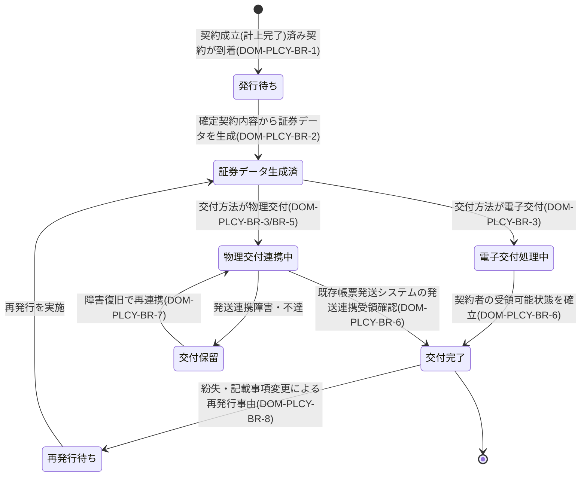

# 保険証券発行要求仕様書

## 本書について

### 概要

本書は、[ドメイン定義書](../domain-definition-document#一覧)に記載されるドメインのうち、「保険証券発行」に関する要求事項を記載したドキュメントです。
本書は「本ドメインとして何を満たすべきか(What)」を扱います。

### 注記

本書では原則として 具体的な実装手段(How)には踏み込みませんが、 **ビジネス・規制上譲れない本ドメイン固有のHow** は本書で確定します。

## 業務要求

### 業務ルール

本ドメインは「成立済み契約に対する保険証券の発行・交付」を担うドメインですが、横断的な水準・方針・原則(電子帳簿保存法対応・改ざん不能性・冪等性方針 等)は **ドメイン共通要求仕様書** が単独責務として扱います。本書は **並列の関係** にあり、共通要求と内容が重ならない当該ドメイン固有の業務ルール(発行対象の限定・証券データの完全性・交付方法の確定・再発行/責務境界・既存帳票発送システムへの委任範囲)のみを記述します。

| ID | 業務ルール | 内容 | 根拠/制約 |
|---|---|---|---|
| DOM-PLCY-BR-1 | 発行対象の限定 | 保険証券は契約成立(計上完了)済みの契約に対してのみ発行する。成立条件未充足・不成立・計上未完了の契約には発行しない | ドメイン定義書「成立済み契約に対し」、BOOK 連携、生命保険新契約実務 |
| DOM-PLCY-BR-2 | 証券データの完全性 | 証券データは契約成立時点で確定した契約内容(契約者・被保険者・受取人・プラン・保険金額・保険料・払込方法・責任開始日・特別条件 等)を正確かつ網羅的に反映する。確定契約内容と証券記載内容に差異を生じさせない | ドメイン定義書「証券データの完全性」、生命保険約款上の証券記載義務 |
| DOM-PLCY-BR-3 | 交付方法の確定 | 証券の交付方法を電子交付・物理交付のいずれか(または併用)で確定する。交付方法は契約者の選択・同意・チャネル・商品条件に基づき決定する。物理交付の印刷・封入・郵送は既存帳票発送システムへ委ねる | ドメイン定義書「電子交付/物理交付の双方への対応性」「物理発送は既存帳票発送システムへ委ねる」 |
| DOM-PLCY-BR-5 | 既存帳票発送システムへの発送連携 | 物理交付対象の証券は、印刷・封入・郵送を担う既存帳票発送システムへ発送連携する。連携の責務境界(本ドメインは発送連携依頼の発出と連携結果の受領まで、印刷・封入・郵送過程は既存帳票発送システム側)を業務上明確にする | ドメイン定義書「既存帳票発送システムへの連携」、BRD スコープ注記 |
| DOM-PLCY-BR-6 | 交付完了の確定 | 電子交付は契約者の受領可能状態の確立(本人による閲覧可能化)をもって、物理交付は既存帳票発送システムへの発送連携の受領確認をもって交付処理の完了とする。発送連携依頼のみでは物理交付完了とみなさない | ドメイン定義書「証券データの完全性」、帳票発送実務 |
| DOM-PLCY-BR-7 | 発行・交付の冪等性・二重交付防止 | 同一契約の証券発行・交付は1回限りとし、再実行・連携再送・リトライ時にも二重発行・二重発送しない。発行・交付の確定は冪等に扱う | 帳票発送実務(誤送・重複送付防止) / 生命保険新契約実務 |
| DOM-PLCY-BR-8 | 再発行の取り扱い | 証券の紛失・記載事項の事後変更 等による再発行は、初回発行と区別して扱い、再発行の事由・履歴を残す。本プロジェクトの初期フェーズでは新契約成立に伴う初回発行を対象の中心とし、保全起因の再発行は既存契約管理システム/保全業務との責務分担に従う【要確認: 保全起因の証券再発行の責務境界(本システム/既存契約管理システムの分担)】 |
| DOM-PLCY-BR-9 | 物理交付の本人到達非保証範囲 | 既存帳票発送システムへの発送連携完了後の郵送過程(配達・不在・返戻)は既存帳票発送システムの責務とし、本ドメインの責務は発送連携の確実な受け渡しと連携結果の証跡保全に限定する | BRD スコープ注記(物理発送はスコープ外)、ドメイン定義書、DOM-PLCY-BR-5 |

<!-- HINT(リファクタ経緯):
本表は並列モデル化により、共通要求の言い換えになっていた BR(旧 BR-4「電子交付の真実性確保(電子帳簿保存法の真実性・可視性)」)を削除し、残った BR の「根拠/制約」列からドメイン共通要求 ID(`DOM-COMMON-*`)への参照も削除した。本書とドメイン共通要求は並列の関係(参照関係を持たない)であり、電子帳簿保存法対応(真実性・可視性)・冪等性の枠組み・互換性方針 等の横断的な水準・方針・原則は共通要求側に単独責務がある。なお BR-7(発行・交付の冪等性)は冪等性そのものの抽象方針ではなく「同一契約の証券発行・交付は 1 回限り」という当該ドメイン固有の意味付けを主題とするため残置している。ID 連番は欠番のまま維持し、横展開完了後に一括リナンバリングする予定。
-->

### 業務状態遷移

本ドメインが管理する主要な業務対象である「保険証券」の業務状態と遷移を示します。

| 業務状態 | 定義 | この状態での主な制約 |
|---|---|---|
| 発行待ち | 計上完了済み契約が到着し、証券データ生成前の状態 | 成立済み契約にのみ発行(DOM-PLCY-BR-1) |
| 証券データ生成済 | 確定契約内容から証券データを生成した状態 | 確定契約内容と差異を生じさせない(DOM-PLCY-BR-2) |
| 電子交付処理中 | 電子交付方式で契約者の受領可能状態確立を進行中の状態 | 電子帳簿保存法の真実性・可視性要件を満たす形で保全する |
| 物理交付連携中 | 既存帳票発送システムへ発送連携を実行中の状態 | 二重発送を起こさない(DOM-PLCY-BR-7)。受領確認まで交付未完了 |
| 交付完了 | 電子=受領可能状態確立/物理=発送連携受領確認 を得た状態 | 交付は冪等に確定。証跡を保全 |
| 交付保留 | 発送連携障害・不達で交付を一時保留した状態 | 交付完了とみなさない。復旧後再連携の対象 |
| 再発行待ち | 紛失・記載事項変更等で再発行事由が発生した状態 | 初回発行と区別し再発行事由・履歴を保持(DOM-PLCY-BR-8) |

| 遷移元 | 遷移先 | 契機 | 主体 | 前提条件 |
|---|---|---|---|---|
| 発行待ち | 証券データ生成済 | 確定契約内容から証券データを生成 | システム(業務ルール) | 計上完了済(DOM-PLCY-BR-1) |
| 証券データ生成済 | 電子交付処理中 | 交付方法が電子交付 | システム(業務ルール) | 交付方法=電子(DOM-PLCY-BR-3) |
| 証券データ生成済 | 物理交付連携中 | 交付方法が物理交付 | システム(業務ルール) | 交付方法=物理(DOM-PLCY-BR-3) |
| 電子交付処理中 | 交付完了 | 契約者の受領可能状態を確立 | システム(業務ルール) | 本人による閲覧可能化(DOM-PLCY-BR-6) |
| 物理交付連携中 | 交付完了 | 既存帳票発送システムの発送連携受領確認 | システム(連携) | 受領確認到着(DOM-PLCY-BR-6) |
| 物理交付連携中 | 交付保留 | 発送連携障害・不達 | システム(連携) | 障害検知 |
| 交付保留 | 物理交付連携中 | 障害復旧で再連携 | 新契約事務担当者・システム | 冪等性担保(DOM-PLCY-BR-7) |
| 交付完了 | 再発行待ち | 紛失・記載事項変更による再発行事由 | 新契約事務担当者 | 再発行事由の確定(DOM-PLCY-BR-8) |

### 業務運用(イレギュラー対応)

正常系から外れる業務局面と、その業務上の取り扱いを以下に示します。

| ID | イレギュラー事象 | 発生契機 | 業務上の対応 |
|---|---|---|---|
| DOM-PLCY-IRR-1 | 既存帳票発送システム連携の障害・不達 | 連携先のダウン・タイムアウト・応答不達 | 交付を保留管理し、復旧後にリトライする。リトライ時は二重発送を起こさないように冪等に扱う(DOM-PLCY-BR-7 に整合) |
| DOM-PLCY-IRR-2 | 証券データと確定契約内容の不整合検知 | 証券データ生成時に契約内容との差異を検知 | 証券を発行・交付せず保留。新契約事務担当者が不整合原因を確認・是正後に再生成。是正不能時は発行を停止し起因ドメインへ照会(DOM-PLCY-BR-2 に整合) |
| DOM-PLCY-IRR-3 | 電子交付の本人受領未確立 | 契約者が電子交付の受領可能状態に到達しない | 受領可能状態確立まで交付未完了として管理。一定期間到達しない場合は物理交付への切替 等を業務運用で判断(DOM-PLCY-BR-6 に整合) |
| DOM-PLCY-IRR-4 | 二重発行・二重発送の疑い | リトライ・連携再送と実発行/実発送が重複 | 冪等に発行・交付を確定(DOM-PLCY-BR-7)。二重交付が判明した場合は既存帳票発送システムと整合させ是正 |
| DOM-PLCY-IRR-5 | 計上完了後・証券発行前の契約取消 | クーリングオフ・申込錯誤 等が証券発行前に判明 | 証券を発行・交付しない。BOOK(契約成立)・既存契約管理システムの取消業務と整合させ、発行停止の証跡を保全(DOM-PLCY-BR-1 に整合) |
| DOM-PLCY-IRR-6 | 証券交付後の記載事項変更・契約取消 | 交付後にクーリングオフ・記載変更が発生 | 既発行証券の無効化・再発行・回収は保全業務/既存契約管理システムとの責務分担(DOM-PLCY-BR-8)に従う。本ドメインは関連証跡の保全に責務を限定 |
| DOM-PLCY-IRR-7 | 物理郵送の不着・返戻 | 既存帳票発送システム側で配達不能・返戻 | 郵送過程は既存帳票発送システムの責務(DOM-PLCY-BR-9)。返戻情報を受領した場合は再交付要否を業務運用で判断 |
| DOM-PLCY-IRR-8 | 月末月初の証券発行滞留 | 繁忙期の契約成立集中に伴う発行対象集中 | 滞留状況を新契約事務担当者が把握できる前提で運用し、滞留管理を行う |

## セキュリティ要求

### データアクセス要求

| ID | データ | 機密区分 | 本ドメインでの取り扱い |
|---|---|---|---|
| DOM-PLCY-DATA-1 | 証券データ(契約者・被保険者・受取人・プラン・保険金額・保険料・責任開始日・特別条件 等) | 個人情報・業務上機密 | 確定契約内容の正確なスナップショットとして生成。発行・交付確定後の本ドメインでの新規更新は行わない(再発行は別事象として区別) |
| DOM-PLCY-DATA-2 | 交付方法・交付状態情報 | 個人情報・業務上機密 | 電子/物理の交付方法・交付完了状態を保持。交付完了の判定根拠とする |
| DOM-PLCY-DATA-3 | 電子交付証券の保全データ | 個人情報・業務上機密 | 本ドメインで保有する電子交付証券の保全データ。電子帳簿保存法対応の方針は共通要求側に委ね、本ドメインは保有データとして交付完了の判定根拠と一体に管理する |
| DOM-PLCY-DATA-4 | 発送連携の処理識別・連携結果 | 業務上機密 | 二重発送防止・冪等性担保のための処理識別と連携結果を保持(DOM-PLCY-BR-7) |
| DOM-PLCY-DATA-5 | 発行・交付・再発行の証跡 | 個人情報含む・業務上機密 | 発行・交付・再発行の事由・履歴を保持し、本ドメイン内での再発行/初回発行の区別の根拠とする(DOM-PLCY-BR-8) |

## 受け入れ基準

* 発行対象の限定: 計上完了済み契約にのみ証券が発行され、不成立・計上未完了の契約には発行されないこと(DOM-PLCY-BR-1)
* 証券データの完全性: 確定契約内容と証券記載内容に差異がなく、責任開始日・特別条件 等を網羅的に反映していること(DOM-PLCY-BR-2)
* 交付方法の対応: 電子交付・物理交付の双方に対応し、物理交付が既存帳票発送システムへ正しく連携されること(DOM-PLCY-BR-3・DOM-PLCY-BR-5)
* 交付完了の確定と冪等性: 交付完了が定義どおり確定し、再実行・連携再送時にも二重発行・二重発送が発生しないこと(DOM-PLCY-BR-6・DOM-PLCY-BR-7)
* イレギュラー対応: 発送連携障害・データ不整合・電子受領未確立・二重交付の疑い・発行前後の契約取消 の各局面が業務上収束すること(DOM-PLCY-IRR-1〜DOM-PLCY-IRR-6)
* 責務境界の遵守: 物理発送の郵送過程・保全起因の再発行 を本ドメインの責務外として既存システム/保全業務と正しく分担すること(DOM-PLCY-BR-8・DOM-PLCY-BR-9)
