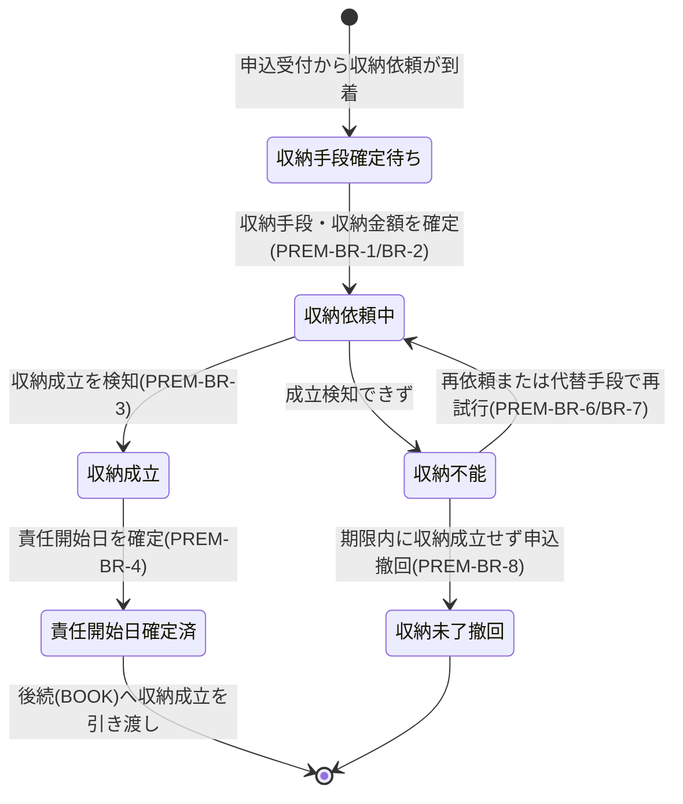

# 第一回保険料収納要求仕様書

## 本書について

### 概要

本書は、[ドメイン定義書](../domain-definition-document#一覧)に記載されるドメインのうち、「第一回保険料収納」に関する要求事項を記載したドキュメントです。
本書は「本ドメインとして何を満たすべきか(What)」を扱います。

### 注記

本書では原則として 具体的な実装手段(How)には踏み込みませんが、 **ビジネス・規制上譲れない本ドメイン固有のHow** は本書で確定します。

## 業務要求

### 業務ルール

本ドメインが満たすべき判断基準・制約・条件分岐を以下に示します。

| ID | 業務ルール | 内容 | 根拠/制約 |
|---|---|---|---|
| PREM-BR-1 | 収納手段の確定 | 第一回保険料の収納手段を、口座振替・クレジットカード・振込・コンビニ払込・現金 のいずれかから商品種別・チャネル・申込条件で許容される範囲で確定する。手段ごとに収納成立検知の契機(即時/非同期)が異なることを前提に運用する | ドメイン定義書「収納手段を確定し」、生命保険新契約の収納実務 |
| PREM-BR-2 | 収納金額の確定 | 収納すべき第一回保険料額は、設計書作成・申込受付で確定したプラン内容・払込方法・引受査定で付与された特別条件(特別保険料割増 等)を反映した確定額とする。特別条件付き可決の場合は条件反映後の金額で収納する | ドメイン定義書「契約成立条件としての完全性」、UNDW(引受査定)連携、生命保険引受実務 |
| PREM-BR-3 | 収納成立の検知 | 収納手段ごとの成立条件(口座振替=引落確定、クレジットカード=オーソリ確定/売上確定、振込=入金消込、コンビニ=収納消込、現金=受領確認)に基づき収納成立を確実かつ迅速に検知する。成立の確定をもって契約成立条件の一方を充足したとみなす | ドメイン定義書「収納成立の確実かつ迅速な検知」、PRD-NFR-6、PRD-NFR-9 |
| PREM-BR-4 | 責任開始日の確定 | 第一回保険料の収納成立日と告知日・引受可決日の関係から、社内責任開始期(責任開始日=保障開始日)規定に従い責任開始日を確定する。責任開始日は契約成立・保険証券記載・保障範囲に直結するため一意に確定し、確定根拠を残す | ドメイン定義書「責任開始日の正確な確定」、生命保険の責任開始期に関する約款規定 |
| PREM-BR-5 | 契約成立条件としての位置づけ | 第一回保険料収納の成立は引受可決と並ぶ契約成立条件であり、双方が揃わない限り契約は成立しない。本ドメインは収納成立可否をBOOK(契約成立)へ確定情報として引き渡す | ドメイン定義書「引受可決と並ぶ契約成立条件」、BRD スコープNo.7 |
| PREM-BR-6 | 収納不能時の再依頼 | 収納が成立しなかった場合、収納手段に応じた再依頼(口座振替の再振替・カード再オーソリ・振込/コンビニの再案内)を一定回数・一定期間内で行う。再依頼の回数・間隔は収納手段ごとの社内収納規程に従う | ドメイン定義書「収納不能ケースの再依頼・代替手段提示の業務継続性」、収納実務 |
| PREM-BR-7 | 代替収納手段の提示 | 同一手段での再依頼でも収納できない場合、申込人へ代替収納手段(別口座・別手段)への変更を提示し、変更後の手段で再収納を試行する | ドメイン定義書「代替手段提示の業務継続性」、収納実務 |
| PREM-BR-8 | 収納未了による申込撤回 | 再依頼・代替手段提示を尽くしても一定期間内に収納が成立しない場合、当該申込を撤回(不成立)として取り扱い、BOOK(契約成立)へ不成立を伝達する。撤回期限は社内収納規程に従う | ドメイン定義書「一定期間内に収納できなかった場合の申込撤回対応」 |
| PREM-BR-9 | 既存収納システムへの引き継ぎ範囲 | 本ドメインは第一回保険料の収納成立確認までを担い、契約成立後の第2回目以降の継続収納に必要な収納手段情報を既存収納システムへ引き継ぐ。第2回目以降の継続収納そのものは本ドメインの対象外とする | ドメイン定義書「第2回目以降の継続収納は既存収納システムが担うため対象外」、BRD スコープ注記 |
| PREM-BR-10 | 二重収納の防止 | 同一申込に対する第一回保険料の収納は1回限りとし、再依頼・リトライ・連携再送時にも二重に収納しない。収納成立の確定は冪等に扱う | PRD-NFR-9(冪等性)、収納実務(過収納防止) |

### 業務状態遷移

本ドメインが管理する主要な業務対象である「第一回保険料収納」の業務状態と遷移を示します。

| 業務状態 | 定義 | この状態での主な制約 |
|---|---|---|
| 収納手段確定待ち | 申込受付から収納依頼が到着し、収納手段・金額が未確定の状態 | 手段・金額確定前は収納依頼を起こせない |
| 収納依頼中 | 確定した収納手段で収納を依頼し、成立検知を待つ状態 | 二重収納を起こさない(PREM-BR-10)。成立検知まで契約成立条件は未充足 |
| 収納成立 | 収納手段ごとの成立条件を満たし収納が確定した状態 | 収納成立は冪等に確定。取り消しは業務運用に従う |
| 責任開始日確定済 | 収納成立日等から責任開始日を確定した状態 | 責任開始日は一意・確定根拠を保持(PREM-BR-4) |
| 収納不能 | 収納が成立せず再依頼・代替手段提示の対象となった状態 | 再依頼回数・期限の管理下。期限超過で撤回へ |
| 収納未了撤回 | 期限内に収納が成立せず申込を撤回(不成立)とした状態 | BOOK(契約成立)へ「不成立」を伝達する |

| 遷移元 | 遷移先 | 契機 | 主体 | 前提条件 |
|---|---|---|---|---|
| 収納手段確定待ち | 収納依頼中 | 収納手段・収納金額を確定 | 申込人/募集人・新契約事務担当者 | プラン・特別条件反映済(PREM-BR-2) |
| 収納依頼中 | 収納成立 | 収納成立を検知 | システム(収納成立検知) | 収納手段ごとの成立条件充足(PREM-BR-3) |
| 収納依頼中 | 収納不能 | 成立検知できず | システム(収納成立検知) | 引落不能・オーソリ拒否・期限内入金なし 等 |
| 収納不能 | 収納依頼中 | 再依頼または代替手段で再試行 | 新契約事務担当者・申込人 | 再依頼回数・期限内(PREM-BR-6/BR-7) |
| 収納成立 | 責任開始日確定済 | 責任開始日を確定 | システム(業務ルール) | 収納成立日・告知日・可決日が揃う(PREM-BR-4) |
| 収納不能 | 収納未了撤回 | 期限内に収納成立せず申込撤回 | 新契約事務担当者 | 再依頼・代替提示を尽くし期限到来(PREM-BR-8) |

### 業務運用(イレギュラー対応)

正常系から外れる業務局面と、その業務上の取り扱いを以下に示します。

| ID | イレギュラー事象 | 発生契機 | 業務上の対応 |
|---|---|---|---|
| PREM-IRR-1 | 口座振替の引落不能 | 残高不足・口座相違・振替不能 | PREM-BR-6 に従い再振替を試行。規定回数を超えたら代替手段提示(PREM-BR-7)へ移行 |
| PREM-IRR-2 | クレジットカードのオーソリ拒否 | 与信不足・カード無効・限度超過 | 申込人へ別カード/別手段への変更を提示し再試行。期限内に成立しなければ撤回対象 |
| PREM-IRR-3 | 振込・コンビニ払込の入金未確認 | 期限内に入金されない/消込できない | 入金督促・再案内を行い、期限超過時は収納未了撤回(PREM-BR-8) |
| PREM-IRR-4 | 外部決済サービスの障害・不達 | 決済サービスのダウン・タイムアウト・応答不達 | PRD-NFR-4 の縮退運用方針に従い収納業務を継続。復旧後にリトライし PREM-BR-10 で二重収納を防止 |
| PREM-IRR-5 | 収納成立検知の遅延 | 非同期検知の遅延・連携滞留 | PRD-NFR-6 の監視で検知し、滞留解消まで滞留管理。責任開始日確定はPREM-BR-4 に従い検知確定後に実施 |
| PREM-IRR-6 | 過収納・二重収納の疑い | 再依頼・連携再送と実収納が重複 | 冪等に収納成立を確定(PREM-BR-10)。二重収納が判明した場合は返金・取消を業務手順で実施 |
| PREM-IRR-7 | 引受査定の謝絶・申込撤回後に収納成立 | 査定結果確定前に収納が先行成立し、その後謝絶/撤回 | 契約不成立として収納金を返金・取消する業務手順を適用。BOOK(契約成立)へ不成立を伝達 |
| PREM-IRR-8 | 収納金額の事後変更 | 特別条件付与・プラン変更で確定額が変動 | 確定額(PREM-BR-2)に基づき差額の追加収納または返金を行い、整合した額で契約成立条件を充足させる |

## セキュリティ要求

### データアクセス要求

| ID | データ | PRD 機密区分との対応 | 本ドメインでの取り扱い |
|---|---|---|---|
| PREM-DATA-1 | 収納手段情報(口座・カード・払込方法 等) | PRD-SEC-DATA-3(個人情報・業務上機密) | 保存時暗号化必須(PRD-SEC-4)。役割×組織で権限制御。既存収納システムへ引き継ぐ範囲を限定(PREM-BR-9) |
| PREM-DATA-2 | 収納金額・収納成立情報 | PRD-SEC-DATA-3(個人情報・業務上機密) | 確定額・成立日・成立検知根拠を保持。改ざん不能保存(PRD-SEC-6) |
| PREM-DATA-3 | 責任開始日・確定根拠 | PRD-SEC-DATA-3(個人情報・業務上機密) | 一意確定し確定根拠を保持。証券記載・保障範囲の正典として保全 |
| PREM-DATA-4 | 再依頼・代替手段提示の履歴 | PRD-SEC-DATA-3(個人情報・業務上機密)・PRD-SEC-DATA-7(業務上機密) | 再依頼回数・期限・撤回判断の経緯を保持。監査ログ対象 |
| PREM-DATA-5 | 外部決済サービス連携の処理識別情報 | PRD-SEC-DATA-7(業務上機密) | 二重収納防止・冪等性担保のための処理識別を保持(PREM-BR-10)。改ざん不能保存 |

## 受け入れ基準

* 収納手段の網羅: 口座振替・クレジットカード・振込・コンビニ払込・現金 の各手段で収納依頼から成立検知までが業務上成立すること(PREM-BR-1・BR-3)
* 収納金額の正確性: 特別条件・プラン内容を反映した確定額で収納され、事後変動時も整合した額に収束すること(PREM-BR-2・PREM-IRR-8)
* 責任開始日の確定: 収納成立日・告知日・可決日から責任開始日が一意に確定し、確定根拠が保持されること(PREM-BR-4)
* 契約成立条件の引き渡し: 収納成立可否・収納未了撤回 がBOOK(契約成立)へ正しく伝達されること(PREM-BR-5・BR-8)
* イレギュラー対応: 引落不能・オーソリ拒否・入金未確認・外部決済障害・二重収納の疑い・査定謝絶後収納 の各局面が業務上収束すること
* 二重収納の防止: 再依頼・リトライ・連携再送時にも収納が冪等に確定し過収納が発生しないこと(PREM-BR-10、PRD-NFR-9)
* 既存システム連携: 既存収納システムへ第2回目以降の継続収納に必要な情報を引き継ぎ、本ドメインの責務境界を越えないこと(PREM-BR-9)
