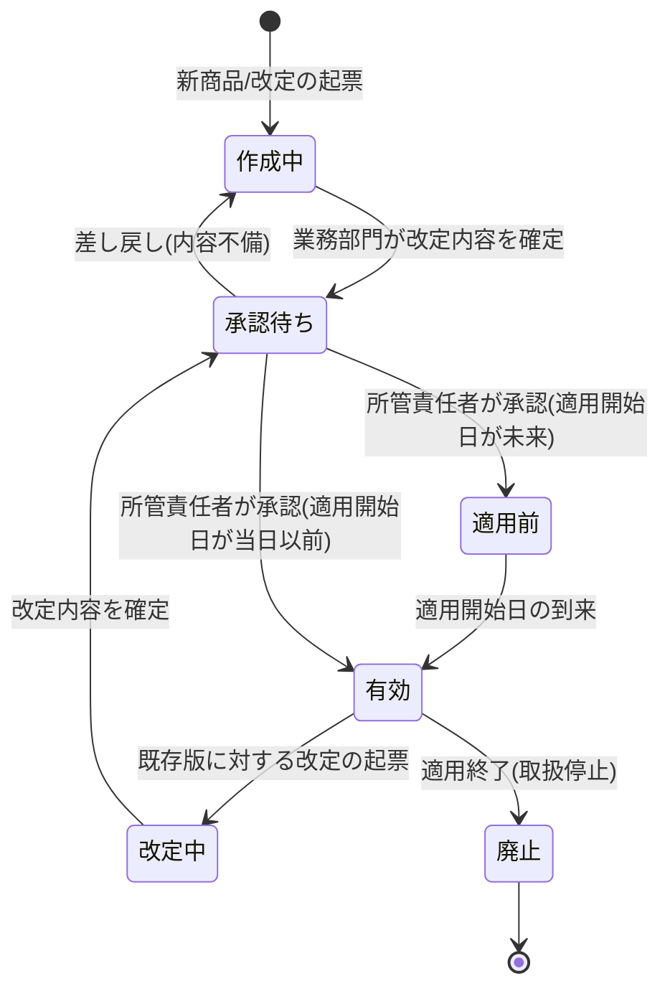

# 商品仕様管理要求仕様書

## 本書について

### 概要

本書は、[ドメイン定義書](../domain-definition-document#一覧)に記載されるドメインのうち、「商品仕様管理」に関する要求事項を記載したドキュメントです。
本書は「本ドメインとして何を満たすべきか(What)」を扱います。

### 注記

本書では原則として 具体的な実装手段(How)には踏み込みませんが、 **ビジネス・規制上譲れない本ドメイン固有のHow** は本書で確定します。

## 業務要求

### 業務ルール

本ドメインが定義・管理する商品仕様・引受基準・保険料計算ロジックに関する業務ルールを以下に示します。

| ID | 業務ルール | 内容 | 根拠/制約 |
|---|---|---|---|
| PROD-BR-1 | 取扱商品種別の定義 | 個人保険の商品種別(終身・定期・医療・がん)を初期取扱対象として定義する。就業不能・介護・特定疾病 等の追加商品はフェーズ2で対応する [フェーズ2] | ドメイン定義書(主な関心事=商品拡張性) / BRD「将来のビジネスの拡張性」 |
| PROD-BR-2 | 特約の定義と付加可否 | 各商品種別に付加可能な特約を定義し、主契約と特約の組合せ可否・付加上限・付加条件(被保険者年齢・主契約保険金額との比率 等)を業務ルールとして保持する | 生保業務一般 / ドメイン定義書(商品種別・特約) |
| PROD-BR-3 | 引受基準の定義 | 商品種別・特約ごとに、加入可能年齢範囲・保険金額の上限/下限・職業区分による加入可否/制限・既往症等による標準体/特別条件/謝絶の判定基準 を引受基準として定義する。引受査定の判定根拠の源となる | PRD-SEC-DATA-4 / ドメイン定義書(引受基準) |
| PROD-BR-4 | 保険料計算ロジックの定義 | 商品種別・特約・被保険者属性(年齢・性別)・保険金額・保険期間・払込方法・払込期間 を入力として保険料を算出する計算ロジック(基礎率・計算式)を定義・保持する。計算結果はプロダクト全体で一意であること | PRD-SEC-DATA-4 / 生保業務一般(標準生命表・予定利率等の基礎率) |
| PROD-BR-5 | 商品仕様の有効期間管理 | 各商品仕様・引受基準・保険料計算ロジックは適用開始日・適用終了日を持ち、申込時点(意向把握・設計書作成・申込受付の基準日)に有効な版を適用する。版の遡及適用・先付け改定を業務上区別して管理する | 生保業務一般(料率改定・商品改定の版管理) / PRD-NFR-7 |
| PROD-BR-6 | 商品改定・新商品/特約追加への拡張 | 既存商品の改定(料率改定・引受基準見直し・特約追加)および新商品・新特約の追加を、既存商品仕様への影響を局所化して反映できること。改定は業務部門の承認を経て有効化する [フェーズ2: 新商品・新特約の追加] | ドメイン定義書(商品拡張性) / BRD「商品拡張性」 / PRD-NFR-7 |
| PROD-BR-7 | 業務部門による保守性の担保 | 商品仕様・引受基準・保険料計算ロジックは、商品開発部門・アクチュアリーが内容を把握・検証・更新可能な表現で保持する。IT部門の開発介在を必須としない保守運用を業務要求とする | PRD-NFR-7 / ドメイン定義書(ルールエンジン化による業務部門での保守性) |
| PROD-BR-8 | 改定の承認統制 | 商品仕様・引受基準・保険料計算ロジックの作成・改定・廃止は、業務部門の所管責任者の承認を経て有効化する。承認前の版は設計書作成・引受査定に適用しない | PRD-SEC-5 / PRD-REG-6 |

### 業務状態遷移

本ドメインが管理する主要な業務対象である「商品仕様(商品種別・特約・引受基準・保険料計算ロジックを束ねた版)」の業務状態と遷移を示します。

| 業務状態 | 定義 | この状態での主な制約 |
|---|---|---|
| 作成中 | 新商品・特約・引受基準・保険料計算ロジックの内容を業務部門が編集している状態 | 設計書作成・引受査定からの参照対象外。未確定のため対外提案に使用不可 |
| 承認待ち | 改定内容が確定し所管責任者の承認を待つ状態 | 参照対象外。承認をもって有効化される |
| 適用前 | 承認済みだが適用開始日が未到来の状態 | 参照対象外。適用開始日まで現行有効版が適用される |
| 有効 | 適用開始日以降、申込手続きに適用される状態 | 設計書作成・引受査定が参照可能。直接の内容書き換えは不可(改定起票を要する) |
| 改定中 | 有効版に対する改定内容を編集している状態 | 有効版は引き続き参照可能。改定版は承認まで適用されない |
| 廃止 | 取扱停止により新規申込への適用を終了した状態 | 新規の設計書作成・申込受付には適用不可。既存手続き中の参照のため履歴として保全 |

| 遷移元 | 遷移先 | 契機 | 主体 | 前提条件 |
|---|---|---|---|---|
| (なし) | 作成中 | 新商品・特約・改定の起票 | 商品開発部門・アクチュアリー | 商品企画の業務上の意思決定 |
| 作成中 | 承認待ち | 改定内容の確定 | 商品開発部門・アクチュアリー | 必須項目・整合性が業務上充足 |
| 承認待ち | 作成中 | 内容不備による差し戻し | 所管責任者 | 承認審査で不備指摘 |
| 承認待ち | 適用前 | 承認(適用開始日が未来) | 所管責任者 | 承認かつ適用開始日が未到来 |
| 承認待ち | 有効 | 承認(適用開始日が当日以前) | 所管責任者 | 承認かつ適用開始日が到来済み |
| 適用前 | 有効 | 適用開始日の到来 | (業務日付による自動遷移) | 適用開始日に到達 |
| 有効 | 改定中 | 既存版への改定起票 | 商品開発部門・アクチュアリー | 料率改定・引受基準見直し 等の業務判断 |
| 有効 | 廃止 | 取扱停止の決定 | 商品開発部門・所管責任者 | 商品の販売終了の業務判断 |

### 業務運用(イレギュラー対応)

正常系から外れる業務局面と、その業務上の取り扱いを以下に示します。

| ID | イレギュラー事象 | 発生契機 | 業務上の対応 |
|---|---|---|---|
| PROD-IRR-1 | 料率改定の適用日跨ぎ | 料率改定の適用開始日前後に設計書作成・申込受付が継続している | 申込手続きの基準日(設計書作成・申込受付の業務上の基準日)に有効だった版を一貫して適用する。基準日の確定ルールに従い、跨ぎ案件は旧版・新版の取り違えを防ぐ |
| PROD-IRR-2 | 適用済み保険料計算ロジックの誤り発覚 | 有効版の計算ロジックに誤りが事後判明 | 影響範囲(対象商品・期間・既申込件数)を特定し、訂正版を緊急改定として承認・適用。既に提示・申込済みの案件は業務部門の指示に基づき再計算・訂正対応の要否を判定する |
| PROD-IRR-3 | 承認前版の誤参照 | 承認待ち・適用前の版が設計書作成・引受査定から誤って参照されようとした | 有効状態でない版は参照対象から除外する。参照要求は有効版にフォールバックし、誤適用を業務上発生させない |
| PROD-IRR-4 | 改定承認の遅延 | 適用開始予定日までに所管責任者の承認が完了しない | 適用開始日が到来しても未承認版は適用せず、現行有効版を継続適用する。承認遅延を業務上のアラート対象とし、所管部門へ連絡する |
| PROD-IRR-5 | 商品廃止後の手続き中案件 | 取扱停止(廃止)時点で当該商品の設計書作成・申込受付が進行中 | 進行中案件は廃止前の有効版を履歴として参照可能とし、手続きを完結させる。新規の設計書作成・申込受付には適用不可とする |

## セキュリティ要求

### データアクセス要求

| ID | データ | PRD 機密区分との対応 | 本ドメインでの取り扱い |
|---|---|---|---|
| PROD-DATA-1 | 商品仕様(商品種別・特約・付加可否・引受基準) | PRD-SEC-DATA-4(業務上機密) | 版・有効期間付きで保持。参照は広範に許容、更新は業務部門の所管者に限定。改定操作は監査対象 |
| PROD-DATA-2 | 保険料計算ロジック(基礎率・計算式) | PRD-SEC-DATA-4(業務上機密) | 版・有効期間付きで保持。計算結果の一意性を担保。更新は限定、改定操作は監査対象 |
| PROD-DATA-3 | 商品改定履歴(作成・改定・廃止・承認の経緯) | PRD-SEC-DATA-7(業務上機密)/ PRD-SEC-6 | 改ざん不能な形で保持し、改定の正当性・適用版の追跡を可能とする |

## 受け入れ基準

* 商品仕様の網羅: 初期取扱対象(終身・定期・医療・がん)の商品種別・特約・引受基準・保険料計算ロジックが業務ルールとして網羅されていること
* 版管理の一貫性: 申込手続きの基準日に有効な商品仕様・保険料計算ロジックが一意に決定され、料率改定の適用日跨ぎ(PROD-IRR-1)で版の取り違えが起きないこと
* 業務部門保守性(PRD-NFR-7 充足): 商品仕様・引受基準・保険料計算ロジックを業務部門が把握・検証・更新可能な形で保持する設計であることが確認されていること
* 承認統制: 商品仕様の作成・改定・廃止が承認を経て有効化され、未承認版が設計書作成・引受査定に適用されないこと(PROD-BR-8 / PROD-IRR-3)
* 拡張性検証: 既存商品改定および新商品・新特約追加が既存仕様への影響を局所化して反映できること(PROD-BR-6、新商品・新特約は [フェーズ2])
* 監査追跡性: 商品改定履歴が改ざん不能に保全され、適用版の追跡が可能であること
