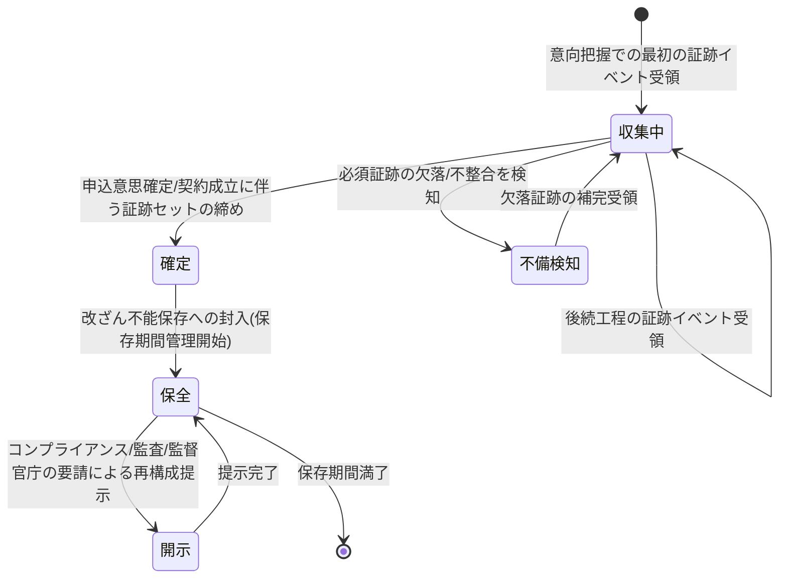

# 募集コンプライアンス証跡管理要求仕様書

## 本書について

### 概要

本書は、[ドメイン定義書](../domain-definition-document#一覧)に記載されるドメインのうち、「募集コンプライアンス証跡管理」に関する要求事項を記載したドキュメントです。
本書は「本ドメインとして何を満たすべきか(What)」を扱います。

### 注記

本書では原則として 具体的な実装手段(How)には踏み込みませんが、 **ビジネス・規制上譲れない本ドメイン固有のHow** は本書で確定します。

## 業務要求

### 業務ルール

本ドメインが収集・保全する募集コンプライアンス証跡に関する業務ルールを以下に示します。

| ID | 業務ルール | 内容 | 根拠/制約 |
|---|---|---|---|
| SUIT-BR-1 | 証跡化対象事象の定義 | 意向把握義務・情報提供義務・適合性原則・告知の妥当性 に関わる説明・確認・同意の各事象を、証跡化対象事象として定義する | PRD-REG-1 / ドメイン定義書(募集規制への対応) |
| SUIT-BR-2 | 証跡の発生源と責務境界 | 意向把握・情報提供・適合性確認・告知 の業務工程そのものは各工程ドメイン(HEAR・DESIGN・APPL・DECL)が担い、本ドメインは発生した証跡イベントの収集・保全・説明可能性に責務を限定する。業務工程の判断ロジックを本ドメインで再実装しない | ドメイン定義書(本ドメインの責務限定の記述) |
| SUIT-BR-3 | 証跡の網羅性 | 募集の一連の工程(意向把握→設計書作成→申込受付→告知受付)で発生すべき証跡が、案件単位で漏れなく集約されていることを業務上の要求とする。欠落を検知可能とする | ドメイン定義書(証跡の網羅性) / PRD-REG-6 |
| SUIT-BR-4 | 改ざん不能性 | 収集した証跡は事後の改変・削除を許容しない形で保全し、改変試行も含めて全件追跡可能とする | PRD-SEC-6 / PRD-SEC-DATA-6 / ドメイン定義書(改ざん不能性) |
| SUIT-BR-5 | 説明可能性(再構成可能性) | コンプライアンス部・内部監査部・監督官庁の要請に対し、案件単位で「いつ・誰が・何を説明/確認/同意したか」を時系列で再構成・提示可能とする | ドメイン定義書(説明可能性) / PRD-REG-6 |
| SUIT-BR-6 | 証跡の真実性・可視性確保 | 申込書・告知書等の証跡について、作成時刻の真正性(タイムスタンプ等)と検索による可視性を確保する | PRD-REG-5(電子帳簿保存法) |
| SUIT-BR-7 | 適合性原則の確認証跡 | 顧客の意向・属性に対し提案・申込内容が適合しているかの確認事象を証跡化する。意向と乖離した申込が成立しないための確認の事実を保全する | PRD-REG-1(適合性原則) / PRD体験設計(募集コンプライアンスの証跡化) |
| SUIT-BR-8 | 告知の妥当性に関する証跡 | 告知妨害・不告知教唆の防止に資する確認事象(告知は被保険者本人の認識に基づくものであること等)を証跡化する。告知内容そのものの管理は DECL の責務 | PRD-REG-2(保険法・告知義務) / ドメイン定義書 |
| SUIT-BR-9 | 証跡の保存期間 | 募集コンプライアンス証跡を10年間保持する。保持期間中の参照可能性を維持する | PRD-SEC-7 |

### 業務状態遷移

本ドメインが管理する主要な業務対象である「案件単位の募集コンプライアンス証跡(募集工程を通じて積み上がる証跡の束)」の業務状態と遷移を示します。

| 業務状態 | 定義 | この状態での主な制約 |
|---|---|---|
| 収集中 | 募集工程の進行に伴い証跡イベントを順次受領・蓄積している状態 | 受領済み証跡は改変不可。工程の進行を阻害しない形で受領する |
| 不備検知 | 必須証跡の欠落・不整合が検知された状態 | 当該案件の証跡網羅性が未充足。後続工程の進行可否を業務上判定する根拠を提供 |
| 確定 | 申込意思確定・契約成立に伴い証跡セットが締められた状態 | 以降の証跡追加は原則行わない。締め後の追加は別事象として扱う |
| 保全 | 改ざん不能保存に封入され保存期間管理が始まった状態 | 改変・削除不可。参照は限定担当者のみ、全件監査対象 |
| 開示 | コンプライアンス部・内部監査部・監督官庁の要請で再構成・提示している状態 | 提示は原本を改変しない。提示行為自体も証跡・監査対象 |

| 遷移元 | 遷移先 | 契機 | 主体 | 前提条件 |
|---|---|---|---|---|
| (なし) | 収集中 | 最初の証跡イベント受領 | 工程ドメイン(HEAR等) | 意向把握等の募集工程開始 |
| 収集中 | 収集中 | 後続工程の証跡イベント受領 | 工程ドメイン(DESIGN/APPL/DECL) | 当該工程での説明・確認・同意事象の発生 |
| 収集中 | 不備検知 | 必須証跡の欠落・不整合検知 | (証跡網羅性の業務上の検証) | 必須証跡が未受領または不整合 |
| 不備検知 | 収集中 | 欠落証跡の補完受領 | 工程ドメイン | 欠落事象の補完実施 |
| 収集中 | 確定 | 申込意思確定・契約成立 | (申込受付/契約成立に伴う業務連携) | 募集工程の証跡が出揃う |
| 確定 | 保全 | 改ざん不能保存への封入 | (証跡保全の業務処理) | 証跡セットの締め完了 |
| 保全 | 開示 | コンプライアンス/監査/監督官庁の要請 | コンプライアンス部 / 内部監査部 / 金融庁 | 説明要請の発生 |
| 開示 | 保全 | 提示完了 | コンプライアンス部 等 | 要請対応の完了 |

### 業務運用(イレギュラー対応)

正常系から外れる業務局面と、その業務上の取り扱いを以下に示します。

| ID | イレギュラー事象 | 発生契機 | 業務上の対応 |
|---|---|---|---|
| SUIT-IRR-1 | 必須証跡の欠落 | ある募集工程で発生すべき説明・確認・同意の証跡が未受領 | 証跡欠落を検知し当該案件を不備として扱う。後続工程の進行可否を業務上判定する根拠を関係ドメイン・コンプライアンス部へ通知する |
| SUIT-IRR-2 | 証跡イベントの遅延到達 | 工程側の事情で証跡イベントが遅れて到達 | 受領時刻と事象発生時刻を区別して保全し、遅延を理由に証跡を欠落扱いとしない。遅延が常態化する場合は業務上の是正対象とする |
| SUIT-IRR-3 | 改ざん試行の検知 | 保全済み証跡への改変・削除が試行された | 改変試行自体を追跡可能な形で記録し、原本の完全性を維持する。コンプライアンス部・CSIRTへエスカレーションする(PRD-SEC-9) |
| SUIT-IRR-4 | 不適切募集の疑義 | 証跡から意向と乖離した申込・告知妨害等の疑義が浮上 | 当該案件をコンプライアンス部のレビュー対象として連携する。証跡は原本のまま保全し、判断に必要な再構成を提供する |
| SUIT-IRR-5 | 申込中断・取消後の証跡 | 申込が中断・撤回され契約成立に至らなかった | 成立に至らなかった案件の証跡も法令・社内規程に従い保全対象とし、安易な破棄を業務上行わない |
| SUIT-IRR-6 | 監督官庁・監査からの遡及照会 | 過去案件についてコンプライアンス部・監督官庁から遡及的な説明要請 | 保存期間内の証跡を案件単位で時系列再構成し説明可能とする。提示行為自体も監査対象として記録する |

## セキュリティ要求

### データアクセス要求

| ID | データ | PRD 機密区分との対応 | 本ドメインでの取り扱い |
|---|---|---|---|
| SUIT-DATA-1 | 募集コンプライアンス証跡イベント(意向把握・情報提供・適合性確認・告知妥当性確認・同意) | PRD-SEC-DATA-6(個人情報含む・業務上機密) | 改ざん不能保存。参照は限定・全件監査ログ対象。受領時刻と事象発生時刻を区別保持 |
| SUIT-DATA-2 | 証跡の責任主体属性(担当募集人・代理店・チャネル) | PRD-SEC-DATA-6(業務上機密) | 外部システム(募集人管理システム `EXT-CHNL-MASTER`)から受領した識別情報を証跡に紐づけて保全(PRD-EXT-5) |
| SUIT-DATA-3 | 証跡の真正性メタ情報(タイムスタンプ等) | PRD-SEC-DATA-6 / PRD-REG-5 | 電子帳簿保存法の真実性・可視性確保のため作成時刻の真正性と検索性を維持 |
| SUIT-DATA-4 | 証跡の参照・開示記録 | PRD-SEC-DATA-7(業務上機密)/ PRD-SEC-6 | 証跡への参照・開示行為自体を改ざん不能に記録。保存期間10年(PRD-SEC-7) |

## 受け入れ基準

* 証跡網羅性(PRD-REG-1 / PRD-REG-6 充足): 募集工程(意向把握→設計書作成→申込受付→告知受付)で発生すべき証跡が案件単位で漏れなく集約され、欠落が検知できること(SUIT-BR-3 / SUIT-IRR-1)
* 責務境界の遵守: 業務工程の判断ロジックを本ドメインで再実装せず、証跡の収集・保全・説明可能性に責務が限定されていること(SUIT-BR-2)
* 改ざん不能性(PRD-SEC-6 充足): 保全済み証跡が改変・削除不可で、改変試行も含め全件追跡可能であること(SUIT-BR-4 / SUIT-IRR-3)
* 説明可能性: コンプライアンス部・内部監査部・監督官庁の要請に対し案件単位で時系列再構成・提示できること(SUIT-BR-5 / SUIT-IRR-6)
* 保存期間: 募集コンプライアンス証跡が10年間保持され、保持期間中の参照可能性が維持されること(SUIT-BR-9 / PRD-SEC-7)
* 不成立案件の保全: 中断・撤回案件の証跡も法令・社内規程に従い保全されること(SUIT-IRR-5)
