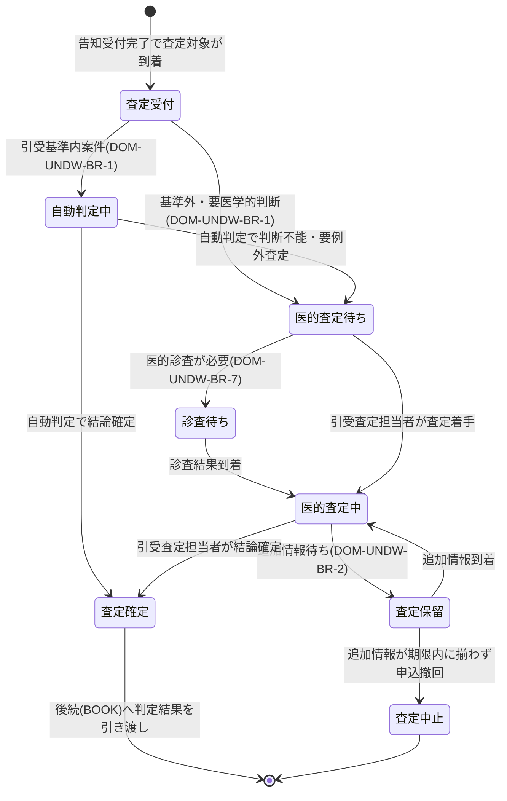

# 引受査定要求仕様書

## 本書について

### 概要

本書は、[ドメイン定義書](../domain-definition-document#一覧)に記載されるドメインのうち、「引受査定」に関する要求事項を記載したドキュメントです。
本書は「本ドメインとして何を満たすべきか(What)」を扱います。

### 注記

本書では原則として 具体的な実装手段(How)には踏み込みませんが、 **ビジネス・規制上譲れない本ドメイン固有のHow** は本書で確定します。

## 業務要求

### 業務ルール

本ドメインが満たすべき判断基準・制約・条件分岐を以下に示します。

> **前提(外部システム参照):** 本ドメインが判定の根拠とする商品仕様・引受基準・保険料計算ロジックは、外部システム(商品マスタ管理システム `EXT-PROD-MASTER`)を正典として参照します(DOM-COMMON-EXT-4 / DOM-COMMON-SEC-DATA-4)。本ドメインはこれらのマスタを保有・改変せず、判定時点で有効なバージョンを取得し、非遡及で適用します(DOM-UNDW-BR-5)。引受基準改定は外部システム側で業務部門(商品開発・アクチュアリー)が実施し、本ドメインはその結果を参照する立場をとります。

| ID | 業務ルール | 内容 | 根拠/制約 |
|---|---|---|---|
| DOM-UNDW-BR-1 | 査定経路の振り分け | 告知内容・診査結果・環境査定情報を引受基準に照合し、基準内で完結する案件は自動判定経路へ、基準外・要医学的判断・告知内容に疑義がある案件は医的査定(例外査定)経路へ振り分ける。振り分け基準は商品種別・保険金額・被保険者年齢・告知該当項目で定義する | KPI「自動判定率70%以上」(BRD)、ドメイン定義書「主な関心事(自動判定率・判定品質の標準化)」、DOM-COMMON-NFR-7 |
| DOM-UNDW-BR-2 | 引受可否区分の確定 | 査定結果は「可決(無条件)」「特別条件付き可決」「謝絶」「保留(追加情報待ち)」のいずれかに確定する。区分ごとに後続のBOOK(契約成立)・PREM(第一回保険料収納)・募集人/申込人への通知の取り扱いが分岐する | ドメイン定義書「引受可否・特別条件付与を判定」、生命保険新契約業務の引受実務 |
| DOM-UNDW-BR-3 | 特別条件の付与基準 | 標準体で引き受けられない被保険者に対し、特別保険料(割増)・保険金削減・特定部位/特定疾病不担保・保険金額削減・引受期間制限 等の特別条件を引受基準に基づき付与する。付与する条件種別・水準は商品種別ごとの引受基準に従う | ドメイン定義書「特別条件付与を判定」、DOM-COMMON-SEC-DATA-4、生命保険引受実務 |
| DOM-UNDW-BR-4 | 判定根拠の追跡可能性 | 自動判定・医的査定を問わず、すべての査定結果に対し「どの告知項目・診査結果・環境査定情報・引受基準のどの条文に基づきどの結論に至ったか」の判定根拠を結論と一体で残す。事後に第三者(引受査定担当者・コンプライアンス部・内部監査部)が判定の妥当性を検証できる粒度とする | ドメイン定義書「判定根拠の追跡可能性」、DOM-COMMON-SEC-6、DOM-COMMON-REG-6 |
| DOM-UNDW-BR-5 | 引受基準バージョンの固定 | 各案件の査定は、査定実施時点で有効な引受基準のバージョンに基づき判定し、適用した引受基準バージョンを判定根拠に記録する。査定後に引受基準が改定されても、確定済み案件の判定結果は遡及して変更しない | DOM-COMMON-SEC-DATA-4、DOM-COMMON-NFR-7、生命保険引受実務(基準改定の非遡及) |
| DOM-UNDW-BR-6 | 医的査定担当者の判断優先 | 医的査定経路において、引受査定担当者の最終判断が自動判定の暫定結果に優先する。担当者が自動判定結果を覆す場合は、覆した理由を判定根拠に必須記録する | ドメイン定義書「自動判定と例外査定の双方を扱う」、アクター一覧 ACT-3、DOM-COMMON-SEC-6 |
| DOM-UNDW-BR-7 | 診査要否の判定 | 保険金額・被保険者年齢・告知内容が引受基準で定める診査要否しきい値を超える場合、医的診査(健康診断書・医師の診断書・面接士報告 等)を要する案件として識別し、診査結果が揃うまで査定を確定しない | 生命保険引受実務(高額・高年齢時の診査要件)、ドメイン定義書「診査結果・環境査定情報をもとに」 |
| DOM-UNDW-BR-8 | 環境査定の反映 | 職業・財務状況・既契約状況(他社含む通算保険金額)・モラルリスク観点 等の環境査定情報を引受判定に反映する。通算保険金額が引受限度を超える場合は減額または謝絶の対象とする | 生命保険引受実務(モラルリスク・通算限度)、ドメイン定義書「環境査定情報をもとに」 |
| DOM-UNDW-BR-9 | 自動判定ロジックの段階的チューニング | 自動判定の判定基準・しきい値は、リリース後の判定結果モニタリングに基づき業務部門が段階的に調整可能とする。調整は引受基準バージョンの改定として管理し、DOM-UNDW-BR-5 の非遡及原則に従う | BRD「判定ロジックの段階的チューニングサイクル」、ドメイン定義書「段階的チューニング」、DOM-COMMON-NFR-7 |
| DOM-UNDW-BR-10 | 機械学習による査定高度化 [フェーズ2] | 申込・引受・成立データの蓄積を前提に、自動判定の精度向上・医的査定要否の事前予測に機械学習を活用する。導入時も DOM-UNDW-BR-4(判定根拠の追跡可能性)を満たし、説明可能性を確保した上で運用する | BRD「将来のビジネスの拡張性(機械学習活用)」、ドメイン定義書「将来の機械学習活用への備え」 |

### 業務状態遷移

本ドメインが管理する主要な業務対象である「査定案件」の業務状態と遷移を示します。

| 業務状態 | 定義 | この状態での主な制約 |
|---|---|---|
| 査定受付 | 告知受付完了により査定対象案件が到着し、査定経路の振り分け前の状態 | 査定経路振り分け前は判定結果を確定できない |
| 自動判定中 | 引受基準内案件として自動判定を実施中の状態 | 自動判定で判断不能となった場合は医的査定へ移行する。担当者の手動介入は行わない |
| 医的査定待ち | 引受査定担当者による例外査定を待つ状態 | 担当者がアサインされるまで判定を確定できない |
| 診査待ち | 医的診査(健康診断書・医師の診断書 等)の到着を待つ状態 | 診査結果が揃うまで査定を確定できない(DOM-UNDW-BR-7) |
| 医的査定中 | 引受査定担当者が判定を実施中の状態 | 担当者の最終判断が優先する(DOM-UNDW-BR-6)。判定根拠の記録が確定の前提 |
| 査定保留 | 追加情報(再診査・追加告知・照会回答 等)待ちで結論を留保する状態 | 結論確定不可。後続ドメインへ引き渡せない |
| 査定確定 | 引受可否区分(可決/特別条件付き可決/謝絶)が確定した状態 | 判定結果は非遡及(DOM-UNDW-BR-5)。確定後の変更は不可 |
| 査定中止 | 追加情報が期限内に揃わず、または申込撤回により査定を打ち切った状態 | 後続のBOOK(契約成立)へは「不成立」として伝達する |

| 遷移元 | 遷移先 | 契機 | 主体 | 前提条件 |
|---|---|---|---|---|
| 査定受付 | 自動判定中 | 引受基準内案件と振り分け | システム(業務ルール) | 告知・環境査定情報が揃っている |
| 査定受付 | 医的査定待ち | 基準外・要医学的判断と振り分け | システム(業務ルール) | 振り分け基準該当 |
| 自動判定中 | 査定確定 | 自動判定で結論確定 | システム(業務ルール) | 判定根拠を一体記録(DOM-UNDW-BR-4) |
| 自動判定中 | 医的査定待ち | 自動判定で判断不能 | システム(業務ルール) | 例外査定経路への切替 |
| 医的査定待ち | 診査待ち | 医的診査が必要と判断 | 引受査定担当者 | 診査要否しきい値超過(DOM-UNDW-BR-7) |
| 診査待ち | 医的査定中 | 診査結果到着 | 引受査定担当者 | 必要な診査結果が揃う |
| 医的査定待ち | 医的査定中 | 担当者が査定着手 | 引受査定担当者 | 担当者アサイン済 |
| 医的査定中 | 査定保留 | 追加情報が必要 | 引受査定担当者 | 保留理由を記録 |
| 査定保留 | 医的査定中 | 追加情報到着 | 引受査定担当者 | 追加情報が揃う |
| 医的査定中 | 査定確定 | 引受査定担当者が結論確定 | 引受査定担当者 | 判定根拠を必須記録(DOM-UNDW-BR-4・BR-6) |
| 査定保留 | 査定中止 | 追加情報が期限内に揃わず申込撤回 | 新契約事務担当者 | 撤回判断・期限到来 |

### 業務運用(イレギュラー対応)

正常系から外れる業務局面と、その業務上の取り扱いを以下に示します。

| ID | イレギュラー事象 | 発生契機 | 業務上の対応 |
|---|---|---|---|
| DOM-UNDW-IRR-1 | 自動判定が判断不能 | 告知内容が引受基準で機械判定できない組合せ・新規パターン | 医的査定経路へ切り替え、引受査定担当者の判断に委ねる。発生パターンは DOM-UNDW-BR-9 のチューニング対象として蓄積する |
| DOM-UNDW-IRR-2 | 診査結果の長期未到着 | 健康診断書・医師の診断書・面接士報告が期限内に届かない | 査定保留として滞留管理し、督促対象とする。一定期間【要確認: 診査結果待ちの最長許容期間(社内引受規程に依存)】を超えた場合は申込撤回扱いとし査定中止へ |
| DOM-UNDW-IRR-3 | 告知内容への疑義・追加告知の必要 | 査定中に告知内容の不整合・追加確認事項を発見 | 医的査定担当者が照会事項を起票し、告知受付ドメインを通じて被保険者へ再告知・追加告知を依頼。回答到着まで査定保留 |
| DOM-UNDW-IRR-4 | 謝絶案件の発生 | 引受基準・環境査定で引受不可と判定 | 謝絶として確定し、後続BOOK(契約成立)へ「不成立」を伝達。募集人・申込人への謝絶通知は告知妨害を疑われないよう理由表現を社内基準で統制する |
| DOM-UNDW-IRR-5 | 特別条件の申込人不同意 | 特別条件付き可決を申込人が受諾しない | 申込撤回または条件再交渉として取り扱い、査定結果は確定済みのまま後続を「不成立」として処理。再申込時は新規案件として再査定 |
| DOM-UNDW-IRR-6 | 確定後の引受基準改定の影響確認要請 | 外部システム(商品マスタ管理システム)側のリリース後チューニングで引受基準を改定 | 確定済み案件は非遡及(DOM-UNDW-BR-5)。改定の影響は新規案件にのみ適用し、改定前後の判定差はモニタリング対象として記録 |
| DOM-UNDW-IRR-7 | 査定品質モニタリングでの逸脱検知 | 判定結果モニタリングで自動判定の品質逸脱(誤判定傾向)を検知 | 業務部門に分析結果をフィードバックし、外部システム(商品マスタ管理システム)側で DOM-UNDW-BR-9 のチューニングサイクルにより引受基準バージョンを改定する。重大逸脱時は該当パターンを一時的に医的査定経路へ強制振り分け |

## セキュリティ要求

### データアクセス要求

| ID | データ | PRD 機密区分との対応 | 本ドメインでの取り扱い |
|---|---|---|---|
| DOM-UNDW-DATA-1 | 査定対象の告知・診査情報 | DOM-COMMON-SEC-DATA-2(要配慮個人情報) | 判定根拠としてのみ参照。引受査定担当者・限定担当者のみ参照可。改ざん不能保存・参照は監査ログ必須 |
| DOM-UNDW-DATA-2 | 引受基準(バージョン付き、外部システム参照) | DOM-COMMON-SEC-DATA-4(業務上機密) | **本ドメインでは保有せず、外部システム(商品マスタ管理システム `EXT-PROD-MASTER`)から参照する**。査定時点バージョンを判定に適用(DOM-UNDW-BR-5)。改定は外部システム側で業務部門が実施(DOM-COMMON-EXT-4) |
| DOM-UNDW-DATA-3 | 査定結果・判定根拠 | DOM-COMMON-SEC-DATA-6(個人情報含む・業務上機密) | 引受可否区分・特別条件・適用基準バージョン・担当者介入理由を結論と一体保存。改ざん不能・10年保持(DOM-COMMON-SEC-7) |
| DOM-UNDW-DATA-4 | 環境査定情報(職業・財務・通算保険金額 等) | DOM-COMMON-SEC-DATA-1(個人情報)・DOM-COMMON-SEC-DATA-3(個人情報・業務上機密) | 判定根拠として参照。最小権限制御・参照は監査ログ対象 |
| DOM-UNDW-DATA-5 | 査定品質モニタリング・チューニング履歴 | DOM-COMMON-SEC-DATA-7(業務上機密) | 自動判定の品質指標・引受基準改定履歴を保持。改ざん不能保存・10年保持 |

## 受け入れ基準

* 査定経路振り分け: 引受基準内案件が自動判定経路、基準外・要医学的判断案件が医的査定経路へ正しく振り分けられ、自動判定率70%以上(BRD KPI)が見込めること
* 判定根拠の追跡可能性: 自動判定・医的査定いずれの結果も、適用引受基準バージョン・根拠告知項目・担当者介入理由を含む判定根拠が結論と一体で検証可能であること(DOM-UNDW-BR-4)
* 引受可否区分の網羅: 可決/特別条件付き可決/謝絶/保留 の各区分と特別条件付与が引受基準に基づき確定し、後続BOOKへ正しく伝達されること
* 業務状態遷移の通し確認: 自動判定経路・医的査定経路・診査待ち・査定保留・査定中止 の正常/異常の各遷移が通しで成立すること
* イレギュラー対応: 自動判定不能・診査長期未到着・追加告知・謝絶・特別条件不同意 の各局面が業務上収束すること
* 継承PRD要求の充足: 要配慮個人情報の最小権限アクセス(DOM-COMMON-SEC-5)・改ざん不能証跡(DOM-COMMON-SEC-6)・引受基準の業務部門保守性(DOM-COMMON-NFR-7)が本ドメインで満たされること
* 段階的チューニング: リリース後の判定品質モニタリングと引受基準バージョン改定による非遡及のチューニングサイクルが運用可能であること(DOM-UNDW-BR-5・BR-9)
