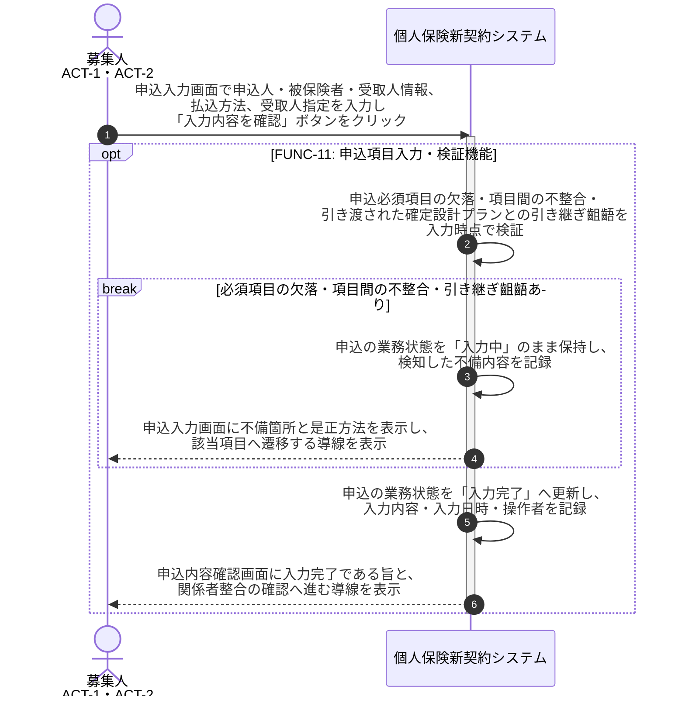

# UC-10: 申込項目を入力・検証する

- **事前条件**: 設計書作成で単一プランが確定し申込受付へ引き渡されている
- **事後条件**: 必須項目の欠落・項目間の不整合・前工程からの引き継ぎ齟齬がない状態で、申込の業務状態が「入力完了」となる。不備が検知された場合は「入力中」のまま保持し、不備箇所と是正方法を画面に返す

```mermaid
sequenceDiagram
    autonumber
    actor act1_2 as 募集人<br/>ACT-1・ACT-2
    participant sys as 個人保険新契約システム

    act1_2->>sys: 申込入力画面で申込人・被保険者・受取人情報、<br/>払込方法、受取人指定を入力し<br/>「入力内容を確認」ボタンをクリック
    activate sys

    opt FUNC-11: 申込項目入力・検証機能
        sys->>sys: 申込必須項目の欠落・項目間の不整合・<br/>引き渡された確定設計プランとの引き継ぎ齟齬を<br/>入力時点で検証

        break 必須項目の欠落・項目間の不整合・引き継ぎ齟齬あり
            sys->>sys: 申込の業務状態を「入力中」のまま保持し、<br/>検知した不備内容を記録
            sys-->>act1_2: 申込入力画面に不備箇所と是正方法を表示し、<br/>該当項目へ遷移する導線を表示
        end

        sys->>sys: 申込の業務状態を「入力完了」へ更新し、<br/>入力内容・入力日時・操作者を記録
        sys-->>act1_2: 申込内容確認画面に入力完了である旨と、<br/>関係者整合の確認へ進む導線を表示
    end

    deactivate sys
```
