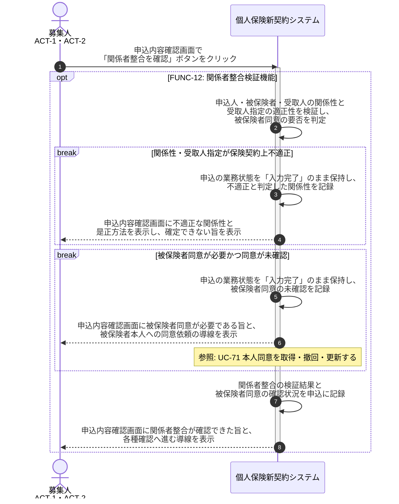

# UC-11: 関係者整合(被保険者同意要否)を検証する

- **事前条件**: 申込の業務状態が「入力完了」で、申込人・被保険者・受取人が入力済み
- **事後条件**: 関係性と受取人指定の適正性が確認され、被保険者同意が必要な契約形態では同意の取得済みが確認された状態になる。不適正または同意未確認の場合は「入力完了」のまま保持し、是正・同意依頼の導線を画面に返す

```mermaid
sequenceDiagram
    autonumber
    actor act1_2 as 募集人<br/>ACT-1・ACT-2
    participant sys as 個人保険新契約システム

    act1_2->>sys: 申込内容確認画面で<br/>「関係者整合を確認」ボタンをクリック
    activate sys

    opt FUNC-12: 関係者整合検証機能
        sys->>sys: 申込人・被保険者・受取人の関係性と<br/>受取人指定の適正性を検証し、<br/>被保険者同意の要否を判定

        break 関係性・受取人指定が保険契約上不適正
            sys->>sys: 申込の業務状態を「入力完了」のまま保持し、<br/>不適正と判定した関係性を記録
            sys-->>act1_2: 申込内容確認画面に不適正な関係性と<br/>是正方法を表示し、確定できない旨を表示
        end

        break 被保険者同意が必要かつ同意が未確認
            sys->>sys: 申込の業務状態を「入力完了」のまま保持し、<br/>被保険者同意の未確認を記録
            sys-->>act1_2: 申込内容確認画面に被保険者同意が必要である旨と、<br/>被保険者本人への同意依頼の導線を表示
            Note over sys: 参照: UC-71 本人同意を取得・撤回・更新する
        end

        sys->>sys: 関係者整合の検証結果と<br/>被保険者同意の確認状況を申込に記録
        sys-->>act1_2: 申込内容確認画面に関係者整合が確認できた旨と、<br/>各種確認へ進む導線を表示
    end

    deactivate sys
```
