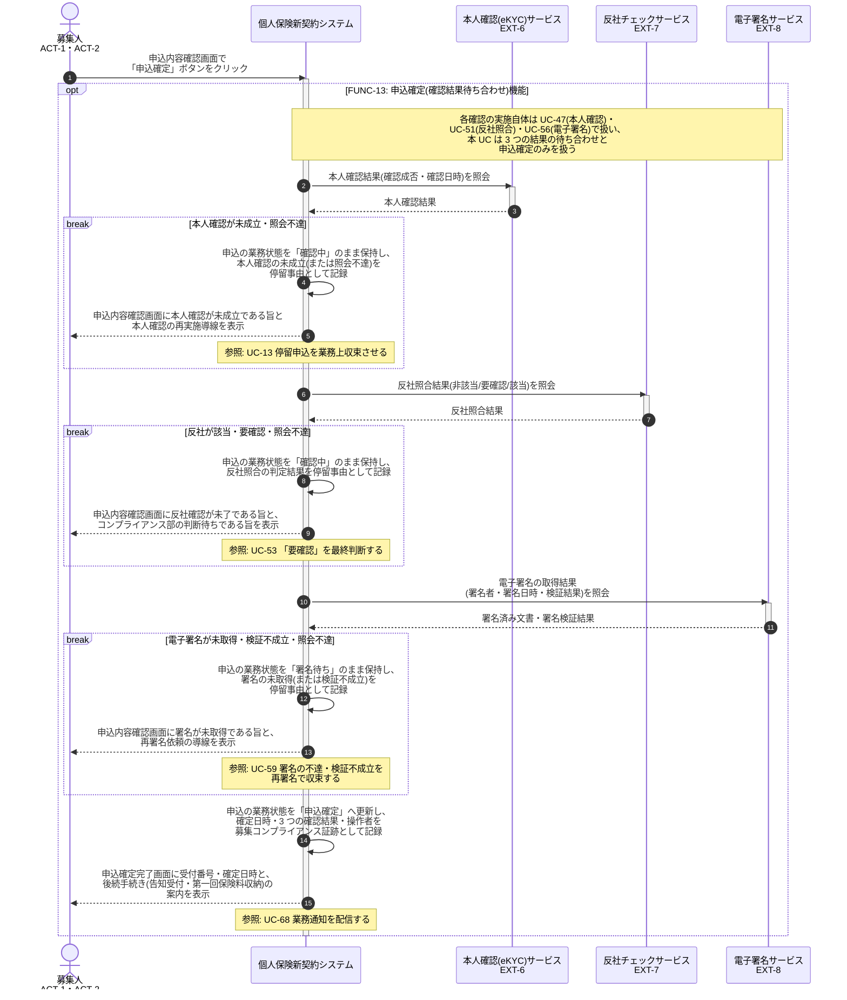

# UC-12: 本人確認・反社・電子署名の確認結果を待ち合わせ申込を確定する

- **事前条件**: 申込が入力完了(必須項目充足・関係者整合検証済み)で、本人確認(eKYC)・反社照合・電子署名の 3 つが各 UC により実施中または実施済み
- **事後条件**: 本人確認(eKYC)成立・反社照合の非該当確定・電子署名取得の 3 つがすべて成立した場合に、申込の業務状態が「申込確定」となり募集コンプライアンス証跡が記録される。いずれかが未成立と判明した時点で以降の確認へ進まず、停留事由を記録して申込内容確認画面に結果を返す

