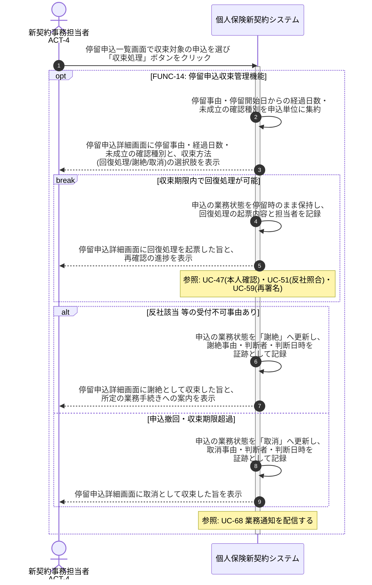

# UC-13: 停留申込を業務上収束させる

- **事前条件**: 本人確認未了・反社該当/要確認・電子署名未取得 等により申込が「確認中」または「署名待ち」で停留している
- **事後条件**: 回復処理の起票により再確認へ戻るか、業務状態が「謝絶」または「取消」へ更新され、収束事由と判断者が証跡として記録された状態になる

```mermaid
sequenceDiagram
    autonumber
    actor act4 as 新契約事務担当者<br/>ACT-4
    participant sys as 個人保険新契約システム

    act4->>sys: 停留申込一覧画面で収束対象の申込を選び<br/>「収束処理」ボタンをクリック
    activate sys

    opt FUNC-14: 停留申込収束管理機能
        sys->>sys: 停留事由・停留開始日からの経過日数・<br/>未成立の確認種別を申込単位に集約
        sys-->>act4: 停留申込詳細画面に停留事由・経過日数・<br/>未成立の確認種別と、収束方法<br/>(回復処理/謝絶/取消)の選択肢を表示

        break 収束期限内で回復処理が可能
            sys->>sys: 申込の業務状態を停留時のまま保持し、<br/>回復処理の起票内容と担当者を記録
            sys-->>act4: 停留申込詳細画面に回復処理を起票した旨と、<br/>再確認の進捗を表示
            Note over sys: 参照: UC-47(本人確認)・UC-51(反社照合)・<br/>UC-59(再署名)
        end

        alt 反社該当 等の受付不可事由あり
            sys->>sys: 申込の業務状態を「謝絶」へ更新し、<br/>謝絶事由・判断者・判断日時を<br/>証跡として記録
            sys-->>act4: 停留申込詳細画面に謝絶として収束した旨と、<br/>所定の業務手続きへの案内を表示
        else 申込撤回・収束期限超過
            sys->>sys: 申込の業務状態を「取消」へ更新し、<br/>取消事由・判断者・判断日時を<br/>証跡として記録
            sys-->>act4: 停留申込詳細画面に取消として収束した旨を表示
        end

        Note over sys: 参照: UC-68 業務通知を配信する
    end

    deactivate sys
```
