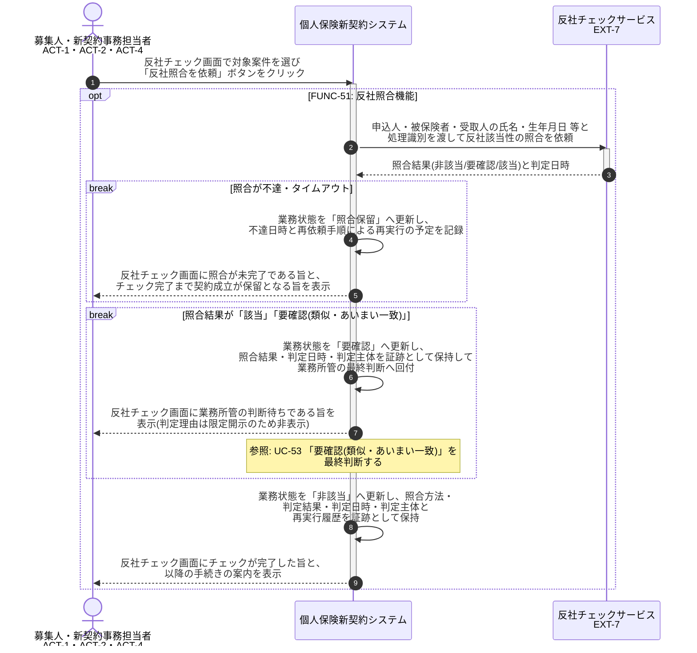

# UC-51: 契約関係者の反社該当性を外部サービスへ照合する

- **事前条件**: 申込受付で申込人・被保険者・受取人 等の契約関係者が確定し、業務状態が「未依頼」
- **事後条件**: 外部反社チェックサービスの照合結果に依拠して業務状態が「非該当」「要確認」「照合保留」のいずれかに振り分けられ、依頼内容・応答・再実行履歴が証跡として保持された状態になる。不達の場合は再依頼で業務を継続し、チェック完了まで契約成立へ進めない

