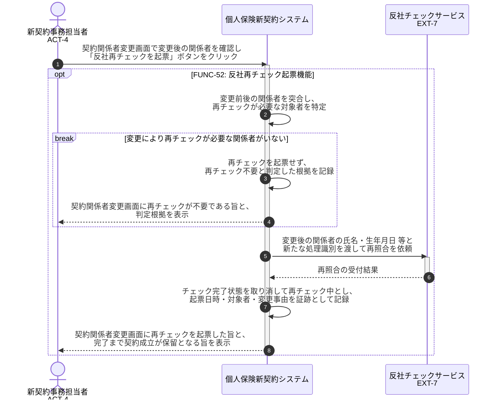

# UC-52: 関係者変更時に反社再チェックを起票する

- **事前条件**: 受取人・被保険者 等の契約関係者が事後に変更され、変更前の関係者に対するチェック結果のみが存在する
- **事後条件**: 変更後の関係者に対する再チェックが起票・依頼され、チェック完了が取り直された状態になる。再チェックが完了するまで契約成立へ進めない

```mermaid
sequenceDiagram
    autonumber
    actor act4 as 新契約事務担当者<br/>ACT-4
    participant sys as 個人保険新契約システム
    participant ext7 as 反社チェックサービス<br/>EXT-7

    act4->>sys: 契約関係者変更画面で変更後の関係者を確認し<br/>「反社再チェックを起票」ボタンをクリック
    activate sys

    opt FUNC-52: 反社再チェック起票機能
        sys->>sys: 変更前後の関係者を突合し、<br/>再チェックが必要な対象者を特定

        break 変更により再チェックが必要な関係者がいない
            sys->>sys: 再チェックを起票せず、<br/>再チェック不要と判定した根拠を記録
            sys-->>act4: 契約関係者変更画面に再チェックが不要である旨と、<br/>判定根拠を表示
        end

        sys->>ext7: 変更後の関係者の氏名・生年月日 等と<br/>新たな処理識別を渡して再照合を依頼
        activate ext7
        ext7-->>sys: 再照合の受付結果
        deactivate ext7

        sys->>sys: チェック完了状態を取り消して再チェック中とし、<br/>起票日時・対象者・変更事由を証跡として記録
        sys-->>act4: 契約関係者変更画面に再チェックを起票した旨と、<br/>完了まで契約成立が保留となる旨を表示
    end

    deactivate sys
```
