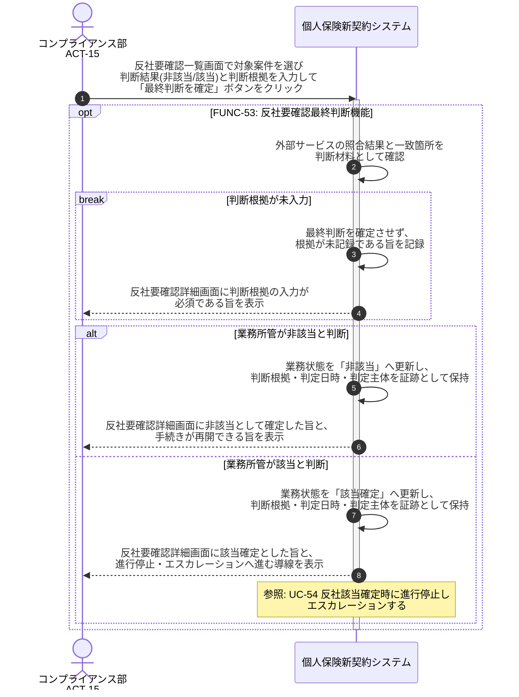

# UC-53: 「要確認(類似・あいまい一致)」を最終判断する

- **事前条件**: 外部反社チェックサービスから「要確認(類似・あいまい一致)」の応答があり、業務状態が「要確認」で業務所管の判断待ちになっている
- **事後条件**: 業務所管の最終判断により業務状態が「非該当」または「該当確定」に確定し、判断根拠と結果が証跡として保持された状態になる。判断が完了するまで契約成立扱いにしない

