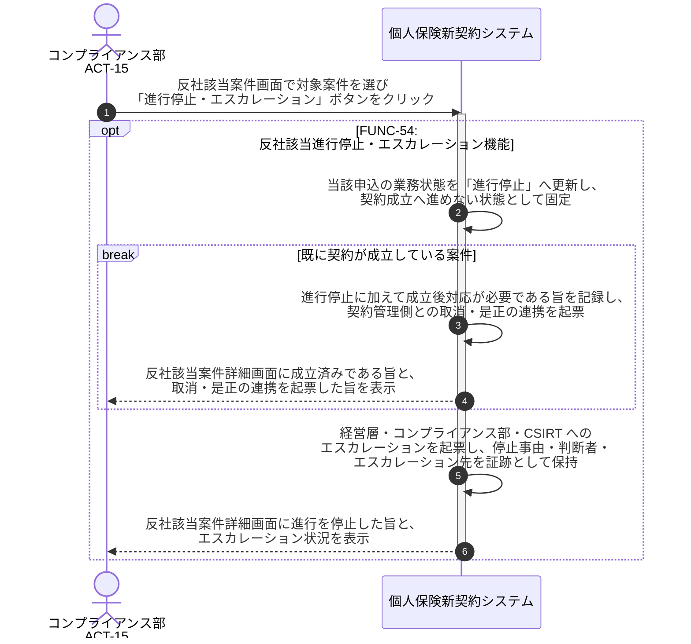

# UC-54: 反社該当確定時に進行停止しエスカレーションする

- **事前条件**: 外部判定または業務所管の判断により反社該当が確定し、業務状態が「該当確定」
- **事後条件**: 当該申込の契約進行が停止され、経営層・コンプライアンス部・CSIRT へエスカレーションされた状態になる。停止の事由・判断者・エスカレーション先が証跡として保持され、判定理由は限定開示のまま扱われる

```mermaid
sequenceDiagram
    autonumber
    actor act15 as コンプライアンス部<br/>ACT-15
    participant sys as 個人保険新契約システム

    act15->>sys: 反社該当案件画面で対象案件を選び<br/>「進行停止・エスカレーション」ボタンをクリック
    activate sys

    opt FUNC-54: 反社該当進行停止・エスカレーション機能
        sys->>sys: 当該申込の業務状態を「進行停止」へ更新し、<br/>契約成立へ進めない状態として固定

        break 既に契約が成立している案件
            sys->>sys: 進行停止に加えて成立後対応が必要である旨を記録し、<br/>契約管理側との取消・是正の連携を起票
            sys-->>act15: 反社該当案件詳細画面に成立済みである旨と、<br/>取消・是正の連携を起票した旨を表示
        end

        sys->>sys: 経営層・コンプライアンス部・CSIRT への<br/>エスカレーションを起票し、停止事由・判断者・<br/>エスカレーション先を証跡として保持
        sys-->>act15: 反社該当案件詳細画面に進行を停止した旨と、<br/>エスカレーション状況を表示
    end

    deactivate sys
```
