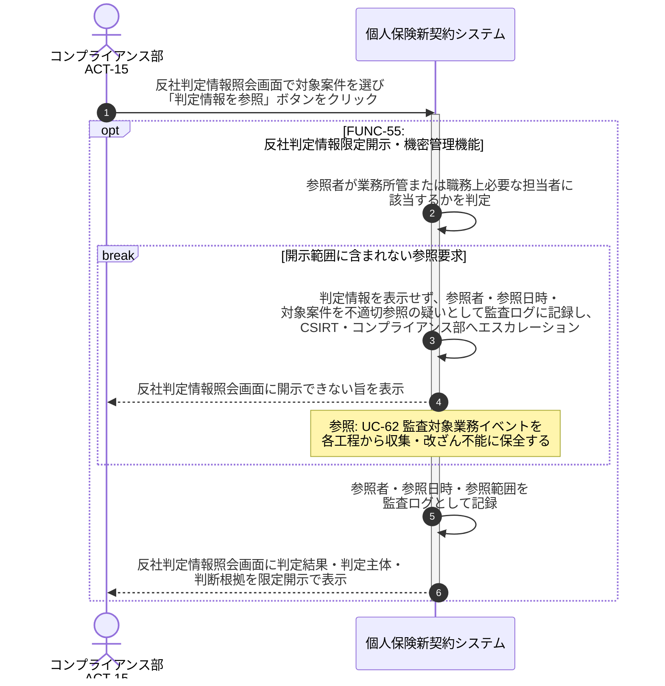

# UC-55: 反社判定情報を限定開示で機密管理する

- **事前条件**: 該当・要確認の判定情報が存在し、当該情報への参照要求が発生している
- **事後条件**: 業務所管および職務上必要な担当者にのみ判定情報が開示され、参照の事実が監査ログとして追跡可能に記録された状態になる。権限のない参照要求には判定情報を表示せず、不適切参照の疑いとしてエスカレーションする

```mermaid
sequenceDiagram
    autonumber
    actor act15 as コンプライアンス部<br/>ACT-15
    participant sys as 個人保険新契約システム

    act15->>sys: 反社判定情報照会画面で対象案件を選び<br/>「判定情報を参照」ボタンをクリック
    activate sys

    opt FUNC-55: 反社判定情報限定開示・機密管理機能
        sys->>sys: 参照者が業務所管または職務上必要な担当者に<br/>該当するかを判定

        break 開示範囲に含まれない参照要求
            sys->>sys: 判定情報を表示せず、参照者・参照日時・<br/>対象案件を不適切参照の疑いとして監査ログに記録し、<br/>CSIRT・コンプライアンス部へエスカレーション
            sys-->>act15: 反社判定情報照会画面に開示できない旨を表示
            Note over sys: 参照: UC-62 監査対象業務イベントを<br/>各工程から収集・改ざん不能に保全する
        end

        sys->>sys: 参照者・参照日時・参照範囲を<br/>監査ログとして記録
        sys-->>act15: 反社判定情報照会画面に判定結果・判定主体・<br/>判断根拠を限定開示で表示
    end

    deactivate sys
```
