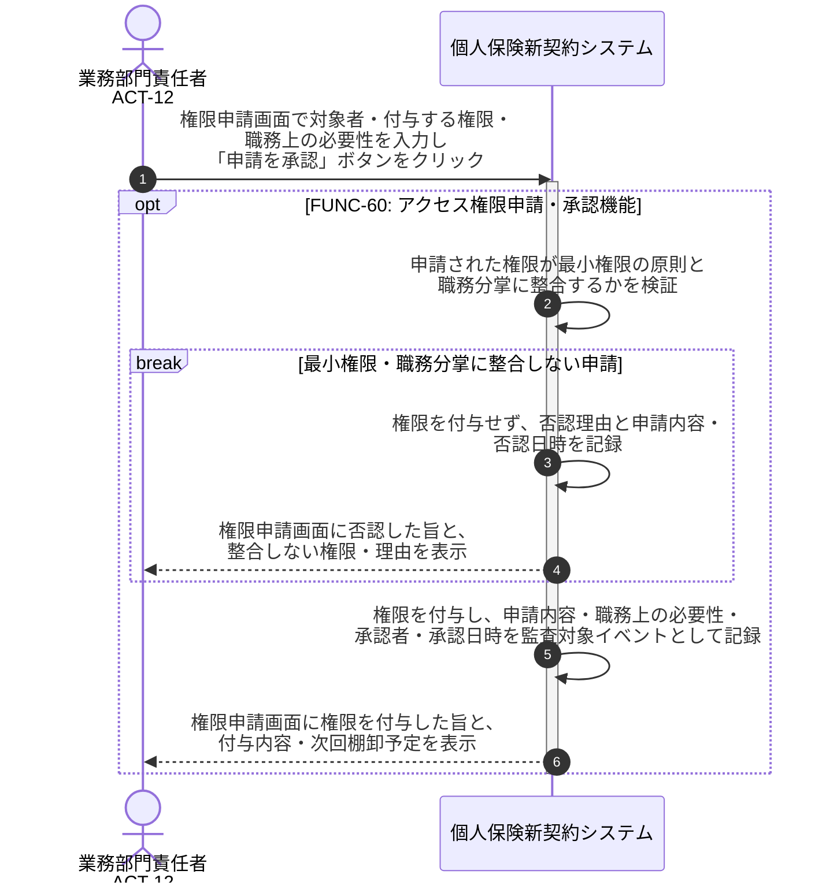

# UC-60: アクセス権限を申請・承認する

- **事前条件**: 職務上の必要性が発生し、付与・変更したい権限と対象者が特定されている
- **事後条件**: 最小権限・職務分掌に整合する権限のみが申請・承認の業務手続きを経て付与され、申請内容・承認者・承認日時が記録された状態になる。職務分掌に整合しない申請は否認する

```mermaid
sequenceDiagram
    autonumber
    actor act12 as 業務部門責任者<br/>ACT-12
    participant sys as 個人保険新契約システム

    act12->>sys: 権限申請画面で対象者・付与する権限・<br/>職務上の必要性を入力し<br/>「申請を承認」ボタンをクリック
    activate sys

    opt FUNC-60: アクセス権限申請・承認機能
        sys->>sys: 申請された権限が最小権限の原則と<br/>職務分掌に整合するかを検証

        break 最小権限・職務分掌に整合しない申請
            sys->>sys: 権限を付与せず、否認理由と申請内容・<br/>否認日時を記録
            sys-->>act12: 権限申請画面に否認した旨と、<br/>整合しない権限・理由を表示
        end

        sys->>sys: 権限を付与し、申請内容・職務上の必要性・<br/>承認者・承認日時を監査対象イベントとして記録
        sys-->>act12: 権限申請画面に権限を付与した旨と、<br/>付与内容・次回棚卸予定を表示
    end

    deactivate sys
```
