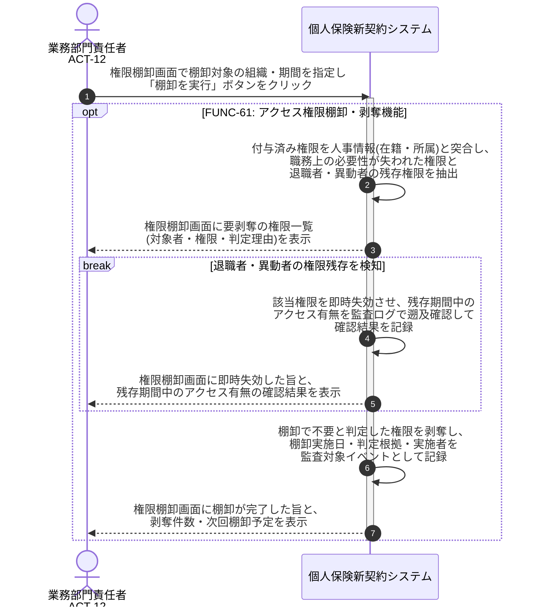

# UC-61: アクセス権限を定期棚卸し不要権限を剥奪する

- **事前条件**: 定期棚卸サイクルが到来している、または人事異動・退職の連携により権限見直しの契機が発生している
- **事後条件**: 付与済み権限の妥当性が検証され、不要権限・退職者/異動者の権限が失効した状態になる。剥奪漏れによる権限残存を検知した場合は即時失効させ、残存期間中のアクセス有無を監査ログで遡及確認した記録が残る

