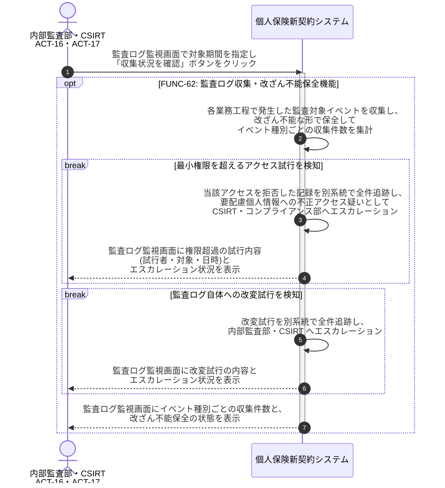

# UC-62: 監査対象業務イベントを各工程から収集・改ざん不能に保全する

- **事前条件**: 各業務工程で監査対象業務イベント(個人情報・契約データへのアクセス/操作/参照、権限の付与・変更・剥奪、証跡参照、ログ改変試行)が発生している
- **事後条件**: 監査対象イベントが漏れなく改ざん不能な形で収集・保全された状態になる。最小権限を超えるアクセス試行と監査ログ自体への改変試行は別系統で全件追跡され、CSIRT・内部監査部へエスカレーションされる

