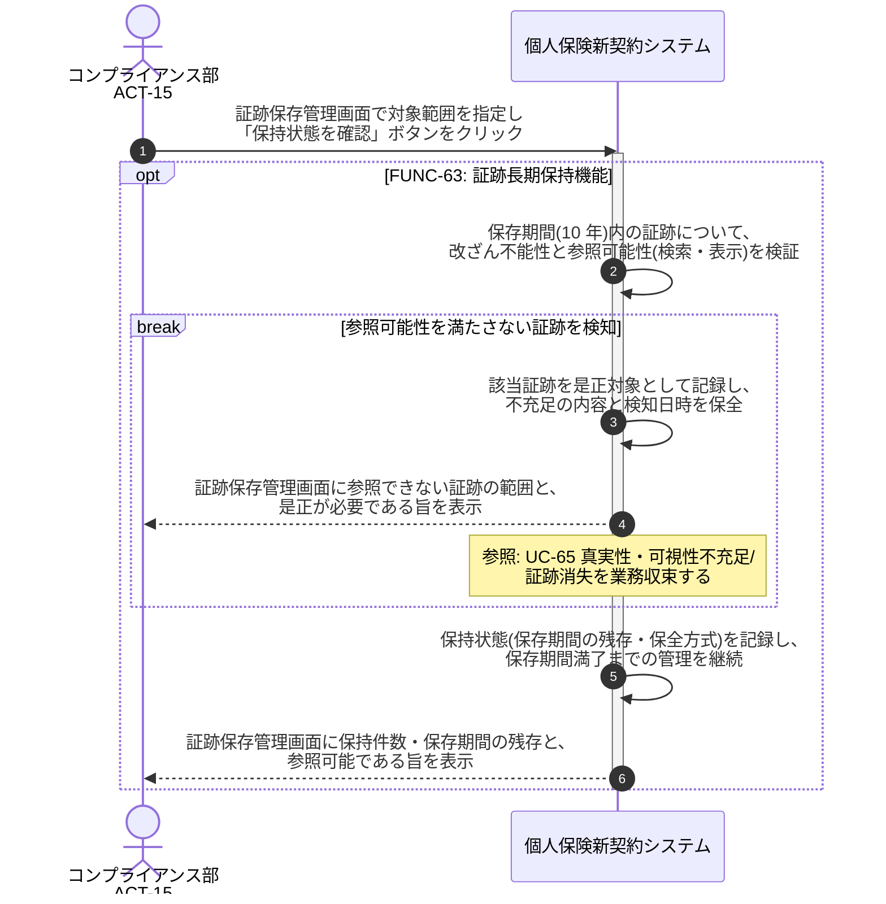

# UC-63: 証跡を 10 年保持し参照可能性を維持する

- **事前条件**: 監査ログ・契約関係の証跡が改ざん不能保存に封入され、保存期間の管理が開始されている
- **事後条件**: 証跡が改ざん不能のまま 10 年間保持され、保持期間中の参照可能性が維持されている状態が確認される。参照可能性を満たさない証跡を検知した場合は是正対象として記録する

```mermaid
sequenceDiagram
    autonumber
    actor act15 as コンプライアンス部<br/>ACT-15
    participant sys as 個人保険新契約システム

    act15->>sys: 証跡保存管理画面で対象範囲を指定し<br/>「保持状態を確認」ボタンをクリック
    activate sys

    opt FUNC-63: 証跡長期保持機能
        sys->>sys: 保存期間(10 年)内の証跡について、<br/>改ざん不能性と参照可能性(検索・表示)を検証

        break 参照可能性を満たさない証跡を検知
            sys->>sys: 該当証跡を是正対象として記録し、<br/>不充足の内容と検知日時を保全
            sys-->>act15: 証跡保存管理画面に参照できない証跡の範囲と、<br/>是正が必要である旨を表示
            Note over sys: 参照: UC-65 真実性・可視性不充足/<br/>証跡消失を業務収束する
        end

        sys->>sys: 保持状態(保存期間の残存・保全方式)を記録し、<br/>保存期間満了までの管理を継続
        sys-->>act15: 証跡保存管理画面に保持件数・保存期間の残存と、<br/>参照可能である旨を表示
    end

    deactivate sys
```
