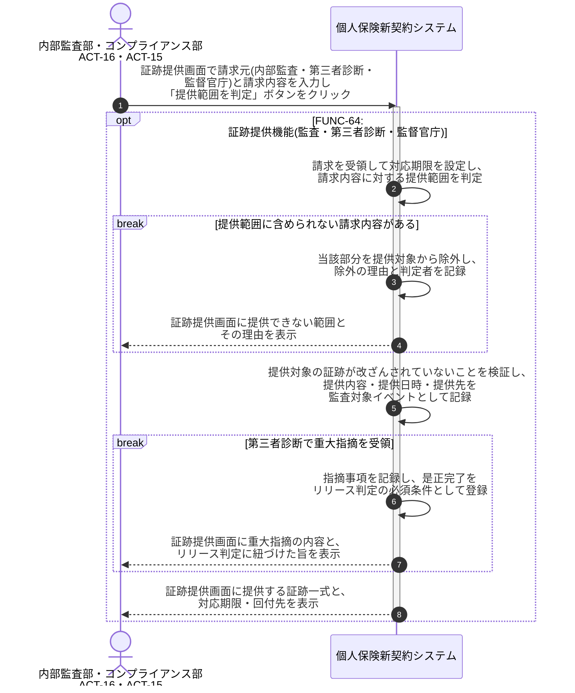

# UC-64: 証跡を説明可能な形で提供する(監査・第三者診断・監督官庁)

- **事前条件**: 内部監査・第三者セキュリティ診断・監督官庁のいずれかから証跡の請求を受領している
- **事後条件**: 請求の受領・対応期限・提供範囲の判定・回付の業務手順により、改ざんされていない証跡が説明可能な形で提供された状態になる。第三者診断の重大指摘については、是正完了がリリース判定の必須条件として記録される

