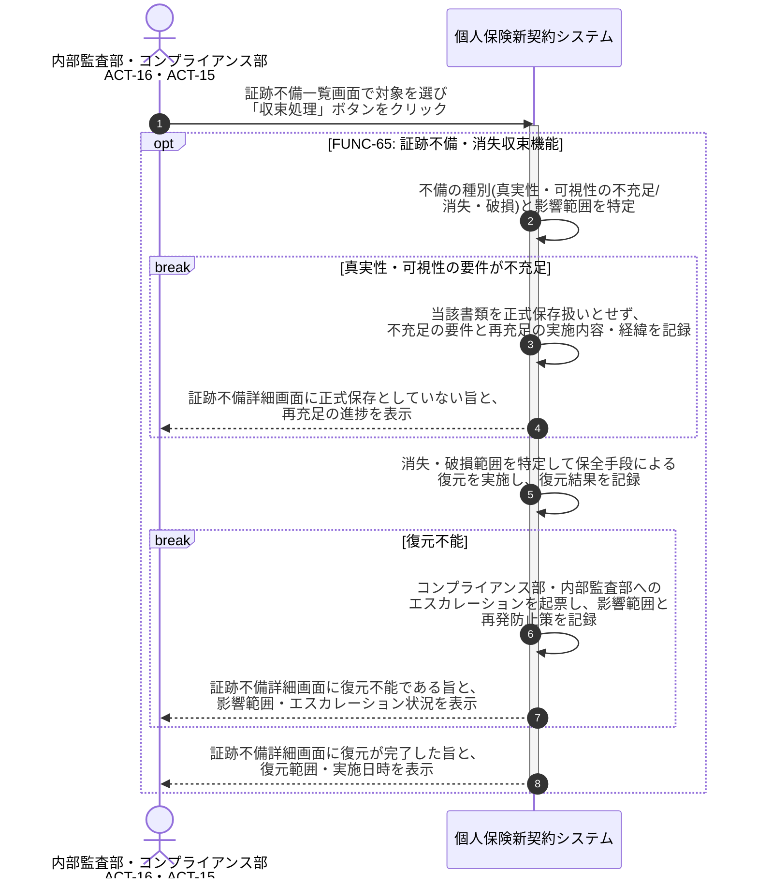

# UC-65: 真実性・可視性不充足/証跡消失を業務収束する

- **事前条件**: 真実性措置の付与失敗・検索要件の不備が検知されている、または保存期間内の証跡消失・破損の疑いが生じている
- **事後条件**: 要件不充足の書類は正式保存扱いとせず真実性・可視性措置が再充足されるか、消失・破損は復元により回復した状態になる。復元不能の場合はコンプライアンス部・内部監査部へエスカレーションし、影響範囲と再発防止が記録される

