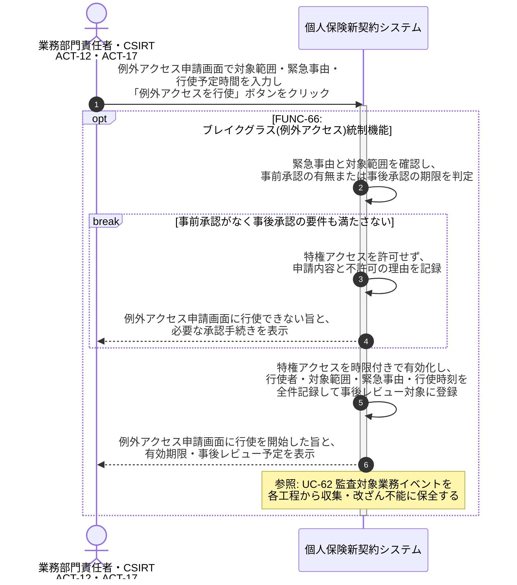

# UC-66: 緊急時の例外アクセス(ブレイクグラス)を統制下で行使する

- **事前条件**: 障害対応・インシデント対応 等で通常権限を超える特権アクセスの業務上必要性が発生している
- **事後条件**: 事前承認または事後速やかな承認のもとで特権アクセスが行使され、行使内容が全件記録されて事後レビューに付された状態になる。承認が得られない行使は許可しない

```mermaid
sequenceDiagram
    autonumber
    actor act12_17 as 業務部門責任者・CSIRT<br/>ACT-12・ACT-17
    participant sys as 個人保険新契約システム

    act12_17->>sys: 例外アクセス申請画面で対象範囲・緊急事由・<br/>行使予定時間を入力し<br/>「例外アクセスを行使」ボタンをクリック
    activate sys

    opt FUNC-66: ブレイクグラス(例外アクセス)統制機能
        sys->>sys: 緊急事由と対象範囲を確認し、<br/>事前承認の有無または事後承認の期限を判定

        break 事前承認がなく事後承認の要件も満たさない
            sys->>sys: 特権アクセスを許可せず、<br/>申請内容と不許可の理由を記録
            sys-->>act12_17: 例外アクセス申請画面に行使できない旨と、<br/>必要な承認手続きを表示
        end

        sys->>sys: 特権アクセスを時限付きで有効化し、<br/>行使者・対象範囲・緊急事由・行使時刻を<br/>全件記録して事後レビュー対象に登録
        sys-->>act12_17: 例外アクセス申請画面に行使を開始した旨と、<br/>有効期限・事後レビュー予定を表示
        Note over sys: 参照: UC-62 監査対象業務イベントを<br/>各工程から収集・改ざん不能に保全する
    end

    deactivate sys
```
