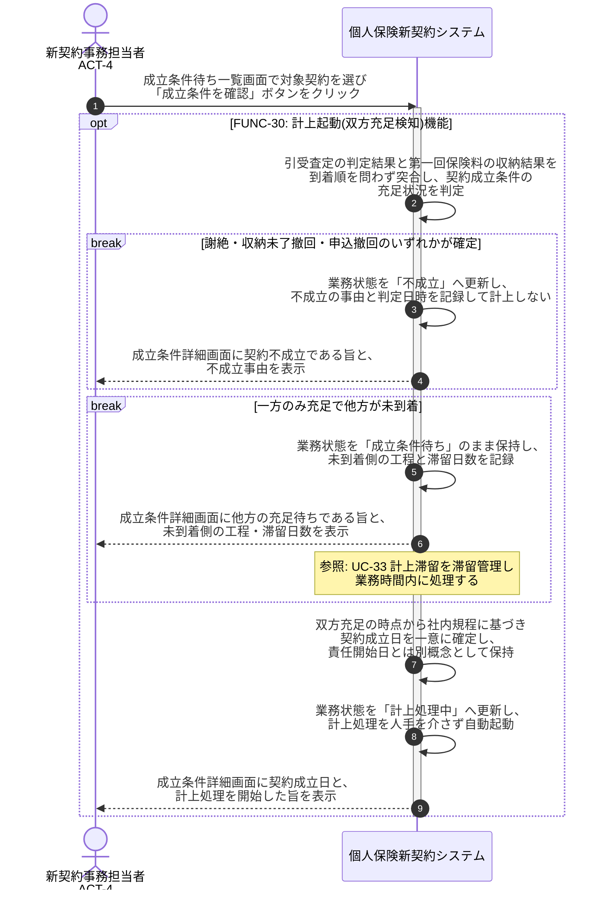

# UC-30: 引受可決と収納成立の双方充足を検知し自動計上する

- **事前条件**: 申込が査定・収納の対象となり、業務状態が「成立条件待ち」。引受可決と第一回保険料収納成立は到着順を問わない
- **事後条件**: 引受可決と収納成立の双方の充足が検知されて契約成立日が一意に確定し、業務状態が「計上処理中」となって計上処理が自動起動する。一方のみ充足の場合は成立条件待ちのまま滞留管理し、謝絶・収納未了撤回の場合は「不成立」として計上しない

