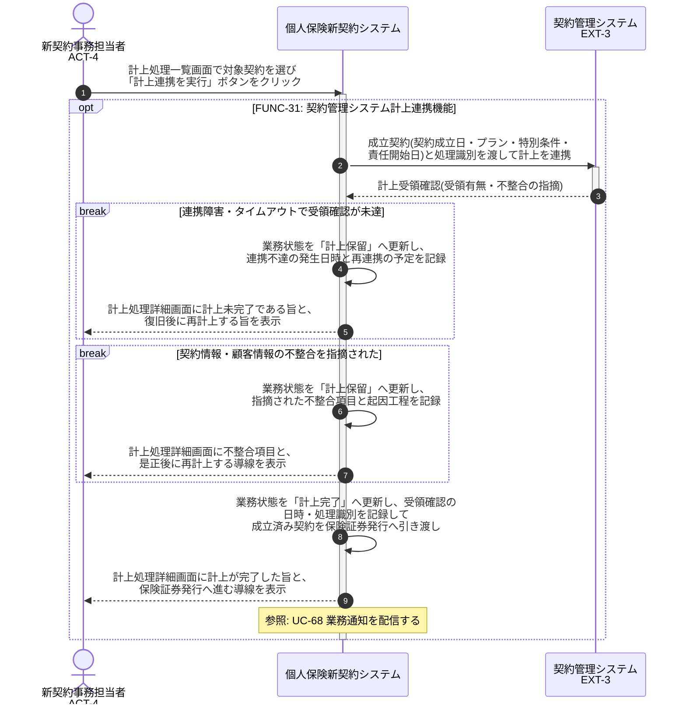

# UC-31: 既存契約管理システムへ連携し受領確認で計上完了とする

- **事前条件**: 業務状態が「計上処理中」で、契約成立日と計上対象の契約情報が確定している
- **事後条件**: 既存契約管理システムからの計上受領確認をもって業務状態が「計上完了」となり、成立済み契約が保険証券発行へ引き渡される。連携障害・受領未達・データ不整合の場合は「計上保留」として滞留管理し、復旧・是正後に再計上する

