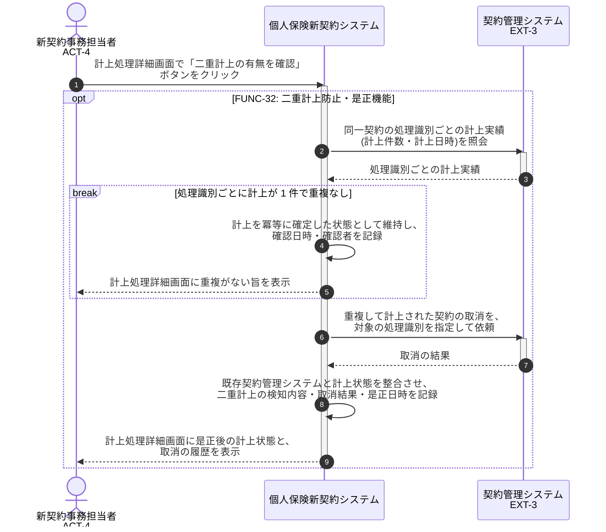

# UC-32: 二重計上を冪等に防止・是正する

- **事前条件**: リトライ・連携再送と実計上の重複により二重計上の疑いが検知されている
- **事後条件**: 処理識別により計上が 1 回限りに冪等確定し、二重計上が判明した場合は既存契約管理システムと整合させて取消・是正され、是正の事由と履歴が記録された状態になる

```mermaid
sequenceDiagram
    autonumber
    actor act4 as 新契約事務担当者<br/>ACT-4
    participant sys as 個人保険新契約システム
    participant ext3 as 契約管理システム<br/>EXT-3

    act4->>sys: 計上処理詳細画面で「二重計上の有無を確認」<br/>ボタンをクリック
    activate sys

    opt FUNC-32: 二重計上防止・是正機能
        sys->>ext3: 同一契約の処理識別ごとの計上実績<br/>(計上件数・計上日時)を照会
        activate ext3
        ext3-->>sys: 処理識別ごとの計上実績
        deactivate ext3

        break 処理識別ごとに計上が 1 件で重複なし
            sys->>sys: 計上を冪等に確定した状態として維持し、<br/>確認日時・確認者を記録
            sys-->>act4: 計上処理詳細画面に重複がない旨を表示
        end

        sys->>ext3: 重複して計上された契約の取消を、<br/>対象の処理識別を指定して依頼
        activate ext3
        ext3-->>sys: 取消の結果
        deactivate ext3

        sys->>sys: 既存契約管理システムと計上状態を整合させ、<br/>二重計上の検知内容・取消結果・是正日時を記録
        sys-->>act4: 計上処理詳細画面に是正後の計上状態と、<br/>取消の履歴を表示
    end

    deactivate sys
```
