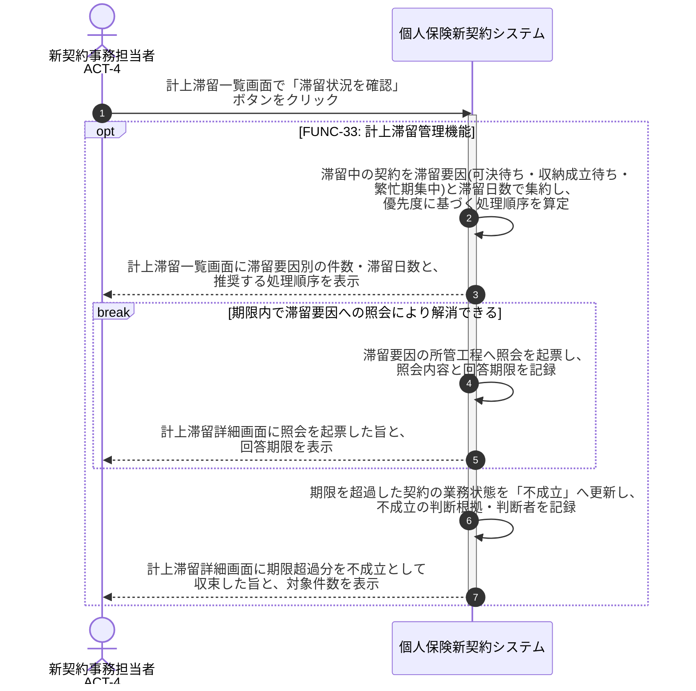

# UC-33: 計上滞留を滞留管理し業務時間内に処理する

- **事前条件**: 片側のみ成立で他方が未到着、または月末月初の計上集中により計上対象が滞留している
- **事後条件**: 滞留要因への照会と優先度に基づく処理順序により滞留が解消され業務時間内に処理されるか、期限を超過した契約は「不成立」として収束した状態になる

```mermaid
sequenceDiagram
    autonumber
    actor act4 as 新契約事務担当者<br/>ACT-4
    participant sys as 個人保険新契約システム

    act4->>sys: 計上滞留一覧画面で「滞留状況を確認」<br/>ボタンをクリック
    activate sys

    opt FUNC-33: 計上滞留管理機能
        sys->>sys: 滞留中の契約を滞留要因(可決待ち・収納成立待ち・<br/>繁忙期集中)と滞留日数で集約し、<br/>優先度に基づく処理順序を算定
        sys-->>act4: 計上滞留一覧画面に滞留要因別の件数・滞留日数と、<br/>推奨する処理順序を表示

        break 期限内で滞留要因への照会により解消できる
            sys->>sys: 滞留要因の所管工程へ照会を起票し、<br/>照会内容と回答期限を記録
            sys-->>act4: 計上滞留詳細画面に照会を起票した旨と、<br/>回答期限を表示
        end

        sys->>sys: 期限を超過した契約の業務状態を「不成立」へ更新し、<br/>不成立の判断根拠・判断者を記録
        sys-->>act4: 計上滞留詳細画面に期限超過分を不成立として<br/>収束した旨と、対象件数を表示
    end

    deactivate sys
```
