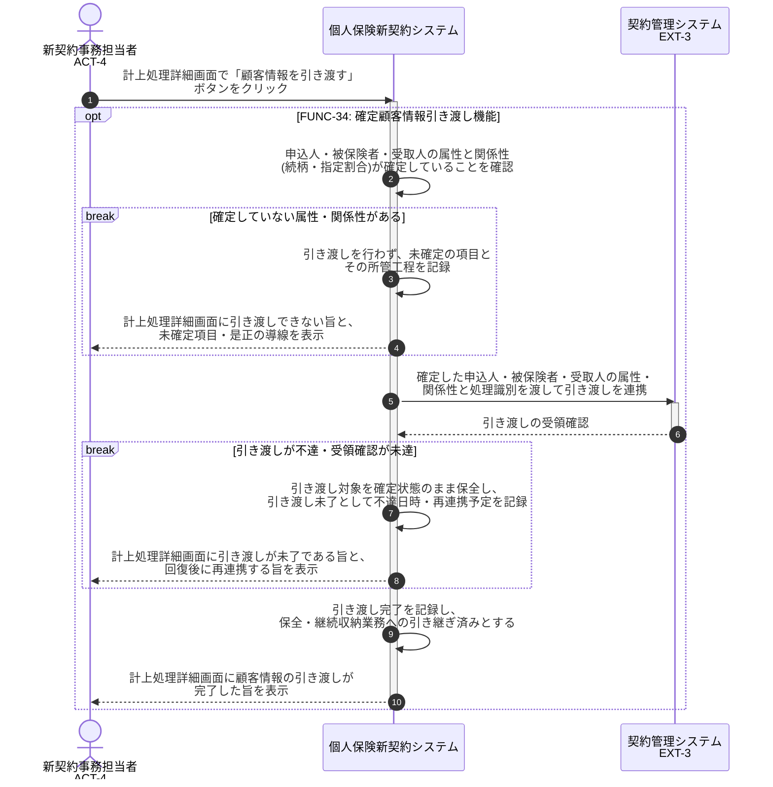

# UC-34: 確定顧客情報を既存契約管理システムへ引き渡す

- **事前条件**: 契約成立条件が充足し、引き渡し対象となる申込人・被保険者・受取人の属性・関係性が確定している
- **事後条件**: 確定顧客情報が既存契約管理システムへ引き渡され、保全・継続収納業務へ引き継がれた状態になる。不達の場合は引き渡し対象を確定状態のまま保全し、引き渡し未了として追跡して回復後に再連携する

