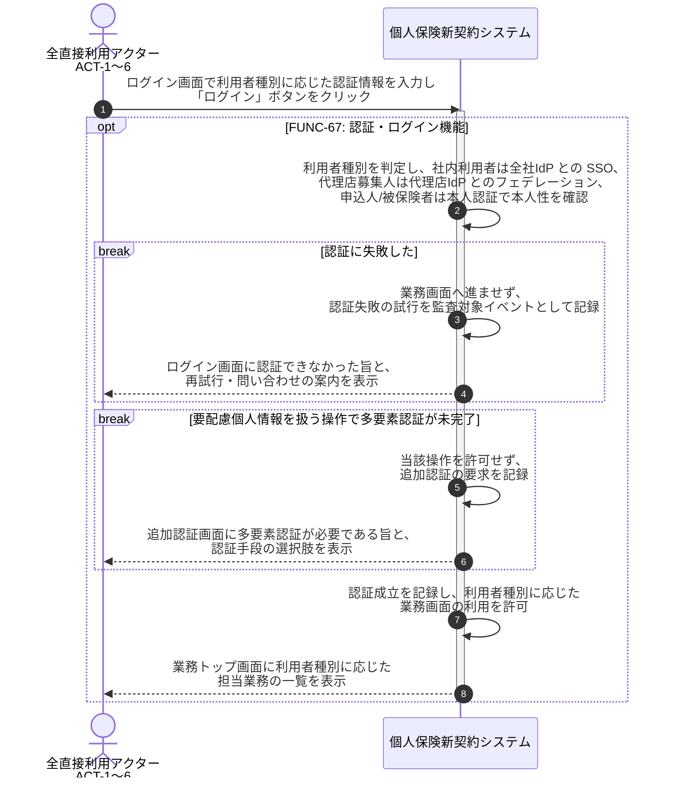

# UC-67: 本プロダクトにログインする

- **事前条件**: 利用者種別に対応する認証手段(社内利用者=全社IdP との SSO、代理店募集人=代理店IdP とのフェデレーション、申込人/被保険者=本人認証)が利用できる状態にある
- **事後条件**: 利用者種別に整合する認証強度で本人性が確認され、業務画面を利用できる状態になる。要配慮個人情報を扱う操作を行う場合は多要素認証が完了していることを要件とし、未充足の場合は当該操作へ進ませない

