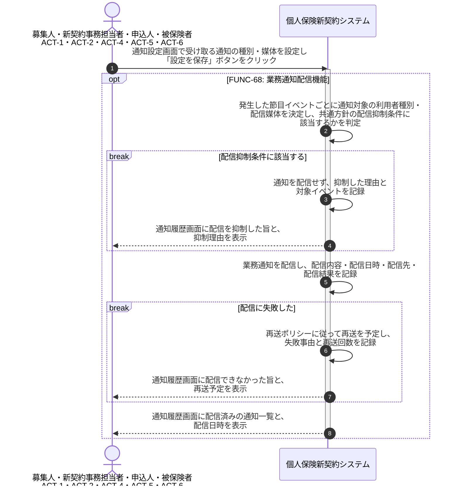

# UC-68: 業務通知を配信する

- **事前条件**: 業務上の節目イベント(申込受付・告知完了・査定結果・収納成立・契約成立・証券発行 等)が発生し、通知対象の利用者種別が特定できる
- **事後条件**: 節目イベントごとに各利用者種別へ業務通知が配信され、配信内容・配信日時・配信先が記録された状態になる。共通方針の配信抑制に該当する通知は配信せず、配信に失敗した通知は再送ポリシーに従って再送される

