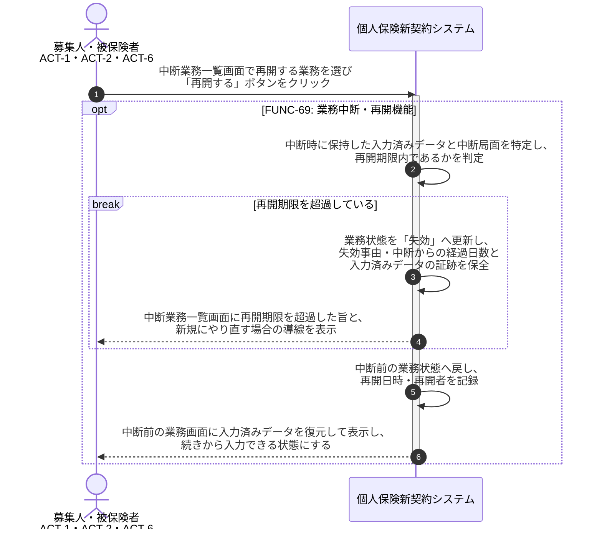

# UC-69: 中断した業務を再開する

- **事前条件**: 意向把握・設計書作成・申込受付・告知入力 等の局面で一時中断が発生し、入力済みデータが保持されたまま業務状態が「中断中」になっている
- **事後条件**: 再開期限内であれば入力済みデータを失わずに中断前の局面から業務が再開された状態になる。再開期限を超過している場合は再開させず、証跡を保全したうえで失効として扱う

```mermaid
sequenceDiagram
    autonumber
    actor act1_2_6 as 募集人・被保険者<br/>ACT-1・ACT-2・ACT-6
    participant sys as 個人保険新契約システム

    act1_2_6->>sys: 中断業務一覧画面で再開する業務を選び<br/>「再開する」ボタンをクリック
    activate sys

    opt FUNC-69: 業務中断・再開機能
        sys->>sys: 中断時に保持した入力済みデータと中断局面を特定し、<br/>再開期限内であるかを判定

        break 再開期限を超過している
            sys->>sys: 業務状態を「失効」へ更新し、<br/>失効事由・中断からの経過日数と<br/>入力済みデータの証跡を保全
            sys-->>act1_2_6: 中断業務一覧画面に再開期限を超過した旨と、<br/>新規にやり直す場合の導線を表示
        end

        sys->>sys: 中断前の業務状態へ戻し、<br/>再開日時・再開者を記録
        sys-->>act1_2_6: 中断前の業務画面に入力済みデータを復元して表示し、<br/>続きから入力できる状態にする
    end

    deactivate sys
```
